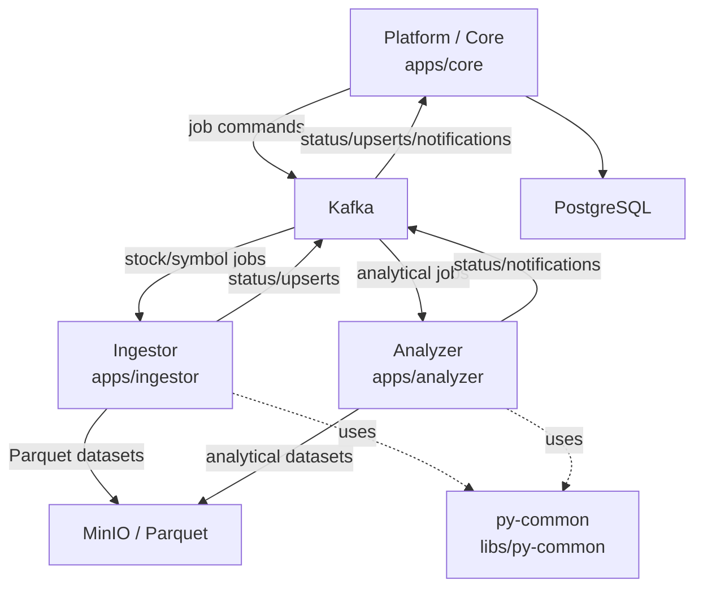

# Omni

Omni is an Nx monorepo for stock-market data ingestion, analytical precomputation, and job orchestration. It coordinates a Java/Spring Platform service, Python worker/API services, Kafka, PostgreSQL, and MinIO/S3-compatible Parquet storage.

## Architecture at a Glance



Detailed architecture starts in [docs/README.md](docs/README.md).

## Services

| Project     | Path                               | Responsibility                                                                                              |
| ----------- | ---------------------------------- | ----------------------------------------------------------------------------------------------------------- |
| `platform`  | [`apps/core`](apps/core)           | Platform API, scheduler, job orchestration, PostgreSQL operational state, Kafka producer/consumer boundary. |
| `ingestor`  | [`apps/ingestor`](apps/ingestor)   | External market-data ingestion, symbol/EOD Parquet updates, status/upsert events.                           |
| `analyzer`  | [`apps/analyzer`](apps/analyzer)   | Indicators, signals, signal evaluation, Sector Wave features/backtests.                                     |
| `py-common` | [`libs/py-common`](libs/py-common) | Shared Python config, Kafka, runtime, and storage abstractions.                                             |

## Quick Start

```bash
git clone --recursive <repository-url>
cd omni
npm install
cp .env.example .env
nx run omni:init
```

Synchronize Python environments:

```bash
nx run analyzer:sync
nx run ingestor:sync
nx run py-common:sync
```

Run all applications together for local development:

```bash
nx run omni:dev
```

Start only infrastructure:

```bash
docker compose -f docker-compose.infra.yaml up -d
```

Start the complete Docker stack:

```bash
docker compose --env-file .env up -d
```

## Documentation

| Document                                                                     | Purpose                                     |
| ---------------------------------------------------------------------------- | ------------------------------------------- |
| [docs/README.md](docs/README.md)                                             | Documentation entry point and map.          |
| [docs/architecture/system-overview.md](docs/architecture/system-overview.md) | System overview and service boundaries.     |
| [docs/development/where-to-change.md](docs/development/where-to-change.md)   | Where to start for common changes.          |
| [docs/data/kafka-contracts.md](docs/data/kafka-contracts.md)                 | Kafka topic and payload contract ownership. |
| [docs/data/data-lake.md](docs/data/data-lake.md)                             | Parquet dataset/path ownership.             |
| [docs/flows/job-execution.md](docs/flows/job-execution.md)                   | Scheduler and worker job execution flow.    |
| [ARCHITECTURE.md](ARCHITECTURE.md)                                           | Compatibility index for architecture links. |
| [AGENTS.md](AGENTS.md)                                                       | Development and agent workflow rules.       |

## Common Development Commands

Nx is the canonical entry point for project operations. Inspect targets before running unfamiliar commands:

```bash
nx show project platform
nx show project analyzer
nx show project ingestor
nx show project py-common
```

Common targets:

```bash
nx run platform:serve
nx run platform:build

nx run analyzer:serve
nx run analyzer:test
nx run analyzer:lint
nx run analyzer:format

nx run ingestor:serve
nx run ingestor:test
nx run ingestor:lint
nx run ingestor:format

nx run py-common:test
nx run py-common:lint
nx run py-common:format
```

Python dependency operations also go through Nx:

```bash
nx run analyzer:add --name="pandas>=2.2.0"
nx run ingestor:remove --name="requests"
nx run py-common:sync
```

## Local Infrastructure

| Service    | Local port     | Purpose                          |
| ---------- | -------------- | -------------------------------- |
| PostgreSQL | `5432`         | Platform operational database.   |
| Kafka      | `9092`         | Async job/status/event bus.      |
| MinIO      | `9000`, `9001` | S3-compatible Parquet storage.   |
| pgAdmin    | `5050`         | Local PostgreSQL administration. |

Local defaults are stored in [`.env.example`](.env.example). Deployment placeholders are stored in [`.env.deploy.example`](.env.deploy.example).
