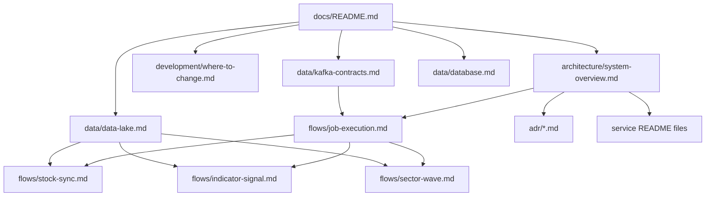

# Omni Documentation

This directory is the documentation entry point for Omni. It is designed to help a new developer understand the system in about 30 minutes without reading implementation-level code first.

## Start Here

1. [System overview](architecture/system-overview.md) — service boundaries, infrastructure, and ownership.
2. [Where to change](development/where-to-change.md) — which project/file area to start from for common changes.
3. [Kafka contracts](data/kafka-contracts.md) — canonical topic and message-contract map.
4. [Data lake](data/data-lake.md) — canonical Parquet dataset and path ownership map.
5. [Job execution](flows/job-execution.md) — how Platform schedules work and aggregates worker status.

## Documentation Map

## Canonical Documents

| Topic | Canonical document | Source of truth |
| --- | --- | --- |
| System boundaries | [architecture/system-overview.md](architecture/system-overview.md) | [`apps`](../apps) and [`libs`](../libs) |
| Developer navigation | [development/where-to-change.md](development/where-to-change.md) | Current project layout |
| Kafka topics/contracts | [data/kafka-contracts.md](data/kafka-contracts.md) | [`configs/shared/topics.yaml`](../configs/shared/topics.yaml) |
| Parquet datasets/paths | [data/data-lake.md](data/data-lake.md) | [`configs/shared/s3-paths.yaml`](../configs/shared/s3-paths.yaml) |
| Database domains | [data/database.md](data/database.md) | [`database/migrations`](../database/migrations) |
| Architecture decisions | [adr](adr) | Accepted ADR files |
| Service details | Service READMEs | [`apps/core`](../apps/core), [`apps/analyzer`](../apps/analyzer), [`apps/ingestor`](../apps/ingestor), [`libs/py-common`](../libs/py-common) |

## Documentation Rules

- Prefer Mermaid diagrams and tables over long prose.
- Keep one canonical document per concept.
- Do not duplicate Kafka topic or S3 path details outside the data docs; link to the canonical contract instead.
- Document flow-level behavior, not every class or method.
- When a large flow changes, update the matching file under [flows](flows).
- When Kafka or storage contracts change, update [data/kafka-contracts.md](data/kafka-contracts.md) or [data/data-lake.md](data/data-lake.md).
- When service responsibility changes, update the related service README.
- Review docs together with code when architecture, storage, or contract behavior changes.
