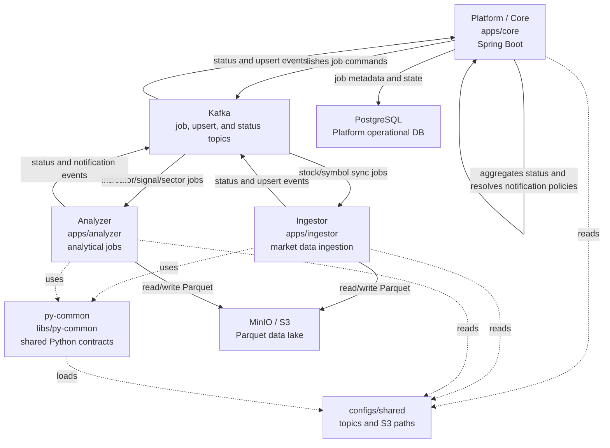
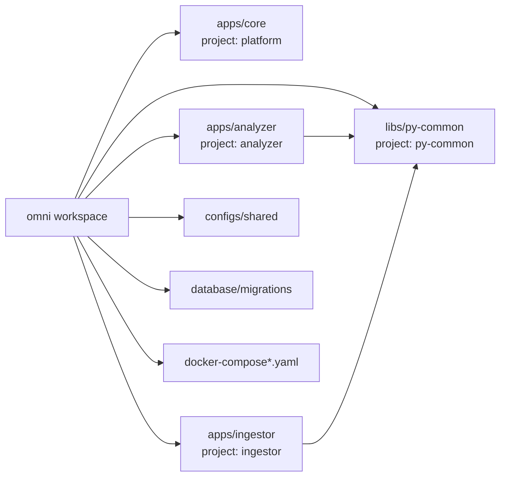

# System Overview

## Cross-service contract ownership

Versioned Kafka and service-to-service Proto3 schemas are owned by the [`contracts`](../../contracts) Nx project. The schemas generate deterministic Java and Python boundary types from one source, while application domain models remain independent. Persisted dataset manifests continue to use JSON and physical object-store paths remain outside business Kafka routing contracts.

The initial contracts project is infrastructure only; production producers and consumers remain on their existing JSON format until rollout-safe compatibility adapters are implemented.

Omni is an Nx monorepo for Vietnamese stock-market data ingestion, analytical precomputation, job orchestration, and operational state tracking.

The system separates orchestration from data processing:

- Platform owns API, scheduler, database-backed job state, and Kafka orchestration.
- Ingestor owns external market-data fetching and raw/normalized Parquet updates.
- Analyzer owns analytical calculations such as indicators, signals, and sector wave datasets.
- py-common owns shared Python infrastructure for configuration, Kafka, runtime, and storage abstractions.

## High-level Architecture

## Runtime Responsibilities

| Component       | Path                                                                 | Responsibility                                                                                                                                                           | Boundary                                                                                                                   |
| --------------- | -------------------------------------------------------------------- | ------------------------------------------------------------------------------------------------------------------------------------------------------------------------ | -------------------------------------------------------------------------------------------------------------------------- |
| Platform / Core | [`apps/core`](../../apps/core)                                       | Owns orchestration, scheduler, producer registry, job definitions, execution history, notification policy selection, API boundary, and Platform database state.          | Does not fetch market data directly, render job notifications in producers, or encode S3 object paths into Kafka messages. |
| Ingestor        | [`apps/ingestor`](../../apps/ingestor)                               | Consumes stock/symbol sync jobs, talks to data providers, normalizes records, writes Parquet, publishes status/upsert events.                                            | Does not own scheduler state or Platform database schema.                                                                  |
| Analyzer        | [`apps/analyzer`](../../apps/analyzer)                               | Consumes analytical jobs, computes indicators/signals/sector wave datasets, writes analytical Parquet, publishes status/notification events, and preserves failure meta. | Does not own stock-price ingestion or Platform transactional database state.                                               |
| py-common       | [`libs/py-common`](../../libs/py-common)                             | Provides shared Python config loading, Kafka payloads, messaging helpers, runtime helpers, storage ports/adapters, and path builders.                                    | Does not contain service-specific business logic.                                                                          |
| PostgreSQL      | [`database/migrations`](../../database/migrations)                   | Stores Platform-owned operational state such as job definitions, job executions, symbols, and sectors.                                                                   | Not the analytical data lake.                                                                                              |
| Kafka           | [`configs/shared/topics.yaml`](../../configs/shared/topics.yaml)     | Carries async job commands, worker status, symbol/sector upserts, signal notifications, and analytical job requests.                                                     | Topic and payload contract changes must update producers, consumers, tests, and docs together.                             |
| MinIO / Parquet | [`configs/shared/s3-paths.yaml`](../../configs/shared/s3-paths.yaml) | Stores raw and analytical datasets as Parquet files in the `stock-data` bucket.                                                                                          | Object paths are derived from shared path builders, not from Kafka message fields.                                         |

## Project Map

## Control Plane vs Data Plane

| Plane          | Owns                                                                                      | Main components                                                                  |
| -------------- | ----------------------------------------------------------------------------------------- | -------------------------------------------------------------------------------- |
| Control plane  | Scheduling, job metadata, execution status, orchestration decisions, API boundary.        | Platform, PostgreSQL, Kafka status topics.                                       |
| Data plane     | Fetching external market data, transforming dataframes, reading/writing Parquet datasets. | Ingestor, Analyzer, MinIO/S3, py-common storage abstractions.                    |
| Contract plane | Topic names, payload fields, storage paths, shared runtime settings.                      | `configs/shared`, py-common payload/settings models, Platform messaging records. |

## Main Flows

| Flow                 | Document                                                     | Summary                                                                                                                                             |
| -------------------- | ------------------------------------------------------------ | --------------------------------------------------------------------------------------------------------------------------------------------------- |
| Job execution        | [../flows/job-execution.md](../flows/job-execution.md)       | `JobScheduler` resolves producers by `JobType`, producers publish Kafka jobs, workers report status, and Platform policy registries notify.         |
| Stock sync           | [../flows/stock-sync.md](../flows/stock-sync.md)             | Platform requests stock/symbol sync, Ingestor fetches provider data, updates Parquet, then reports status/upserts.                                  |
| Indicator and signal | [../flows/indicator-signal.md](../flows/indicator-signal.md) | Analyzer reads EOD/indicator datasets, computes indicators/signals/evaluations, writes Parquet, and publishes status or signal notification events. |
| Sector wave          | [../flows/sector-wave.md](../flows/sector-wave.md)           | Analyzer precomputes symbol features, sector aggregates, rankings, backtest outputs, and Sector Transition research datasets.                       |

## Source-of-truth Config

| Contract                 | Source                                                               |
| ------------------------ | -------------------------------------------------------------------- |
| Kafka topic names        | [`configs/shared/topics.yaml`](../../configs/shared/topics.yaml)     |
| S3/Parquet path patterns | [`configs/shared/s3-paths.yaml`](../../configs/shared/s3-paths.yaml) |
| Platform Nx targets      | [`apps/core/project.json`](../../apps/core/project.json)             |
| Analyzer Nx targets      | [`apps/analyzer/project.json`](../../apps/analyzer/project.json)     |
| Ingestor Nx targets      | [`apps/ingestor/project.json`](../../apps/ingestor/project.json)     |
| py-common Nx targets     | [`libs/py-common/project.json`](../../libs/py-common/project.json)   |
