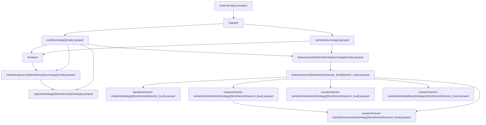

# Data Lake

Omni stores market and analytical datasets as Parquet files in the `stock-data` bucket on MinIO/S3-compatible object storage.

Canonical path patterns live in [`configs/shared/s3-paths.yaml`](../../configs/shared/s3-paths.yaml). This document explains dataset ownership and producer/consumer relationships.

## Dataset Map



## Path Rules

- Exchange names and ticker codes are lowercased in paths.
- Folder names use kebab-case.
- No temporal partitioning such as `dt=` or `run_id=`.
- Files are overwritten or merged in place depending on dataset strategy.
- Kafka messages must not include bucket names or object names for routing.
- Path construction should use shared path builders backed by [`configs/shared/s3-paths.yaml`](../../configs/shared/s3-paths.yaml).

## Dataset Manifests

Every canonical dataset partition publishes metadata under:

```text
_metadata/datasets/<dataset>/<partition_path>/READY.json
_metadata/datasets/<dataset>/<partition_path>/versions/<dataVersion>.json
```

Partition keys are normalized and sorted as `key=value` segments; an empty
partition uses `_default`. The immutable version manifest is written after the
Parquet data is validated, and the mutable `READY.json` pointer is replaced last.

### Manifest Schema

Manifests follow a standardized JSON schema:

```json
{
  "version": 1,
  "dataset": "eod",
  "partition": { "exchange": "hose" },
  "status": "READY",
  "dataVersion": "sha256:abc123...",
  "path": "eod/hose/*.parquet",
  "objectCount": 3,
  "totalBytes": 1048576,
  "rowCount": 1234,
  "columnCount": 15,
  "columns": [
    { "name": "date", "type": "TIMESTAMP", "nullable": false },
    { "name": "close", "type": "DOUBLE", "nullable": false }
  ],
  "schemaVersion": 1,
  "schemaHash": "sha256:def456...",
  "minTimestamp": "2024-01-01T00:00:00Z",
  "maxTimestamp": "2026-08-18T00:00:00Z",
  "inputs": [
    {
      "dataset": "upstream_dataset",
      "partition": { "key": "value" },
      "dataVersion": "sha256:xyz789..."
    }
  ],
  "generatedAt": "2026-08-18T12:00:00Z"
}
```

### READY-Last Semantics

- Exact Parquet bytes are written and validated first.
- Their SHA-256 checksums and byte lengths provide physical object identity.
- The immutable `versions/<dataVersion>.json` manifest is published next.
- `READY.json` is replaced **last**; `status: "READY"` guarantees the referenced data is valid and complete.
- Immutable-write failure does not attempt READY publication.
- READY replacement failure performs no compensating write, so the prior READY object remains authoritative.

### Data Versioning

`dataVersion` is a deterministic SHA-256 fingerprint calculated from:

```text
SHA256(dataset + normalized_partition + schemaHash + object_checksums + inputs)
```

Physical objects and lineage inputs are canonically sorted. `generatedAt` is
excluded so an idempotent retry of identical content retains the same identity.

This enables:

- Exact dependency tracking via `inputs[].dataVersion`
- Change detection without scanning Parquet files
- Lineage verification across pipeline stages
- Idempotent reprocessing with content-based versioning

### Readiness Checks

Dataset consumers should check readiness via manifests instead of scanning Parquet prefixes:

```python
from py_common.storage.manifest import ManifestReader

# Read manifest
manifest = await reader.read_manifest('eod', {'exchange': 'hose'})

# Check readiness
if manifest and manifest.status == 'READY':
    # Dataset is ready
    data_version = manifest.dataVersion
    row_count = manifest.rowCount
```

Do not scan the Parquet prefix for existence checks when a manifest exists. Use the manifest as the source of truth.

### Global Catalog

A global catalog at `_metadata/catalog.json` lists all known datasets:

```json
{
  "version": 1,
  "datasets": [
    {
      "name": "eod",
      "description": "End-of-day price data"
    },
    {
      "name": "indicators",
      "description": "Technical indicators"
    }
  ],
  "lastUpdated": "2026-08-18T12:00:00Z"
}
```

The catalog is bootstrapped from the `OMNI_DATASETS` registry in [`py_common.storage.manifest`](../../libs/py-common/py_common/storage/manifest.py).

### Integration

Dataset producers must call `publish_dataset_manifest()` after successful Parquet writes:

```python
from py_common.storage.manifest import publish_dataset_manifest, ManifestWriter

# After writing Parquet data
await publish_dataset_manifest(
    writer=manifest_writer,
    dataset='eod',
    partition={'exchange': 'hose'},
    data_path='eod/hose/*.parquet',
    dataframe=eod_df,
    inputs=[],  # Upstream dependencies if applicable
)
```

### Automatic EOD Metadata Reconciliation

P3-I5 adds a scheduled and manually triggerable `SYNC_METADATA` worker. Analyzer
lists the internal canonical EOD prefix and accepts only exact
`eod/<exchange>/<code>.parquet` objects; storage location and credentials never
cross the Kafka or browser contract.

```text
canonical EOD Parquet objects
  -> read exact persisted bytes
  -> read and validate persisted bytes
  -> derive schema, rows, objects, bytes, checksums, and date range
  -> calculate canonical deterministic dataVersion
  -> write immutable version manifest
  -> replace READY last
```

This operation scans EOD partitions but does not recompute analytical data, rewrite
Parquet, or change dataset ownership. A corrupt or empty object cannot produce a
READY manifest; if no valid object is publishable, the job fails and does not write
the catalog. Derived datasets are excluded because reconstructing their exact
historical lineage from bytes alone is unsafe.

See [Dataset Metadata Manifest Implementation Plan](../plans/003-dataset-metadata-manifest.md) for full details and
[Phase 3 P3-I5](../../plans/roadmap/phase-3-dataset-manifests.md#increment-p3-i5--automatic-eod-metadata-reconciliation)
for the implemented scope and acceptance criteria.

## Datasets

### symbols

| Field           | Value                                                                                     |
| --------------- | ----------------------------------------------------------------------------------------- |
| Config key      | `symbols`                                                                                 |
| Path            | `symbols/{exchange}.parquet`                                                              |
| Producer        | Ingestor                                                                                  |
| Consumer        | Analyzer, Platform via upsert events                                                      |
| Schema/key      | Exchange-level symbol metadata. Stable keys should include exchange and symbol code.      |
| Update strategy | Refresh or merge exchange snapshot, then publish symbol/sector upsert events when needed. |
| Ownership       | Ingestor owns Parquet production; Platform owns database projection.                      |

### eod

| Field           | Value                                                                                                                                       |
| --------------- | ------------------------------------------------------------------------------------------------------------------------------------------- |
| Config key      | `eod`                                                                                                                                       |
| Path            | `eod/{exchange}/{code}.parquet`                                                                                                             |
| Producer        | Ingestor                                                                                                                                    |
| Consumer        | Analyzer indicator, signal, and sector-wave jobs; Indicator jobs resolve the exact `exchange`/`code` READY manifest and consume its `path`. |
| Schema/key      | One symbol per file, keyed by trading date/timeframe data columns.                                                                          |
| Update strategy | Merge incremental provider rows with existing Parquet and deduplicate by date.                                                              |
| Ownership       | Ingestor owns EOD Parquet files.                                                                                                            |

### indicators

| Field           | Value                                                                                                                                                                                  |
| --------------- | -------------------------------------------------------------------------------------------------------------------------------------------------------------------------------------- |
| Config key      | `indicators`                                                                                                                                                                           |
| Path            | `indicators/{source}/{timeframe}/{exchange}/{code}.parquet`                                                                                                                            |
| Producer        | Analyzer indicator jobs                                                                                                                                                                |
| Consumer        | Analyzer signal jobs and analytical consumers                                                                                                                                          |
| Schema/key      | One symbol, source, and timeframe per file. Keys should include date and indicator columns.                                                                                            |
| Update strategy | Recompute/write from the exact EOD READY version, then publish READY last with one matching EOD entry in `inputs[]`; missing, invalid, or non-READY EOD metadata prevents publication. |
| Ownership       | Analyzer owns indicator outputs.                                                                                                                                                       |

### signals

| Field           | Value                                                                                                             |
| --------------- | ----------------------------------------------------------------------------------------------------------------- |
| Config key      | `signals` and compatibility alias `signal-current`                                                                |
| Path            | `signals/{strategy}/{timeframe}/{exchange}.parquet`                                                               |
| Producer        | Analyzer signal jobs                                                                                              |
| Consumer        | Analyzer evaluation jobs, Platform notifications/status consumers, analytical consumers                           |
| Schema/key      | Strategy/timeframe/exchange-level signal history. Stable keys should include symbol and signal date.              |
| Update strategy | Upsert new signal rows into history; latest state is derived from history.                                        |
| Ownership       | Analyzer owns signal calculation and Parquet history; Platform owns notification delivery and operational status. |

### symbol-features

| Field           | Value                                                                                                               |
| --------------- | ------------------------------------------------------------------------------------------------------------------- |
| Config key      | `symbol-features`                                                                                                   |
| Path            | `features/symbol/{timeframe}/{exchange}/{code}.parquet`                                                             |
| Producer        | Analyzer sector-wave symbol-feature jobs                                                                            |
| Consumer        | Analyzer sector aggregation jobs                                                                                    |
| Schema/key      | Symbol-level features by date/timeframe. Includes momentum/return/breadth input columns used by sector aggregation. |
| Update strategy | Precompute per symbol from EOD and metadata inputs.                                                                 |
| Ownership       | Analyzer owns feature generation.                                                                                   |

### sector-features

| Field           | Value                                                                                                                             |
| --------------- | --------------------------------------------------------------------------------------------------------------------------------- |
| Config key      | `sector-features`                                                                                                                 |
| Path            | `features/sector/{timeframe}/lv{sector_level}/{sector_code}.parquet`                                                              |
| Producer        | Analyzer sector-wave sector-feature jobs                                                                                          |
| Consumer        | Analyzer ranking/backtest jobs and analytical consumers                                                                           |
| Schema/key      | Sector-level aggregate rows by date/timeframe/sector.                                                                             |
| Update strategy | Aggregate symbol features into sector metrics such as breadth, coverage, contributors, contribution share, and relative strength. |
| Ownership       | Analyzer owns sector aggregation.                                                                                                 |

### sector-rotation-backtests

| Field           | Value                                                                                          |
| --------------- | ---------------------------------------------------------------------------------------------- |
| Config key      | `sector-rotation-backtests`                                                                    |
| Path            | `backtests/sector-rotation/{strategy}/{timeframe}/lv{sector_level}.parquet`                    |
| Producer        | Analyzer sector-rotation backtest jobs                                                         |
| Consumer        | Analytical API/reporting consumers                                                             |
| Schema/key      | Strategy/timeframe/sector-level backtest results keyed by evaluation date and holding horizon. |
| Update strategy | Recompute strategy outputs from sector-feature datasets and forward returns.                   |
| Ownership       | Analyzer owns backtest outputs.                                                                |

### sector-transition-predictions

| Field           | Value                                                                                                                                                                                                                                           |
| --------------- | ----------------------------------------------------------------------------------------------------------------------------------------------------------------------------------------------------------------------------------------------- |
| Config key      | `sector-transition-predictions`                                                                                                                                                                                                                 |
| Path            | `research/sector-transition/predictions/{strategy}/{timeframe}/lv{sector_level}.parquet`                                                                                                                                                        |
| Producer        | Analyzer Sector Transition analysis jobs                                                                                                                                                                                                        |
| Consumer        | Analyzer outcome-evaluation jobs and internal research consumers                                                                                                                                                                                |
| Schema/key      | Focused T-anchored prediction rows keyed by `evaluation_date`, `strategy`, `timeframe`, `sector_level`, `from_sector`, `to_sector`, and `horizon_sessions`; rows also carry trading-session `target_date`, `sample_count`, and `model_version`. |
| Update strategy | Merge/upsert by prediction identity without rewriting later outcome facts into original prediction rows.                                                                                                                                        |
| Ownership       | Analyzer owns research prediction outputs.                                                                                                                                                                                                      |

### sector-transition-decisions

| Field           | Value                                                                                                                                                                                                                        |
| --------------- | ---------------------------------------------------------------------------------------------------------------------------------------------------------------------------------------------------------------------------- |
| Config key      | `sector-transition-decisions`                                                                                                                                                                                                |
| Path            | `research/sector-transition/decisions/{strategy}/{timeframe}/lv{sector_level}.parquet`                                                                                                                                       |
| Producer        | Analyzer Sector Transition analysis jobs                                                                                                                                                                                     |
| Consumer        | Internal/private research review only unless product/legal approves exposure.                                                                                                                                                |
| Schema/key      | Private focused decision rows keyed by `evaluation_date`, `strategy`, `timeframe`, `sector_level`, `from_sector`, `to_sector`, and `horizon_sessions`; decisions include score, confidence, sample count, and model version. |
| Update strategy | Merge/upsert current research decisions; keep visibility as `PRIVATE_INTERNAL`.                                                                                                                                              |
| Ownership       | Analyzer owns private research decision outputs.                                                                                                                                                                             |

### sector-transition-probabilities

| Field           | Value                                                                                                                                                                                                                                              |
| --------------- | -------------------------------------------------------------------------------------------------------------------------------------------------------------------------------------------------------------------------------------------------- |
| Config key      | `sector-transition-probabilities`                                                                                                                                                                                                                  |
| Path            | `research/sector-transition/probabilities/{strategy}/{timeframe}/lv{sector_level}.parquet`                                                                                                                                                         |
| Producer        | Analyzer Sector Transition analysis jobs                                                                                                                                                                                                           |
| Consumer        | Internal research diagnostics and model evaluation.                                                                                                                                                                                                |
| Schema/key      | Full-universe transition probability rows keyed by `evaluation_date`, `strategy`, `timeframe`, `sector_level`, `from_sector`, `to_sector`, and `horizon_sessions`; rows include `target_date`, `probability`, `sample_count`, and `model_version`. |
| Update strategy | Merge/upsert probability estimates derived only from data knowable at or before `evaluationDate`; self-transitions remain normal candidates and per-`from_sector`/horizon probabilities should sum to approximately `1.0` when samples exist.      |
| Ownership       | Analyzer owns research probability outputs.                                                                                                                                                                                                        |

### sector-transition-outcomes

| Field           | Value                                                                                                                                                                                                       |
| --------------- | ----------------------------------------------------------------------------------------------------------------------------------------------------------------------------------------------------------- |
| Config key      | `sector-transition-outcomes`                                                                                                                                                                                |
| Path            | `research/sector-transition/outcomes/{strategy}/{timeframe}/lv{sector_level}.parquet`                                                                                                                       |
| Producer        | Analyzer Sector Transition outcome-evaluation jobs                                                                                                                                                          |
| Consumer        | Internal model evaluation, backtesting, and diagnostics.                                                                                                                                                    |
| Schema/key      | Realized focused outcome rows keyed by original prediction identity (`evaluation_date`, `strategy`, `timeframe`, `sector_level`, `from_sector`, `to_sector`, `horizon_sessions`) and realized horizon date. |
| Update strategy | Append/merge realized outcomes separately from predictions once future sessions are available; do not rewrite historical prediction probabilities.                                                          |
| Ownership       | Analyzer owns outcome-evaluation outputs.                                                                                                                                                                   |

## Canonical Parquet date and timestamp types

All implemented analytical producers share the contract in
`py_common.storage.date_contracts`; producer-local dtype inference is not an
authoritative schema contract.

| Meaning                  | Semantic columns                                                                                              | Arrow/Parquet           | DuckDB and manifest                |
| ------------------------ | ------------------------------------------------------------------------------------------------------------- | ----------------------- | ---------------------------------- |
| Business or trading date | `date`, `signal_date`, `evaluation_date`, `target_date`, `resolved_date`, `generated_from_date`               | `date32`                | `DATE`                             |
| Event instant            | `generated_at`, `calculated_at`, `updated_at`, `last_recalculated_at`, `actual_updated_at`, `*_calculated_at` | `timestamp[us, tz=UTC]` | `TIMESTAMPTZ` / `TIMESTAMP_US_UTC` |

The shared decoder normalizes legacy strings and timestamp-backed business dates
before Analyzer joins. Query Service uses READY manifest columns to cast legacy
physical values into the same DuckDB types. Field names remain semantic.

Existing READY objects are migrated only through a versioned sibling rewrite.
The candidate is read back before an immutable manifest and then READY are
published. Failure leaves the previous READY object and pointer valid; wildcard
and multi-object partitions require a dataset-owner-specific rewrite. See
[Normalize Parquet Date Contracts](../../plans/parquet-date-normalization-increment.md).

## Future Expansion Paths

[`configs/shared/s3-paths.yaml`](../../configs/shared/s3-paths.yaml) also reserves path keys for future datasets, including intraday, financials, fundamentals, corporate actions, ownership, news, macro, derivatives, warrants, and ETF data. Do not document these as implemented flows until producers and consumers exist.

## Ownership Summary

| Dataset family             | Producer | Primary consumers                                           |
| -------------------------- | -------- | ----------------------------------------------------------- |
| Reference market data      | Ingestor | Platform, Analyzer                                          |
| EOD prices                 | Ingestor | Analyzer                                                    |
| Indicators                 | Analyzer | Analyzer signal/evaluation jobs                             |
| Signals                    | Analyzer | Analyzer evaluation jobs, Platform notification/status path |
| Sector wave features       | Analyzer | Analyzer sector ranking/backtesting                         |
| Backtests                  | Analyzer | Analytical/reporting consumers                              |
| Sector Transition research | Analyzer | Internal research, diagnostics, and outcome evaluation      |
