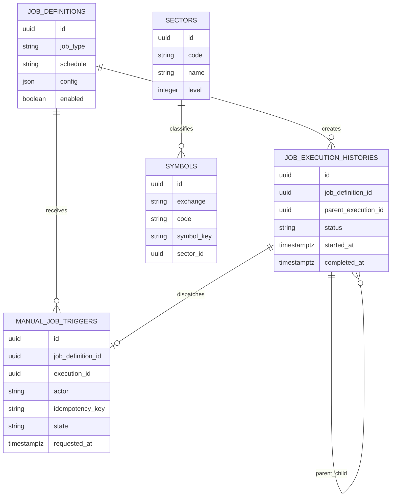

# Database

PostgreSQL stores Platform-owned operational state. It is not the analytical data lake; market and analytical datasets live in MinIO/S3 as Parquet files.

Flyway migrations under [`database/migrations`](../../database/migrations) are the source of truth for active Platform schema. Reference or older schema material may exist under [`database/refs`](../../database/refs), but it should not be treated as the active migration chain.

## Domain Relationship Map

## Important Domains

### Job definitions

| Field          | Value                                                                                                                                                                                      |
| -------------- | ------------------------------------------------------------------------------------------------------------------------------------------------------------------------------------------ |
| Migration      | [`database/migrations/V1__create_job_definitions_table.sql`](../../database/migrations/V1__create_job_definitions_table.sql)                                                               |
| Owner          | Platform scheduler module                                                                                                                                                                  |
| Purpose        | Stores configured jobs, schedules, and job-specific config.                                                                                                                                |
| Related source | [`apps/core/src/main/java/com/omni/platform/modules/scheduler/entities/JobDefinition.java`](../../apps/core/src/main/java/com/omni/platform/modules/scheduler/entities/JobDefinition.java) |
| Related flow   | [Job execution](../flows/001-job-execution.md)                                                                                                                                             |

### Job execution history

| Field          | Value                                                                                                                                                                                                                                                                                                                                                            |
| -------------- | ---------------------------------------------------------------------------------------------------------------------------------------------------------------------------------------------------------------------------------------------------------------------------------------------------------------------------------------------------------------- |
| Migrations     | [`V2__create_job_execution_histories_table.sql`](../../database/migrations/V2__create_job_execution_histories_table.sql), [`V9__backfill_execution_work_identity.sql`](../../database/migrations/V9__backfill_execution_work_identity.sql), [`V11__dependency_aware_scheduler_outbox.sql`](../../database/migrations/V11__dependency_aware_scheduler_outbox.sql) |
| Owner          | Platform scheduler module                                                                                                                                                                                                                                                                                                                                        |
| Purpose        | Tracks parent and child executions, worker status, metrics, and errors.                                                                                                                                                                                                                                                                                          |
| Related source | [`apps/core/src/main/java/com/omni/platform/modules/scheduler/entities/JobExecutionHistory.java`](../../apps/core/src/main/java/com/omni/platform/modules/scheduler/entities/JobExecutionHistory.java)                                                                                                                                                           |
| Related flow   | [Job execution](../flows/001-job-execution.md)                                                                                                                                                                                                                                                                                                                   |

Child rows store canonical execution identity in `meta_json.workType` and
`meta_json.workKey`. V9 is a schema-only cutover: it never deletes or rewrites
operational records, refuses to run while pending scheduler outbox work exists,
and requires operators to clear all execution history manually before deployment.
After those preconditions pass, it replaces symbol-key indexes with canonical
work-identity/offset indexes. Domain payloads may still contain `symbolKey`; it is
not used for execution lookup. V11 adds terminal `BLOCKED` execution semantics for
terminal dependency decisions. `BLOCKED` is not a worker failure and must not be
rewritten to `FAILED`.

Phase 13 P13-I1 plans additive authoritative stage evidence so dispatch preparation,
dependency wait, outbox publication, worker wait, processing start, terminal-status
publication, and Platform application can be measured separately. Current child
`RUNNING`/`started_at` values may originate during dispatch preparation and therefore
must not be treated as proof of active processing. The future migration must preserve
legacy rows as explicitly unknown where evidence is absent; this document does not
claim that migration exists.

### Scheduler outbox

| Field      | Value                                                                                                                                                                                                                |
| ---------- | -------------------------------------------------------------------------------------------------------------------------------------------------------------------------------------------------------------------- |
| Migrations | [`V6__create_scheduler_outbox.sql`](../../database/migrations/V6__create_scheduler_outbox.sql), [`V11__dependency_aware_scheduler_outbox.sql`](../../database/migrations/V11__dependency_aware_scheduler_outbox.sql) |
| Owner      | Platform scheduler module                                                                                                                                                                                            |
| Purpose    | Commits immutable execution/message intent before dependency evaluation, then supports fenced READY claims, retryable WAITING, and terminal BLOCKED disposition.                                                     |

`PENDING` rows are over-fetched as unclaimed candidates. Manifest and exact
run/work eligibility is evaluated without holding a database transaction. Only a
still-PENDING row can then be atomically claimed; this transition increments the
delivery attempt and installs a lease/fencing token. WAITING updates bounded
`dependency_reason` and `available_at` without incrementing attempts. BLOCKED is
terminal, clears claim fields, transitions the execution to terminal `BLOCKED`,
and is excluded from all pending candidate and claim predicates. Existing
PENDING/PUBLISHED rows and audit history are preserved by the additive migration.
Phase 13 P13-I2 plans read-only aggregate visibility over publishable, dependency-waiting,
claimed, and future-retry backlog, including recent publish rate and a guarded drain
estimate for the eligible snapshot. That estimate does not mutate outbox state and does
not predict worker completion.

The reproducible disposable-database harness is
[`database/tests/p1_i4_work_identity_migration.sql`](../../database/tests/p1_i4_work_identity_migration.sql).
It runs V9 twice against empty execution history, verifies both canonical indexes,
and uses PostgreSQL `dblink` to prove that remaining execution history or pending
outbox work aborts the migration. This evidence does not target or modify
production.

### Notification outbox

| Field          | Value                                                                                                                                                                                                                      |
| -------------- | -------------------------------------------------------------------------------------------------------------------------------------------------------------------------------------------------------------------------- |
| Migration      | [`database/migrations/V10__create_notification_outbox.sql`](../../database/migrations/V10__create_notification_outbox.sql)                                                                                                 |
| Owner          | Platform notifications module                                                                                                                                                                                              |
| Purpose        | Durable, idempotent provider-delivery state with leased claims, fencing, bounded retries, and visible `SENT`/`DEAD` outcomes.                                                                                              |
| Related source | [`apps/core/src/main/java/com/omni/platform/modules/notifications/entities/NotificationOutboxMessage.java`](../../apps/core/src/main/java/com/omni/platform/modules/notifications/entities/NotificationOutboxMessage.java) |
| Related plan   | [Notification outbox](../plans/022-notification-outbox.md)                                                                                                                                                                 |

The payload is a versioned typed notification request. Provider credentials, API
credentials, and concrete chat identifiers are resolved from configuration only at
dispatch and are never stored in either notification table. The separate
`notification_provider_rate_limits` row serializes provider permits across Platform
instances. `DEAD` rows are visible terminal records and are not replayed automatically.

### Symbols

### Manual job triggers

| Field          | Value                                                                                                                                                                                            |
| -------------- | ------------------------------------------------------------------------------------------------------------------------------------------------------------------------------------------------ |
| Migration      | [`database/migrations/V8__create_manual_job_triggers.sql`](../../database/migrations/V8__create_manual_job_triggers.sql)                                                                         |
| Owner          | Platform scheduler/job-operations module                                                                                                                                                         |
| Purpose        | Durable operator audit and idempotency ledger; accepted work has a stable execution/outbox identity before its later dependency decision.                                                        |
| Related source | [`apps/core/src/main/java/com/omni/platform/modules/scheduler/entities/ManualJobTrigger.java`](../../apps/core/src/main/java/com/omni/platform/modules/scheduler/entities/ManualJobTrigger.java) |
| Related flow   | [Job execution](../flows/001-job-execution.md)                                                                                                                                                   |

### Symbols

| Field          | Value                                                                                                                                                                        |
| -------------- | ---------------------------------------------------------------------------------------------------------------------------------------------------------------------------- |
| Migration      | [`database/migrations/V3__create_symbols_table.sql`](../../database/migrations/V3__create_symbols_table.sql)                                                                 |
| Owner          | Platform scheduler/domain projection                                                                                                                                         |
| Purpose        | Stores Platform query/projection state for tradable symbols.                                                                                                                 |
| Related source | [`apps/core/src/main/java/com/omni/platform/modules/scheduler/entities/Symbol.java`](../../apps/core/src/main/java/com/omni/platform/modules/scheduler/entities/Symbol.java) |
| Upsert topic   | [`topic-upsert-symbols`](001-kafka-contracts.md#topic-upsert-symbols)                                                                                                        |

### Sectors

| Field          | Value                                                                                                                                                                        |
| -------------- | ---------------------------------------------------------------------------------------------------------------------------------------------------------------------------- |
| Migration      | [`database/migrations/V4__create_sectors_table.sql`](../../database/migrations/V4__create_sectors_table.sql)                                                                 |
| Owner          | Platform scheduler/domain projection                                                                                                                                         |
| Purpose        | Stores sector classification state used by symbol metadata and sector-wave jobs.                                                                                             |
| Related source | [`apps/core/src/main/java/com/omni/platform/modules/scheduler/entities/Sector.java`](../../apps/core/src/main/java/com/omni/platform/modules/scheduler/entities/Sector.java) |
| Upsert topic   | [`topic-upsert-sectors`](001-kafka-contracts.md#topic-upsert-sectors)                                                                                                        |

## Planned Data Health memory cache

Owner decision (2026-10-07): Query Service owns a bounded process-local cache of manual EOD scan runs/results and provenance. Data Health adds no PostgreSQL table, SQLite store, Redis, disk persistence, or analytical EOD copy. Exact dataset/partition/dataVersion/scope/rule/evidence keys, TTL, entry/byte/finding limits, in-flight deduplication, explicit refresh, and restart behavior are defined in [Plan 029](../plans/029-operator-trust-console.md#data-health-in-memory-cache).

Cache loss or restart requires another manual scan; it is not durable audit history and is not shared across processes or replicas. Platform operational-stage persistence remains separate. Calendar/lifecycle evidence still requires approval or explicit narrowing of classifications.

## Boundary Rules

- Platform owns migrations and PostgreSQL state.
- Ingestor and Analyzer should communicate operational results through Kafka, not direct writes to Platform tables.
- Analytical datasets belong in the Parquet data lake, not in Platform transactional tables.
- Schema changes require migrations, Platform code updates, tests, and documentation updates when domain meaning changes.

## Adding a Migration

1. Inspect the highest active version in [`database/migrations`](../../database/migrations).
2. Add the next file using `V<N>__<description>.sql`.
3. Keep changes domain-focused and reversible by future migrations.
4. Update Platform entities/repositories/services as needed.
5. Update this document if the migration adds or changes an important domain.
6. Verify through the relevant Nx target, usually Platform build/tests.
7. For data-changing migrations, add a disposable-database harness when no Nx
   database target exists; record that exception and never substitute production
   execution for migration tests.
