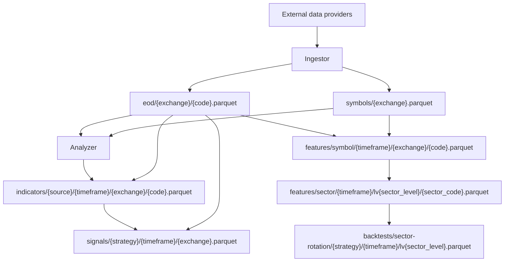

# Data Lake

Omni stores market and analytical datasets as Parquet files in the `stock-data` bucket on MinIO/S3-compatible object storage.

Canonical path patterns live in [`configs/shared/s3-paths.yaml`](../../configs/shared/s3-paths.yaml). This document explains dataset ownership and producer/consumer relationships.

## Dataset Map

## Path Rules

- Exchange names and ticker codes are lowercased in paths.
- Folder names use kebab-case.
- No temporal partitioning such as `dt=` or `run_id=`.
- Files are overwritten or merged in place depending on dataset strategy.
- Kafka messages must not include bucket names or object names for routing.
- Path construction should use shared path builders backed by [`configs/shared/s3-paths.yaml`](../../configs/shared/s3-paths.yaml).

## Datasets

### symbols

| Field           | Value                                                                                     |
| --------------- | ----------------------------------------------------------------------------------------- |
| Config key      | `symbols`                                                                                 |
| Path            | `symbols/{exchange}.parquet`                                                              |
| Producer        | Ingestor                                                                                  |
| Consumer        | Analyzer, Platform via upsert events                                                      |
| Schema/key      | Exchange-level symbol metadata. Stable keys should include exchange and symbol code.      |
| Update strategy | Refresh or merge exchange snapshot, then publish symbol/sector upsert events when needed. |
| Ownership       | Ingestor owns Parquet production; Platform owns database projection.                      |

### eod

| Field           | Value                                                                          |
| --------------- | ------------------------------------------------------------------------------ |
| Config key      | `eod`                                                                          |
| Path            | `eod/{exchange}/{code}.parquet`                                                |
| Producer        | Ingestor                                                                       |
| Consumer        | Analyzer indicator, signal, and sector-wave jobs                               |
| Schema/key      | One symbol per file, keyed by trading date/timeframe data columns.             |
| Update strategy | Merge incremental provider rows with existing Parquet and deduplicate by date. |
| Ownership       | Ingestor owns EOD Parquet files.                                               |

### indicators

| Field           | Value                                                                                       |
| --------------- | ------------------------------------------------------------------------------------------- |
| Config key      | `indicators`                                                                                |
| Path            | `indicators/{source}/{timeframe}/{exchange}/{code}.parquet`                                 |
| Producer        | Analyzer indicator jobs                                                                     |
| Consumer        | Analyzer signal jobs and analytical consumers                                               |
| Schema/key      | One symbol, source, and timeframe per file. Keys should include date and indicator columns. |
| Update strategy | Recompute/write supported indicator set from EOD input for the requested window.            |
| Ownership       | Analyzer owns indicator outputs.                                                            |

### signals

| Field           | Value                                                                                                             |
| --------------- | ----------------------------------------------------------------------------------------------------------------- |
| Config key      | `signals` and compatibility alias `signal-current`                                                                |
| Path            | `signals/{strategy}/{timeframe}/{exchange}.parquet`                                                               |
| Producer        | Analyzer signal jobs                                                                                              |
| Consumer        | Analyzer evaluation jobs, Platform notifications/status consumers, analytical consumers                           |
| Schema/key      | Strategy/timeframe/exchange-level signal history. Stable keys should include symbol and signal date.              |
| Update strategy | Upsert new signal rows into history; latest state is derived from history.                                        |
| Ownership       | Analyzer owns signal calculation and Parquet history; Platform owns notification delivery and operational status. |

### symbol-features

| Field           | Value                                                                                                               |
| --------------- | ------------------------------------------------------------------------------------------------------------------- |
| Config key      | `symbol-features`                                                                                                   |
| Path            | `features/symbol/{timeframe}/{exchange}/{code}.parquet`                                                             |
| Producer        | Analyzer sector-wave symbol-feature jobs                                                                            |
| Consumer        | Analyzer sector aggregation jobs                                                                                    |
| Schema/key      | Symbol-level features by date/timeframe. Includes momentum/return/breadth input columns used by sector aggregation. |
| Update strategy | Precompute per symbol from EOD and metadata inputs.                                                                 |
| Ownership       | Analyzer owns feature generation.                                                                                   |

### sector-features

| Field           | Value                                                                                                                             |
| --------------- | --------------------------------------------------------------------------------------------------------------------------------- |
| Config key      | `sector-features`                                                                                                                 |
| Path            | `features/sector/{timeframe}/lv{sector_level}/{sector_code}.parquet`                                                              |
| Producer        | Analyzer sector-wave sector-feature jobs                                                                                          |
| Consumer        | Analyzer ranking/backtest jobs and analytical consumers                                                                           |
| Schema/key      | Sector-level aggregate rows by date/timeframe/sector.                                                                             |
| Update strategy | Aggregate symbol features into sector metrics such as breadth, coverage, contributors, contribution share, and relative strength. |
| Ownership       | Analyzer owns sector aggregation.                                                                                                 |

### sector-rotation-backtests

| Field           | Value                                                                                          |
| --------------- | ---------------------------------------------------------------------------------------------- |
| Config key      | `sector-rotation-backtests`                                                                    |
| Path            | `backtests/sector-rotation/{strategy}/{timeframe}/lv{sector_level}.parquet`                    |
| Producer        | Analyzer sector-rotation backtest jobs                                                         |
| Consumer        | Analytical API/reporting consumers                                                             |
| Schema/key      | Strategy/timeframe/sector-level backtest results keyed by evaluation date and holding horizon. |
| Update strategy | Recompute strategy outputs from sector-feature datasets and forward returns.                   |
| Ownership       | Analyzer owns backtest outputs.                                                                |

## Future Expansion Paths

[`configs/shared/s3-paths.yaml`](../../configs/shared/s3-paths.yaml) also reserves path keys for future datasets, including intraday, financials, fundamentals, corporate actions, ownership, news, macro, derivatives, warrants, and ETF data. Do not document these as implemented flows until producers and consumers exist.

## Ownership Summary

| Dataset family        | Producer | Primary consumers                                           |
| --------------------- | -------- | ----------------------------------------------------------- |
| Reference market data | Ingestor | Platform, Analyzer                                          |
| EOD prices            | Ingestor | Analyzer                                                    |
| Indicators            | Analyzer | Analyzer signal/evaluation jobs                             |
| Signals               | Analyzer | Analyzer evaluation jobs, Platform notification/status path |
| Sector wave features  | Analyzer | Analyzer sector ranking/backtesting                         |
| Backtests             | Analyzer | Analytical/reporting consumers                              |
