# Database

PostgreSQL stores Platform-owned operational state. It is not the analytical data lake; market and analytical datasets live in MinIO/S3 as Parquet files.

Flyway migrations under [`database/migrations`](../../database/migrations) are the source of truth for active Platform schema. Reference or older schema material may exist under [`database/refs`](../../database/refs), but it should not be treated as the active migration chain.

## Domain Relationship Map

```mermaid
erDiagram
  JOB_DEFINITIONS ||--o{ JOB_EXECUTION_HISTORIES : creates
  JOB_EXECUTION_HISTORIES ||--o{ JOB_EXECUTION_HISTORIES : parent_child
  SECTORS ||--o{ SYMBOLS : classifies

  JOB_DEFINITIONS {
    uuid id
    string job_type
    string schedule
    json config
    boolean enabled
  }

  JOB_EXECUTION_HISTORIES {
    uuid id
    uuid job_definition_id
    uuid parent_execution_id
    string status
    timestamptz started_at
    timestamptz completed_at
  }

  SYMBOLS {
    uuid id
    string exchange
    string code
    string symbol_key
    uuid sector_id
  }

  SECTORS {
    uuid id
    string code
    string name
    integer level
  }
```

## Important Domains

### Job definitions

| Field          | Value                                                                                                                                                                                      |
| -------------- | ------------------------------------------------------------------------------------------------------------------------------------------------------------------------------------------ |
| Migration      | [`database/migrations/V1__create_job_definitions_table.sql`](../../database/migrations/V1__create_job_definitions_table.sql)                                                               |
| Owner          | Platform scheduler module                                                                                                                                                                  |
| Purpose        | Stores configured jobs, schedules, and job-specific config.                                                                                                                                |
| Related source | [`apps/core/src/main/java/com/omni/platform/modules/scheduler/entities/JobDefinition.java`](../../apps/core/src/main/java/com/omni/platform/modules/scheduler/entities/JobDefinition.java) |
| Related flow   | [Job execution](../flows/job-execution.md)                                                                                                                                                 |

### Job execution history

| Field          | Value                                                                                                                                                                                                  |
| -------------- | ------------------------------------------------------------------------------------------------------------------------------------------------------------------------------------------------------ |
| Migration      | [`database/migrations/V2__create_job_execution_histories_table.sql`](../../database/migrations/V2__create_job_execution_histories_table.sql)                                                           |
| Owner          | Platform scheduler module                                                                                                                                                                              |
| Purpose        | Tracks parent and child executions, worker status, metrics, and errors.                                                                                                                                |
| Related source | [`apps/core/src/main/java/com/omni/platform/modules/scheduler/entities/JobExecutionHistory.java`](../../apps/core/src/main/java/com/omni/platform/modules/scheduler/entities/JobExecutionHistory.java) |
| Related flow   | [Job execution](../flows/job-execution.md)                                                                                                                                                             |

### Symbols

| Field          | Value                                                                                                                                                                        |
| -------------- | ---------------------------------------------------------------------------------------------------------------------------------------------------------------------------- |
| Migration      | [`database/migrations/V3__create_symbols_table.sql`](../../database/migrations/V3__create_symbols_table.sql)                                                                 |
| Owner          | Platform scheduler/domain projection                                                                                                                                         |
| Purpose        | Stores Platform query/projection state for tradable symbols.                                                                                                                 |
| Related source | [`apps/core/src/main/java/com/omni/platform/modules/scheduler/entities/Symbol.java`](../../apps/core/src/main/java/com/omni/platform/modules/scheduler/entities/Symbol.java) |
| Upsert topic   | [`topic-upsert-symbols`](kafka-contracts.md#topic-upsert-symbols)                                                                                                            |

### Sectors

| Field          | Value                                                                                                                                                                        |
| -------------- | ---------------------------------------------------------------------------------------------------------------------------------------------------------------------------- |
| Migration      | [`database/migrations/V4__create_sectors_table.sql`](../../database/migrations/V4__create_sectors_table.sql)                                                                 |
| Owner          | Platform scheduler/domain projection                                                                                                                                         |
| Purpose        | Stores sector classification state used by symbol metadata and sector-wave jobs.                                                                                             |
| Related source | [`apps/core/src/main/java/com/omni/platform/modules/scheduler/entities/Sector.java`](../../apps/core/src/main/java/com/omni/platform/modules/scheduler/entities/Sector.java) |
| Upsert topic   | [`topic-upsert-sectors`](kafka-contracts.md#topic-upsert-sectors)                                                                                                            |

## Boundary Rules

- Platform owns migrations and PostgreSQL state.
- Ingestor and Analyzer should communicate operational results through Kafka, not direct writes to Platform tables.
- Analytical datasets belong in the Parquet data lake, not in Platform transactional tables.
- Schema changes require migrations, Platform code updates, tests, and documentation updates when domain meaning changes.

## Adding a Migration

1. Inspect the highest active version in [`database/migrations`](../../database/migrations).
2. Add the next file using `V<N>__<description>.sql`.
3. Keep changes domain-focused and reversible by future migrations.
4. Update Platform entities/repositories/services as needed.
5. Update this document if the migration adds or changes an important domain.
6. Verify through the relevant Nx target, usually Platform build/tests.
