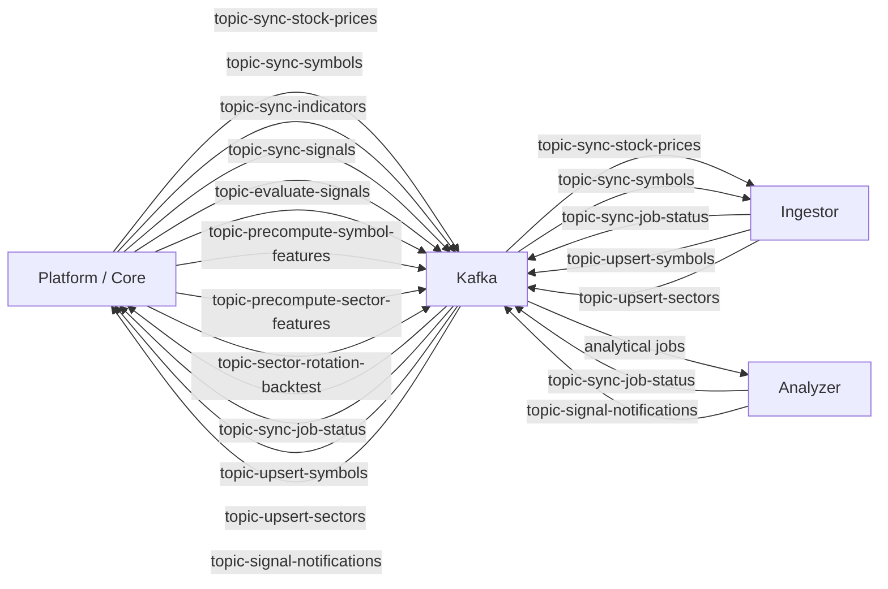

# Kafka Contracts

Kafka is the asynchronous contract boundary between Platform, Ingestor, and Analyzer.

Canonical topic names live in [`configs/shared/topics.yaml`](../../configs/shared/topics.yaml). This document explains ownership and purpose; the YAML file remains the source of truth for literal topic values.

## Contract Rule

Do not update a producer or consumer in isolation. When changing a Kafka topic, payload field, field meaning, serialization rule, validation rule, or error-handling contract, update all of these in the same change:

1. Producer code.
2. Consumer code.
3. Shared payload/config abstractions.
4. Producer and consumer tests.
5. This document.
6. Flow docs that reference the contract.

## Topic Map

## Topics

### topic-sync-stock-prices

| Field | Value |
| --- | --- |
| Topic key | `topic-sync-stock-prices` |
| Producer | Platform scheduler job producer |
| Consumer | Ingestor stock-price handler |
| Purpose | Request EOD stock-price synchronization for a symbol. |
| Related flow | [Stock sync](../flows/stock-sync.md) |
| Related storage | [`eod`](data-lake.md#eod) |

Expected payload shape includes job identity, source, `symbolKey`, optional time bounds, and metadata. It must not include S3 bucket or object path routing fields.

### topic-sync-symbols

| Field | Value |
| --- | --- |
| Topic key | `topic-sync-symbols` |
| Producer | Platform scheduler job producer |
| Consumer | Ingestor symbols handler |
| Purpose | Request symbol metadata synchronization by exchange/source. |
| Related flow | [Stock sync](../flows/stock-sync.md) |
| Related storage | [`symbols`](data-lake.md#symbols) |

### topic-upsert-symbols

| Field | Value |
| --- | --- |
| Topic key | `topic-upsert-symbols` |
| Producer | Ingestor |
| Consumer | Platform scheduler symbol upsert consumer |
| Purpose | Send symbol snapshot/upsert results back to Platform-owned database state. |
| Related database | [Symbols](database.md#symbols) |

### topic-upsert-sectors

| Field | Value |
| --- | --- |
| Topic key | `topic-upsert-sectors` |
| Producer | Ingestor |
| Consumer | Platform scheduler sector upsert consumer |
| Purpose | Send sector snapshot/upsert results back to Platform-owned database state. |
| Related database | [Sectors](database.md#sectors) |

### topic-sync-job-status

| Field | Value |
| --- | --- |
| Topic key | `topic-sync-job-status` |
| Producer | Ingestor and Analyzer workers |
| Consumer | Platform scheduler job status consumer |
| Purpose | Report child job completion/failure metrics to Platform. |
| Related flow | [Job execution](../flows/job-execution.md) |
| Related database | [Job execution history](database.md#job-execution-history) |

Status payloads should carry enough identity to update the correct child execution and aggregate parent execution state. Typical fields include `jobDefinitionId`, `executionId`, optional `parentExecutionId`, `status`, metrics, duration, and optional error details.

### topic-sync-indicators

| Field | Value |
| --- | --- |
| Topic key | `topic-sync-indicators` |
| Producer | Platform scheduler indicator job producer |
| Consumer | Analyzer indicator worker |
| Purpose | Compute technical indicators from EOD Parquet and write indicator Parquet. |
| Related flow | [Indicator and signal](../flows/indicator-signal.md) |
| Related storage | [`indicators`](data-lake.md#indicators) |

### topic-sync-signals

| Field | Value |
| --- | --- |
| Topic key | `topic-sync-signals` |
| Producer | Platform scheduler signal job producer |
| Consumer | Analyzer signal worker |
| Purpose | Compute signal history/current-state records from EOD and indicators. |
| Related flow | [Indicator and signal](../flows/indicator-signal.md) |
| Related storage | [`signals`](data-lake.md#signals) |

### topic-evaluate-signals

| Field | Value |
| --- | --- |
| Topic key | `topic-evaluate-signals` |
| Producer | Platform scheduler signal-evaluation job producer |
| Consumer | Analyzer signal evaluation worker |
| Purpose | Evaluate signal outcomes after forward-return windows become available. |
| Related flow | [Indicator and signal](../flows/indicator-signal.md) |

### topic-signal-notifications

| Field | Value |
| --- | --- |
| Topic key | `topic-signal-notifications` |
| Producer | Analyzer |
| Consumer | Platform notification module |
| Purpose | Publish signal transition notifications for downstream delivery. |
| Related flow | [Indicator and signal](../flows/indicator-signal.md) |

### topic-precompute-symbol-features

| Field | Value |
| --- | --- |
| Topic key | `topic-precompute-symbol-features` |
| Producer | Platform scheduler sector-wave producer |
| Consumer | Analyzer sector-wave worker |
| Purpose | Precompute symbol-level features used by sector aggregation and ranking. |
| Related flow | [Sector wave](../flows/sector-wave.md) |
| Related storage | [`symbol-features`](data-lake.md#symbol-features) |

### topic-precompute-sector-features

| Field | Value |
| --- | --- |
| Topic key | `topic-precompute-sector-features` |
| Producer | Platform scheduler sector-wave producer |
| Consumer | Analyzer sector-wave worker |
| Purpose | Aggregate symbol features into sector-level datasets. |
| Related flow | [Sector wave](../flows/sector-wave.md) |
| Related storage | [`sector-features`](data-lake.md#sector-features) |

### topic-sector-rotation-backtest

| Field | Value |
| --- | --- |
| Topic key | `topic-sector-rotation-backtest` |
| Producer | Platform scheduler sector-rotation backtest producer |
| Consumer | Analyzer sector-wave worker |
| Purpose | Run sector rotation backtests from precomputed sector features. |
| Related flow | [Sector wave](../flows/sector-wave.md) |
| Related storage | [`sector-rotation-backtests`](data-lake.md#sector-rotation-backtests) |

## Shared Configuration

| Config | Path |
| --- | --- |
| Topic names | [`configs/shared/topics.yaml`](../../configs/shared/topics.yaml) |
| Java producer/consumer messages | [`apps/core/src/main/java/com/omni/platform/modules/scheduler/messaging`](../../apps/core/src/main/java/com/omni/platform/modules/scheduler/messaging) |
| Java producers | [`apps/core/src/main/java/com/omni/platform/modules/scheduler/producers`](../../apps/core/src/main/java/com/omni/platform/modules/scheduler/producers) |
| Java consumers | [`apps/core/src/main/java/com/omni/platform/modules/scheduler/consumers`](../../apps/core/src/main/java/com/omni/platform/modules/scheduler/consumers) |
| Python shared messaging | [`libs/py-common/py_common/messaging`](../../libs/py-common/py_common/messaging) |
| Python Kafka helpers | [`libs/py-common/py_common/kafka`](../../libs/py-common/py_common/kafka) |

## Payload Boundary Rules

- Use stable job identity fields so Platform can update execution state.
- Keep dataset routing out of Kafka payloads; use shared S3 path builders instead.
- Keep field names and semantics compatible across Java and Python.
- Add validation at the consumer boundary.
- Include error details in status events without leaking credentials or provider secrets.
