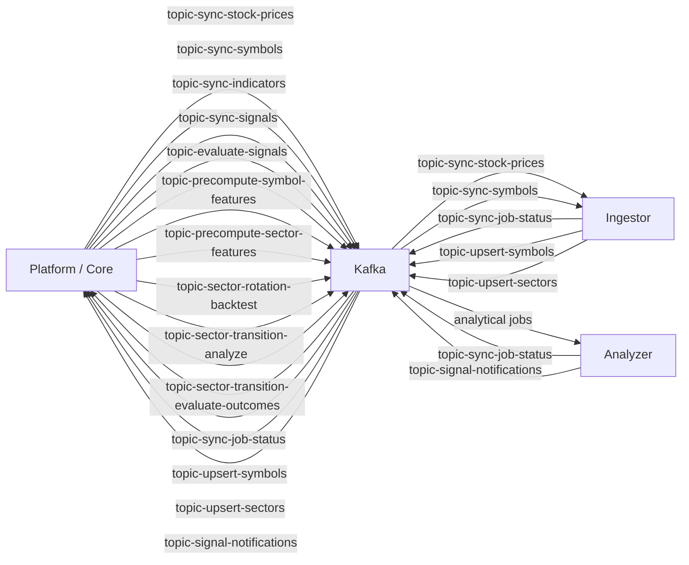

# Kafka Contracts

Kafka is the asynchronous contract boundary between Platform, Ingestor, and Analyzer.

## Proto3 contract foundation

Canonical versioned schemas live under [`libs/contracts/proto`](../../libs/contracts/proto), with committed deterministic Java and Python outputs under [`libs/contracts/gen`](../../libs/contracts/gen). The `contracts` Nx project owns formatting, linting, compilation, breaking-change comparison, generation, and stale-output checks.

The initial `omni.contracts.common.v1` and `omni.contracts.job.v1` schemas define `DatasetRef`, `DatasetOutput`, `ExecutionStatus`, `JobCommand`, and `JobStatusEvent`. Dataset references are logical and do not expose bucket names or physical object paths. Persisted dataset manifests remain JSON.

This foundation does not change the active wire format. Existing producer/consumer pairs continue using their documented JSON payloads until adapter and dual-read increments add compatibility tests and a rollout-safe migration.

Canonical topic names live in [`configs/shared/topics.yaml`](../../configs/shared/topics.yaml). This document explains ownership and purpose; the YAML file remains the source of truth for literal topic values.

## Contract Rule

Do not update a producer or consumer in isolation. When changing a Kafka topic, payload field, field meaning, serialization rule, validation rule, or error-handling contract, update all of these in the same change:

1. Producer code.
2. Consumer code.
3. Shared payload/config abstractions.
4. Producer and consumer tests.
5. This document.
6. Flow docs that reference the contract.

## Topic Map

## Topics

### topic-sync-stock-prices

| Field           | Value                                                 |
| --------------- | ----------------------------------------------------- |
| Topic key       | `topic-sync-stock-prices`                             |
| Producer        | Platform scheduler job producer                       |
| Consumer        | Ingestor stock-price handler                          |
| Purpose         | Request EOD stock-price synchronization for a symbol. |
| Related flow    | [Stock sync](../flows/stock-sync.md)                  |
| Related storage | [`eod`](data-lake.md#eod)                             |

Expected payload shape includes job identity, source, `symbolKey`, optional time bounds, and metadata. It must not include S3 bucket or object path routing fields.

### topic-sync-symbols

| Field           | Value                                                       |
| --------------- | ----------------------------------------------------------- |
| Topic key       | `topic-sync-symbols`                                        |
| Producer        | Platform scheduler job producer                             |
| Consumer        | Ingestor symbols handler                                    |
| Purpose         | Request symbol metadata synchronization by exchange/source. |
| Related flow    | [Stock sync](../flows/stock-sync.md)                        |
| Related storage | [`symbols`](data-lake.md#symbols)                           |

### topic-upsert-symbols

| Field            | Value                                                                      |
| ---------------- | -------------------------------------------------------------------------- |
| Topic key        | `topic-upsert-symbols`                                                     |
| Producer         | Ingestor                                                                   |
| Consumer         | Platform scheduler symbol upsert consumer                                  |
| Purpose          | Send symbol snapshot/upsert results back to Platform-owned database state. |
| Related database | [Symbols](database.md#symbols)                                             |

### topic-upsert-sectors

| Field            | Value                                                                      |
| ---------------- | -------------------------------------------------------------------------- |
| Topic key        | `topic-upsert-sectors`                                                     |
| Producer         | Ingestor                                                                   |
| Consumer         | Platform scheduler sector upsert consumer                                  |
| Purpose          | Send sector snapshot/upsert results back to Platform-owned database state. |
| Related database | [Sectors](database.md#sectors)                                             |

### topic-sync-job-status

| Field            | Value                                                      |
| ---------------- | ---------------------------------------------------------- |
| Topic key        | `topic-sync-job-status`                                    |
| Producer         | Ingestor and Analyzer workers                              |
| Consumer         | Platform scheduler job status consumer                     |
| Purpose          | Report child job completion/failure metrics to Platform.   |
| Related flow     | [Job execution](../flows/job-execution.md)                 |
| Related database | [Job execution history](database.md#job-execution-history) |

Status payloads should carry enough identity to update the correct child execution and aggregate parent execution state. Typical fields include `jobDefinitionId`, `executionId`, optional `parentExecutionId`, `symbolKey`, `status`, metrics, duration, `metaJson`, and optional error details.

`symbolKey` remains part of the worker status contract for backward compatibility. Platform now creates child executions through a generic `createChildExecution(...)` path and stores both `symbolKey` and `workKey` in execution metadata when a work key is available. Do not remove or rename `symbolKey` in Kafka payloads until producer, consumer, shared Python messaging, Java status handling, tests, and these docs are migrated together.

Worker error statuses must preserve useful request context in `metaJson`. Do not replace failure metadata with only `recordsProcessed = 0`; include safe domain fields such as timeframe, strategy, evaluation date, sector universe/focus, prediction horizons, and the actual error message when available.

### topic-sync-indicators

| Field           | Value                                                                      |
| --------------- | -------------------------------------------------------------------------- |
| Topic key       | `topic-sync-indicators`                                                    |
| Producer        | Platform scheduler indicator job producer                                  |
| Consumer        | Analyzer indicator worker                                                  |
| Purpose         | Compute technical indicators from EOD Parquet and write indicator Parquet. |
| Related flow    | [Indicator and signal](../flows/indicator-signal.md)                       |
| Related storage | [`indicators`](data-lake.md#indicators)                                    |

### topic-sync-signals

| Field           | Value                                                                 |
| --------------- | --------------------------------------------------------------------- |
| Topic key       | `topic-sync-signals`                                                  |
| Producer        | Platform scheduler signal job producer                                |
| Consumer        | Analyzer signal worker                                                |
| Purpose         | Compute signal history/current-state records from EOD and indicators. |
| Related flow    | [Indicator and signal](../flows/indicator-signal.md)                  |
| Related storage | [`signals`](data-lake.md#signals)                                     |

### topic-evaluate-signals

| Field        | Value                                                                   |
| ------------ | ----------------------------------------------------------------------- |
| Topic key    | `topic-evaluate-signals`                                                |
| Producer     | Platform scheduler signal-evaluation job producer                       |
| Consumer     | Analyzer signal evaluation worker                                       |
| Purpose      | Evaluate signal outcomes after forward-return windows become available. |
| Related flow | [Indicator and signal](../flows/indicator-signal.md)                    |

### topic-signal-notifications

| Field        | Value                                                            |
| ------------ | ---------------------------------------------------------------- |
| Topic key    | `topic-signal-notifications`                                     |
| Producer     | Analyzer                                                         |
| Consumer     | Platform notification module                                     |
| Purpose      | Publish signal transition notifications for downstream delivery. |
| Related flow | [Indicator and signal](../flows/indicator-signal.md)             |

### topic-precompute-symbol-features

| Field           | Value                                                                    |
| --------------- | ------------------------------------------------------------------------ |
| Topic key       | `topic-precompute-symbol-features`                                       |
| Producer        | Platform scheduler sector-wave producer                                  |
| Consumer        | Analyzer sector-wave worker                                              |
| Purpose         | Precompute symbol-level features used by sector aggregation and ranking. |
| Related flow    | [Sector wave](../flows/sector-wave.md)                                   |
| Related storage | [`symbol-features`](data-lake.md#symbol-features)                        |

### topic-precompute-sector-features

| Field           | Value                                                 |
| --------------- | ----------------------------------------------------- |
| Topic key       | `topic-precompute-sector-features`                    |
| Producer        | Platform scheduler sector-wave producer               |
| Consumer        | Analyzer sector-wave worker                           |
| Purpose         | Aggregate symbol features into sector-level datasets. |
| Related flow    | [Sector wave](../flows/sector-wave.md)                |
| Related storage | [`sector-features`](data-lake.md#sector-features)     |

### topic-sector-rotation-backtest

| Field           | Value                                                                 |
| --------------- | --------------------------------------------------------------------- |
| Topic key       | `topic-sector-rotation-backtest`                                      |
| Producer        | Platform scheduler sector-rotation backtest producer                  |
| Consumer        | Analyzer sector-wave worker                                           |
| Purpose         | Run sector rotation backtests from precomputed sector features.       |
| Related flow    | [Sector wave](../flows/sector-wave.md)                                |
| Related storage | [`sector-rotation-backtests`](data-lake.md#sector-rotation-backtests) |

### topic-sector-transition-analyze

| Field           | Value                                                                                                                                                                                                                                       |
| --------------- | ------------------------------------------------------------------------------------------------------------------------------------------------------------------------------------------------------------------------------------------- |
| Topic key       | `topic-sector-transition-analyze`                                                                                                                                                                                                           |
| Producer        | Platform scheduler Sector Transition analysis producer                                                                                                                                                                                      |
| Consumer        | Analyzer Sector Transition analysis worker                                                                                                                                                                                                  |
| Purpose         | Generate T-anchored Sector Transition predictions, probabilities, and private decisions.                                                                                                                                                    |
| Related flow    | [Sector wave deferred research](../flows/sector-wave.md#deferred-research-sector-transition-and-recommendation)                                                                                                                             |
| Related storage | [`sector-transition-predictions`](data-lake.md#sector-transition-predictions), [`sector-transition-decisions`](data-lake.md#sector-transition-decisions), [`sector-transition-probabilities`](data-lake.md#sector-transition-probabilities) |

Expected payload fields are job identity, `source`, `evaluationDate`, resolved-universe `sectorCodes`, resolved `focusSectorCodes`, `sectorLevel`, `timeframe`, `strategy`, `predictionHorizons`, and `metadata`. `sectorCodes = []` means all eligible sectors at `sectorLevel` only in Platform Sector Transition job config; Platform resolves the concrete universe before publishing. `focusSectorCodes = []` resolves to the full universe, while a non-empty focus must be a subset of the resolved universe. The payload must not carry bucket names or object paths. Decisions produced by this job are `PRIVATE_INTERNAL` research outputs.

Sector Transition failure statuses must preserve enough metadata for actionable Platform notifications: `evaluationDate`, `sectorCodes`, `focusSectorCodes`, `sectorLevel`, `timeframe`, `strategy`, `predictionHorizons`, `recordsProcessed = 0`, and the actual analyzer error message. Platform renders failed analysis notifications through a job-specific notification policy rather than through scheduler producer logic.

### topic-sector-transition-evaluate-outcomes

| Field           | Value                                                                                                           |
| --------------- | --------------------------------------------------------------------------------------------------------------- |
| Topic key       | `topic-sector-transition-evaluate-outcomes`                                                                     |
| Producer        | Platform scheduler Sector Transition outcome-evaluation producer                                                |
| Consumer        | Analyzer Sector Transition outcome-evaluation worker                                                            |
| Purpose         | Evaluate realized outcomes for prior Sector Transition predictions without rewriting them.                      |
| Related flow    | [Sector wave deferred research](../flows/sector-wave.md#deferred-research-sector-transition-and-recommendation) |
| Related storage | [`sector-transition-outcomes`](data-lake.md#sector-transition-outcomes)                                         |

Expected payload fields match `topic-sector-transition-analyze`, including resolved-universe `sectorCodes` and resolved `focusSectorCodes`. Outcome evaluation reads stored focused predictions and appends realized outcome rows to the outcomes dataset without recalculating a focus-only model or rewriting historical prediction probabilities. Failure statuses follow the same metadata-preservation rule as analysis jobs.

## Shared Configuration

| Config                          | Path                                                                                                                                                   |
| ------------------------------- | ------------------------------------------------------------------------------------------------------------------------------------------------------ |
| Topic names                     | [`configs/shared/topics.yaml`](../../configs/shared/topics.yaml)                                                                                       |
| Java producer/consumer messages | [`apps/core/src/main/java/com/omni/platform/modules/scheduler/messaging`](../../apps/core/src/main/java/com/omni/platform/modules/scheduler/messaging) |
| Java producers                  | [`apps/core/src/main/java/com/omni/platform/modules/scheduler/producers`](../../apps/core/src/main/java/com/omni/platform/modules/scheduler/producers) |
| Java consumers                  | [`apps/core/src/main/java/com/omni/platform/modules/scheduler/consumers`](../../apps/core/src/main/java/com/omni/platform/modules/scheduler/consumers) |
| Python shared messaging         | [`libs/py-common/py_common/messaging`](../../libs/py-common/py_common/messaging)                                                                       |
| Python Kafka helpers            | [`libs/py-common/py_common/kafka`](../../libs/py-common/py_common/kafka)                                                                               |

## Payload Boundary Rules

- Use stable job identity fields so Platform can update execution state.
- Keep dataset routing out of Kafka payloads; use shared S3 path builders instead.
- Keep field names and semantics compatible across Java and Python.
- Add validation at the consumer boundary.
- Include error details in status events without leaking credentials or provider secrets.
