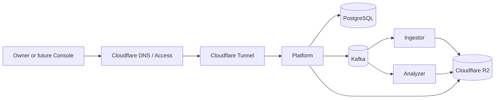
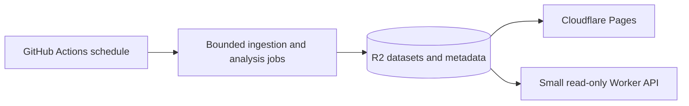

# Cloudflare-First Low-Cost Deployment Decision

**Status:** Proposed  
**Assessment date:** 2026-08-14  
**Scope:** Deployment target selection and readiness gaps for Omni.  
**Owner decision:** Required before Phase 5 implementation changes.

## Decision Summary

Omni should use Cloudflare as an edge and object-storage layer, not as the compute runtime for the complete platform.

The preferred persistent deployment is:

- Cloudflare DNS, Access, and Tunnel at the edge;
- Cloudflare R2 Standard for Parquet data, manifests, and backups;
- one small VPS for Platform, Analyzer, Ingestor, Kafka, and PostgreSQL;
- no public application, Kafka, or database ports;
- no MinIO or pgAdmin in the cloud profile.

Oracle Cloud is intentionally not selected. A genuinely zero-cost deployment is possible only by using an existing always-on machine or by running a reduced batch demonstration that does not preserve the full runtime semantics.

## Deployment Profiles

| Profile                        |                                             Expected cloud cost | Runtime fidelity                                   | Intended use                                | Decision                   |
| ------------------------------ | --------------------------------------------------------------: | -------------------------------------------------- | ------------------------------------------- | -------------------------- |
| `home-lab`                     | Approximately zero, excluding existing hardware and electricity | Full stack                                         | Owner-operated development and private use  | Recommended zero-cost path |
| `demo-batch`                   |                                     Zero within provider quotas | Reduced; no continuously running Platform or Kafka | Public demonstration and bounded EOD output | Recommended demo path      |
| `cloudflare-vps`               |           Small VPS charge; R2 may remain in its free allowance | Full stack                                         | Persistent owner-operated environment       | Preferred reliable path    |
| Cloudflare-only serverless     |    Paid and architecturally incompatible with the current stack | Low                                                | None                                        | Rejected                   |
| Sleeping free application host |                  Zero but resource- and persistence-constrained | Low                                                | Disposable experiments only                 | Rejected                   |

These profiles are separate operational contracts. The reduced `demo-batch` profile must not be described as production parity.

## Preferred Persistent Architecture

All VPS services remain on a private Compose network. `cloudflared` creates the outbound tunnel; only explicitly approved HTTP routes are published through Cloudflare Access.

### Private Console job operations

For the Phase 7 Jobs surface, route the Console's same-origin
`/api/platform/api/v1/jobs/**` prefix to Platform and strip `/api/platform`
before forwarding. The trusted proxy must remove every client-supplied
`X-Omni-User` header, authenticate the Cloudflare Access session, and inject the
verified operator identity. Never configure the browser to manufacture this
header.

Set `APP_SCHEDULER_MANUAL_TRIGGER_ALLOW_LIST` on Platform to a comma-separated
list of exact definition UUIDs or `JOB_TYPE:SOURCE` identities. An empty value
disables manual triggers. Kafka, object storage, PostgreSQL, and the raw Platform
port remain private; the browser receives no credentials or physical paths.

### Minimum sizing

The existing portable deployment plan identifies 2 vCPU and 4 GB RAM as the minimum EOD baseline and 4 vCPU and 8 GB RAM as the comfortable baseline.

For a 4 GB host:

- do not run MinIO or pgAdmin;
- cap Platform JVM, Kafka, PostgreSQL, Analyzer, and Ingestor memory;
- avoid keeping optional HTTP development processes active;
- schedule heavy analysis and ingestion so they do not peak together;
- enable bounded logs and monitor swap and out-of-memory events.

Use 8 GB when continuous analysis, larger PyArrow workloads, or additional observability services are required.

## Zero-Cost Profiles

### Existing machine: `home-lab`

This is the closest match to a zero-cost full-stack deployment:

1. Run the hardened Compose profile on an existing owner-controlled machine.
2. Store analytical objects and encrypted backups in R2.
3. Publish only selected HTTP endpoints through Cloudflare Tunnel and Access.
4. Keep Kafka, PostgreSQL, and service ports private.
5. Accept that availability depends on local power, connectivity, storage, and maintenance.

### Public batch demo: `demo-batch`

A zero-cost public demonstration can use:

This profile should:

- run bounded EOD jobs through public-repository GitHub Actions;
- publish static reports or a future read-only Console through Pages;
- use R2 for generated datasets and metadata;
- omit the continuously running Spring scheduler, Kafka broker, and Kafka consumers;
- carry an explicit demo/batch capability label.

Cloudflare Queues can be evaluated later behind a queue adapter, but it is not a drop-in Kafka replacement and must not change canonical Kafka contracts implicitly.

## Why Pure Cloudflare Compute Is Rejected

The current runtime contains:

- a long-running Spring Boot control plane and scheduler;
- Kafka producers, consumers, and a broker;
- PostgreSQL operational state with Flyway migrations;
- Python services using pandas and PyArrow;
- persistent storage and recovery requirements.

Cloudflare Workers Free has a 128 MB memory limit and a 10 ms CPU limit per request. Cloudflare Containers require Workers Paid. D1 has SQLite semantics rather than PostgreSQL compatibility. Replacing the current stack with Workers, D1, and Queues would therefore be a new architecture, not a deployment configuration.

## Current Deployment Blockers

Omni is not safe to expose yet. Phase 5 implementation must address these blockers before either persistent profile is declared ready.

### Security and configuration

1. Remove or secure `management.endpoint.env.show-values: always`; an exposed Actuator environment endpoint can disclose credentials.
2. Add an explicit production profile and remove Docker runtime defaults that select the development profile.
3. Keep secrets out of Compose defaults and tracked environment files.
4. Require Cloudflare Access or equivalent authentication for all operator-facing endpoints.
5. Validate market-data provider licensing, source-IP, and geographic restrictions for the selected host.

### Image correctness

1. Embed or copy Flyway migrations and shared topic configuration into the Platform runtime image; current filesystem-relative paths are not guaranteed to exist there.
2. Package `libs/py-common` correctly in Python images.
3. Remove Uvicorn `--reload` from production commands.
4. Run every application as a non-root user.
5. Pin base images and dependencies; do not deploy `latest`.
6. Add health/readiness checks and graceful shutdown behavior.

### Compose and state

1. Add `home-lab`, `demo-batch`, and `cloudflare-vps` profiles.
2. Use immutable registry images rather than runtime builds and source bind mounts.
3. Remove MinIO and pgAdmin from `cloudflare-vps`.
4. Add durable Kafka and PostgreSQL volumes with bounded retention and logs.
5. Keep all internal ports unbound or restricted to loopback/private networking.
6. Add resource reservations and limits sized for the selected host.

### Storage and recovery

1. Validate R2 compatibility through both Java and Python storage adapters.
2. Cover list, read, write, copy, multipart upload, delete, and error behavior.
3. Verify PostgreSQL backup and restore to R2.
4. Verify dataset/manifest recovery and document the recovery-time expectations.
5. Use R2 Standard for free-tier evaluation; Infrequent Access has different charges and no equivalent free tier.

### CI evidence

1. Build all deployable images in CI.
2. Run container smoke tests for Platform, Analyzer, and Ingestor.
3. Validate Compose configuration without secrets.
4. Exercise health checks and graceful shutdown.
5. Run a bounded R2 compatibility test against a non-production bucket.
6. Record backup/restore evidence before marking Phase 5 complete.

### P1-I4 coordinated release

Platform, Ingestor, and Analyzer images that implement the required
`workType`/`workKey` contract must be released together. Before deployment,
disable job dispatch and manual triggers, drain the scheduler outbox and Kafka
consumer lag, and take a PostgreSQL snapshot. Follow the
[P1-I4 hard-cutover runbook](001-p1-i4-hard-cutover.md); a rolling mixed-version
deployment is unsupported.

## Phase 5 Implementation Order

1. Complete P5-I1 image hardening and configuration contracts.
2. Obtain the owner decision for the target profiles and cost ceiling.
3. Implement P5-I2 with `home-lab` and `cloudflare-vps`; treat `demo-batch` as an explicitly reduced profile.
4. Publish immutable images to GHCR.
5. Complete P5-I3 backup, restore, and recovery evidence.
6. Threat-model the external trust boundaries before exposing Platform or a future Console.
7. Deploy first to `home-lab` or an ephemeral test VPS, then verify the persistent target.

## Acceptance Criteria

The deployment decision is implemented when:

- the three profiles and their fidelity differences are documented and machine-checkable;
- Platform, Analyzer, and Ingestor run from pinned, non-root images;
- production images contain all runtime configuration and migration resources;
- no internal service port is publicly exposed;
- R2 compatibility passes from Java and Python;
- PostgreSQL and object-storage restore procedures are tested;
- a 4 GB smoke test records peak memory and identifies whether 8 GB is required;
- Cloudflare Tunnel and Access protect approved HTTP endpoints;
- CI builds and smoke-tests immutable images;
- no Oracle-specific dependency or credential is introduced;
- the vault summary links to the implemented repository evidence without becoming a second technical source of truth.

## Cost and Service References

Prices and free allowances change. Verify them again immediately before provisioning.

- [Cloudflare R2 pricing](https://developers.cloudflare.com/r2/pricing/)
- [Cloudflare Workers pricing](https://developers.cloudflare.com/workers/platform/pricing/)
- [Cloudflare Workers limits](https://developers.cloudflare.com/workers/platform/limits/)
- [Cloudflare Containers](https://developers.cloudflare.com/containers/)
- [Cloudflare Tunnel](https://developers.cloudflare.com/tunnel/)
- [Cloudflare Queues pricing](https://developers.cloudflare.com/queues/platform/pricing/)
- [Cloudflare D1](https://developers.cloudflare.com/d1/)
- [Cloudflare Pages pricing](https://developers.cloudflare.com/pages/functions/pricing/)
- [GitHub Actions billing](https://docs.github.com/en/actions/concepts/billing-and-usage)
- [Render free services](https://render.com/docs/free)
- [Koyeb instance reference](https://www.koyeb.com/docs/reference/instances)
- [Hetzner June 2026 price adjustment](https://docs.hetzner.com/general/infrastructure-and-availability/price-adjustment/)

## Repository References

- [Portable Docker Deployment plan](../plans/005-portable-docker-deployment.md)
- [Phase 5 roadmap](../../plans/roadmap/phase-5-portable-deployment.md)
- [Compose infrastructure](../../docker-compose.infra.yaml)
- [Compose services](../../docker-compose.services.yaml)
- [Deployment environment example](../../.env.deploy.example)
- [Platform application configuration](../../apps/core/src/main/resources/application.yaml)
- [Codex control and tooling plan](../development/003-codex-control-and-tooling.md)
