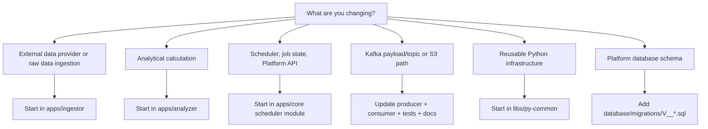

# Where to Change

Use this guide after reading [System overview](../architecture/system-overview.md). It maps common product or architecture changes to the first place to inspect.

## Quick Navigation

| Change                          | Start here                                                                                                                                                                 | Also check                                                                                                                                                        |
| ------------------------------- | -------------------------------------------------------------------------------------------------------------------------------------------------------------------------- | ----------------------------------------------------------------------------------------------------------------------------------------------------------------- |
| Data provider integration       | [`apps/ingestor/app/stocks`](../../apps/ingestor/app/stocks)                                                                                                               | [`apps/ingestor/app/handlers`](../../apps/ingestor/app/handlers), [Data lake](../data/data-lake.md)                                                               |
| Stock price ingestion           | [`apps/ingestor/app/handlers/stock_prices.py`](../../apps/ingestor/app/handlers/stock_prices.py)                                                                           | [`topic-sync-stock-prices`](../data/kafka-contracts.md#topic-sync-stock-prices), [`eod`](../data/data-lake.md#eod)                                                |
| Symbol ingestion                | [`apps/ingestor/app/handlers/symbols.py`](../../apps/ingestor/app/handlers/symbols.py)                                                                                     | [`topic-sync-symbols`](../data/kafka-contracts.md#topic-sync-symbols), [`topic-upsert-symbols`](../data/kafka-contracts.md#topic-upsert-symbols)                  |
| Indicator calculation           | [`apps/analyzer/app/indicators`](../../apps/analyzer/app/indicators), [`apps/analyzer/app/calculations/indicators.py`](../../apps/analyzer/app/calculations/indicators.py) | [Indicator/signal flow](../flows/indicator-signal.md), [`indicators`](../data/data-lake.md#indicators)                                                            |
| Signal rule                     | [`apps/analyzer/app/signals`](../../apps/analyzer/app/signals)                                                                                                             | [Indicator/signal flow](../flows/indicator-signal.md), [`signals`](../data/data-lake.md#signals)                                                                  |
| Sector Wave model               | [`apps/analyzer/app/sector_wave`](../../apps/analyzer/app/sector_wave)                                                                                                     | [Sector wave flow](../flows/sector-wave.md), [`features/symbol`](../data/data-lake.md#symbol-features), [`features/sector`](../data/data-lake.md#sector-features) |
| Scheduler or job orchestration  | [`apps/core/src/main/java/com/omni/platform/modules/scheduler`](../../apps/core/src/main/java/com/omni/platform/modules/scheduler)                                         | [Job execution flow](../flows/job-execution.md), [Database](../data/database.md)                                                                                  |
| Kafka topic or payload contract | Producer + consumer + [`libs/py-common/py_common/messaging`](../../libs/py-common/py_common/messaging) + [`configs/shared/topics.yaml`](../../configs/shared/topics.yaml)  | [Kafka contracts](../data/kafka-contracts.md), tests on both sides                                                                                                |
| S3 path or dataset layout       | [`configs/shared/s3-paths.yaml`](../../configs/shared/s3-paths.yaml) + path builders in [`libs/py-common/py_common/config`](../../libs/py-common/py_common/config)         | [Data lake](../data/data-lake.md), all producers and consumers of the dataset                                                                                     |
| Shared Python abstraction       | [`libs/py-common`](../../libs/py-common)                                                                                                                                   | Analyzer and Ingestor imports/tests                                                                                                                               |
| Database schema                 | [`database/migrations`](../../database/migrations) + owning Platform module                                                                                                | [Database](../data/database.md), Platform tests                                                                                                                   |
| Local runtime command           | Relevant [`project.json`](../../apps/analyzer/project.json)                                                                                                                | Use Nx targets only                                                                                                                                               |

## Decision Tree



## Kafka Contract Rule

Do not update a Kafka producer or consumer in isolation. When changing a topic, event schema, field semantics, serialization, validation, or error-handling contract:

1. Find the producer.
2. Find the consumer.
3. Update shared payload/config abstractions if used.
4. Update tests for both sides.
5. Update [Kafka contracts](../data/kafka-contracts.md).
6. Check impact radius before merging.

## Storage Contract Rule

Do not add bucket names or object names to Kafka job messages for routing. Workers derive object paths from shared path builders backed by [`configs/shared/s3-paths.yaml`](../../configs/shared/s3-paths.yaml).

When changing storage layout:

1. Update [`configs/shared/s3-paths.yaml`](../../configs/shared/s3-paths.yaml).
2. Update path builders and tests.
3. Update all producers and consumers of that dataset.
4. Update [Data lake](../data/data-lake.md).

## Verification

Use Nx targets from the workspace root. Inspect a project before running unfamiliar operations:

```bash
nx show project analyzer
nx show project ingestor
nx show project platform
nx show project py-common
```

Common checks:

```bash
nx run analyzer:test
nx run analyzer:lint
nx run ingestor:test
nx run ingestor:lint
nx run py-common:test
nx run py-common:lint
nx run platform:build
```
