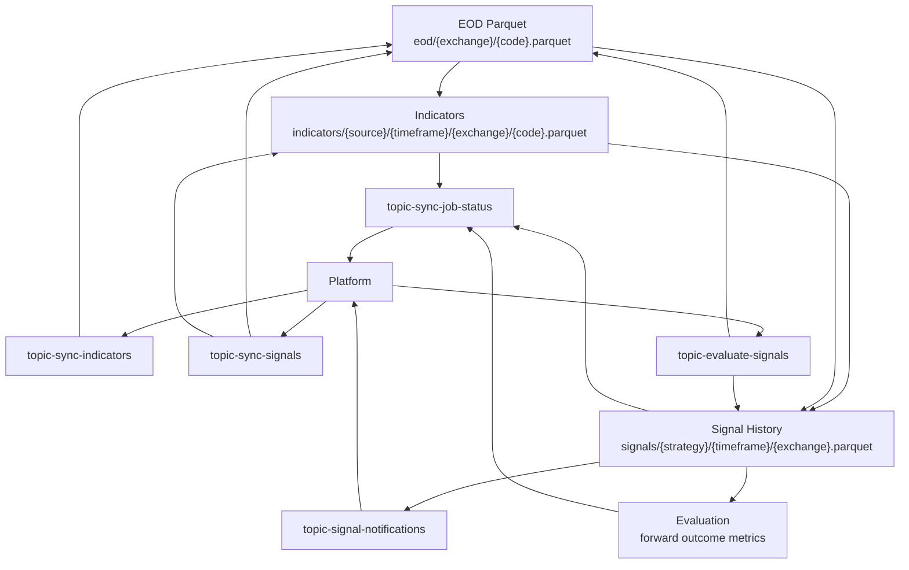
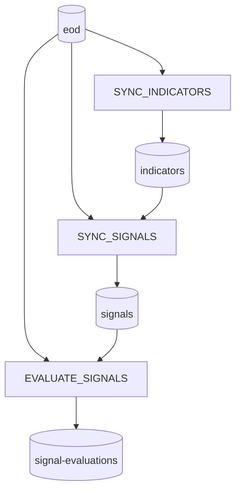
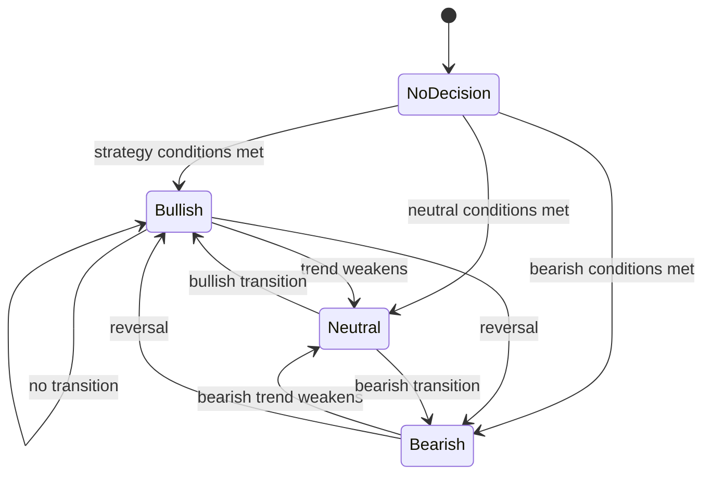

# Indicator and Signal Flow

Analyzer owns technical-indicator calculation, signal calculation, signal evaluation, and signal notification production.

## Flow



## Compact Flow

```text
EOD
 → Indicators
 → Signals
 → Signal History
 → Evaluation
 → Notification
```

## Topics

| Topic                                                                                     | Direction           | Purpose                                                             |
| ----------------------------------------------------------------------------------------- | ------------------- | ------------------------------------------------------------------- |
| [`topic-sync-indicators`](../data/001-kafka-contracts.md#topic-sync-indicators)           | Platform → Analyzer | Compute indicator Parquet from EOD input.                           |
| [`topic-sync-signals`](../data/001-kafka-contracts.md#topic-sync-signals)                 | Platform → Analyzer | Compute signal history/current transition metadata.                 |
| [`topic-evaluate-signals`](../data/001-kafka-contracts.md#topic-evaluate-signals)         | Platform → Analyzer | Evaluate prior signal outcomes after forward windows are available. |
| [`topic-signal-notifications`](../data/001-kafka-contracts.md#topic-signal-notifications) | Analyzer → Platform | Publish signal transition notifications.                            |
| [`topic-sync-job-status`](../data/001-kafka-contracts.md#topic-sync-job-status)           | Analyzer → Platform | Report job execution status.                                        |

## Datasets

| Dataset                                             | Producer                | Consumer                                    | Path                                                        |
| --------------------------------------------------- | ----------------------- | ------------------------------------------- | ----------------------------------------------------------- |
| [`eod`](../data/002-data-lake.md#eod)               | Ingestor                | Analyzer indicator/signal/evaluation jobs   | `eod/{exchange}/{code}.parquet`                             |
| [`indicators`](../data/002-data-lake.md#indicators) | Analyzer indicator jobs | Analyzer signal jobs                        | `indicators/{source}/{timeframe}/{exchange}/{code}.parquet` |
| [`signals`](../data/002-data-lake.md#signals)       | Analyzer signal jobs    | Analyzer evaluation jobs, notification path | `signals/{strategy}/{timeframe}/{exchange}.parquet`         |

## Responsibilities

| Component | Does                                                                                                                                | Does not do                                                |
| --------- | ----------------------------------------------------------------------------------------------------------------------------------- | ---------------------------------------------------------- |
| Platform  | Schedules jobs, publishes analytical job requests, consumes status/notification events.                                             | Does not compute technical indicators or signal decisions. |
| Analyzer  | Reads EOD/indicator Parquet, computes indicators/signals/evaluations, writes Parquet outputs, publishes status/notification events. | Does not own stock ingestion or Platform database state.   |

EOD and Indicator joins use the shared `date32` business-date contract. Signal
history retains the semantic key `signal_date` with the same physical type;
`generated_at`, `last_recalculated_at`, and `actual_updated_at` are UTC
microsecond event timestamps. Legacy files are normalized at the shared Parquet
read boundary before joins or outcome evaluation.
| Ingestor | Produces EOD input dataset. | Does not compute analytical outputs. |

## Dependency Enforcement

Platform seeds Indicator and Signal dependency metadata in [`JobDefinitionConfig.java`](../../apps/core/src/main/java/com/omni/platform/modules/scheduler/constants/JobDefinitionConfig.java). The scheduler enforces parent-level dataset dependencies through READY manifests. Because a signal job expands its configured universe into symbol-level child jobs, the signal producer also checks each exact indicator partition before creating a child execution:

```text
indicators/source=ad_close/timeframe={timeframe}/exchange={exchange}/code={code}/READY.json
```

A symbol is dispatched only when that manifest exists with `status: READY`. A missing, non-READY, or unreadable manifest defers that symbol without creating a child execution; other ready symbols in the same parent run continue normally. Deferred symbols are reconsidered by a later scheduled run.

For each dispatched Indicator job, Analyzer resolves the exact EOD READY pointer for `exchange` and `code`, reads Parquet from the manifest's `path`, and publishes the Indicators READY manifest with exactly that EOD `dataVersion` in `inputs[]`. A missing, invalid, or non-READY EOD manifest fails the child job before any Indicators output or READY manifest is published.



## Signal Lifecycle



## Contract Notes

- Indicator jobs identify symbol, source, timeframe, requested indicators, and job execution identity; their READY manifests contain exactly one EOD lineage input for the same `exchange` and `code`.
- Signal jobs should identify symbol, timeframe, strategy, and job execution identity.
- Signal dispatch requires the exact `indicators` READY manifest for `source`, `timeframe`, `exchange`, and `code`.
- Analyzer treats a missing indicator object after dispatch as a race/stale-manifest safeguard: it returns a non-persisted `NO_DECISION` transition with reason `MISSING_INDICATOR_OBJECT` instead of failing the child job.
- Signal transitions can produce notification events, while all jobs should publish job status. A defensive `NO_DECISION` does not write signal history or publish a transition notification.
- Evaluation jobs should use stable forward-return windows and avoid mutating historical signal meaning.

## Source Links

| Area                   | Path                                                                                                 |
| ---------------------- | ---------------------------------------------------------------------------------------------------- |
| Indicator calculations | [`apps/analyzer/app/calculations/indicators.py`](../../apps/analyzer/app/calculations/indicators.py) |
| Indicator worker       | [`apps/analyzer/app/indicators`](../../apps/analyzer/app/indicators)                                 |
| Signal worker/rules    | [`apps/analyzer/app/signals`](../../apps/analyzer/app/signals)                                       |
| Shared storage         | [`libs/py-common/py_common/storage`](../../libs/py-common/py_common/storage)                         |
| Shared topics          | [`configs/shared/topics.yaml`](../../configs/shared/topics.yaml)                                     |
| Shared paths           | [`configs/shared/s3-paths.yaml`](../../configs/shared/s3-paths.yaml)                                 |
