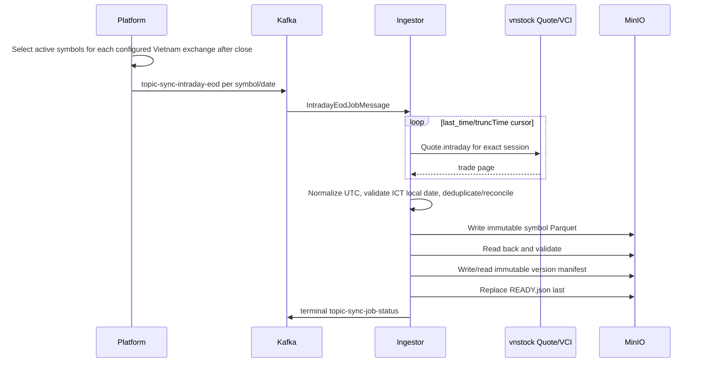

# Intraday EOD Flow

## Scope

P9-I1 synchronizes normalized trades only for source VCI across HOSE, HNX, and UPCOM,
every active symbol on each configured exchange, and the latest completed weekday
selected after configured close. Bars, features, sector aggregation, Console, and
realtime processing are excluded.

## Flow

The Kafka message contains logical domain identity only. Ingestor resolves storage
through shared builders backed by `configs/shared/s3-paths.yaml`. Each provider
timestamp is converted to `Asia/Ho_Chi_Minh` and its local date must equal the requested
`tradingDate`; the persisted timestamp remains UTC. No holiday or session-segment
validation is performed. An empty/unavailable symbol, cursor ambiguity, conflicting
provider ID, local-date mismatch, reconciliation rejection, or storage validation
failure produces an error status and does not replace an existing READY pointer.

## Correction Window

For seven calendar days after the trading date, a complete corrected provider snapshot
may produce a new immutable version. Identical bytes retain the same SHA-256 identity.
No prior immutable object is mutated or deleted, and READY changes only after candidate
validation succeeds.
