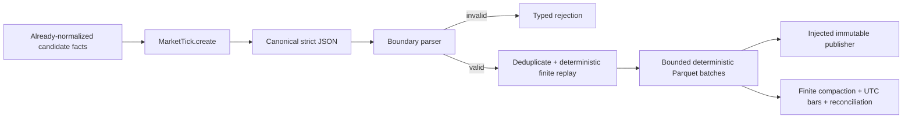
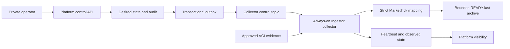

# Realtime Tick Foundation Flow

## Status

P10-I1 strict contract and P10-I2 finite archive/rebuild/bars/reconciliation are locally verified and `verification_pending`. P10-I0/P10-I3 are reactivated but `blocked` pending genuine VCI realtime evidence, P10-I2 delivery, and owner approval of material contracts. There is no active realtime ingestion flow yet.

## Implemented Foundation



This is a shared finite-processing foundation, not a provider or Kafka runtime. The canonical contract requires exact camelCase fields, UTC timestamps, exact decimals, positive price/volume, and an `eventId` derived from immutable normalized trade facts. Same-identity retries retain the earliest `receivedAt` observation, so retry input order cannot alter replay or Parquet bytes. Replay order drives bounded content-addressed batches. Publication accepts injected ports, uses version-before-READY, and does not configure a service writer. Compaction, bars, and P9 comparison require exact partition identity.

## Boundary Rejections

| Code                | Meaning                                                           |
| ------------------- | ----------------------------------------------------------------- |
| `INVALID_JSON`      | Bytes/text are not valid JSON.                                    |
| `INVALID_SHAPE`     | Top-level JSON is not an object.                                  |
| `MISSING_FIELD`     | A required canonical field is absent.                             |
| `UNKNOWN_FIELD`     | An alias, legacy, provider-specific, or unknown field is present. |
| `INVALID_VALUE`     | A value violates canonical type/range/normalization.              |
| `INVALID_TIMESTAMP` | Timestamp is malformed, naive, or not UTC.                        |
| `IDENTITY_MISMATCH` | Supplied event identity does not match canonical facts.           |

A provider adapter, if explicitly reactivated from technical debt, owns provider-frame interpretation and must either construct one canonical tick or reject the frame before transport. Shared code does not infer provider ordering, uniqueness, resume, correction, or late-event guarantees.

## Logical Archive Route

```text
realtime/ticks/source={source}/exchange={exchange}/trading_date={trading_date}/symbol={symbol}/archive_version={archive_version}/part={part}.parquet
```

The path is derived from shared configuration and is never a Kafka business field. A shared callable can publish a prepared batch through `ImmutableDatasetPublisher`, but no application/runtime writer exists. Persisted Parquet is validated, the immutable manifest precedes `READY.json`, and pre-READY failure preserves the prior pointer.

## Planned Live Flow After Gates



Platform controls desired state and visibility, not provider connection lifetime. The independently deployed Ingestor collector applies generation-fenced idempotent commands, owns VCI authentication/subscriptions/reconnect/drain, and reports observed state. Disable stops new subscriptions and drains accepted ticks before acknowledging the applied generation. This flow remains unimplemented until P10-I0 and P10-I2 complete and the evidence-derived P10-I3 contract receives owner approval.

P9-I1 is a completed-session contract reference only and remains `verification_pending`. P9-I4 remains `in_progress`; P9-I2 and P9-I3 remain `superseded`. Phase 10 does not reactivate them or mark Phase 9 complete.

## No-Legacy Rule

Phase 10 introduces no alias fields, fallback topic/path, dual-read DTO, permissive parser, Proto3 migration, or historical rewrite. Existing Phase 9 and unrelated signal/indicator/Parquet compatibility is untouched.

## Source Links

| Area                                       | Path                                                                                                       |
| ------------------------------------------ | ---------------------------------------------------------------------------------------------------------- |
| Shared contract/replay                     | [`libs/py-common/py_common/market_ticks.py`](../../libs/py-common/py_common/market_ticks.py)               |
| Shared archive/rebuild/bars/reconciliation | [`libs/py-common/py_common/market_tick_archive.py`](../../libs/py-common/py_common/market_tick_archive.py) |
| Shared path builder                        | [`libs/py-common/py_common/config/paths.py`](../../libs/py-common/py_common/config/paths.py)               |
| Shared path config                         | [`configs/shared/s3-paths.yaml`](../../configs/shared/s3-paths.yaml)                                       |
| Phase roadmap                              | [`plans/roadmap/phase-10-realtime-per-tick.md`](../../plans/roadmap/phase-10-realtime-per-tick.md)         |
| Supporting plan                            | [`docs/plans/014-realtime-per-tick.md`](../plans/014-realtime-per-tick.md)                                 |
