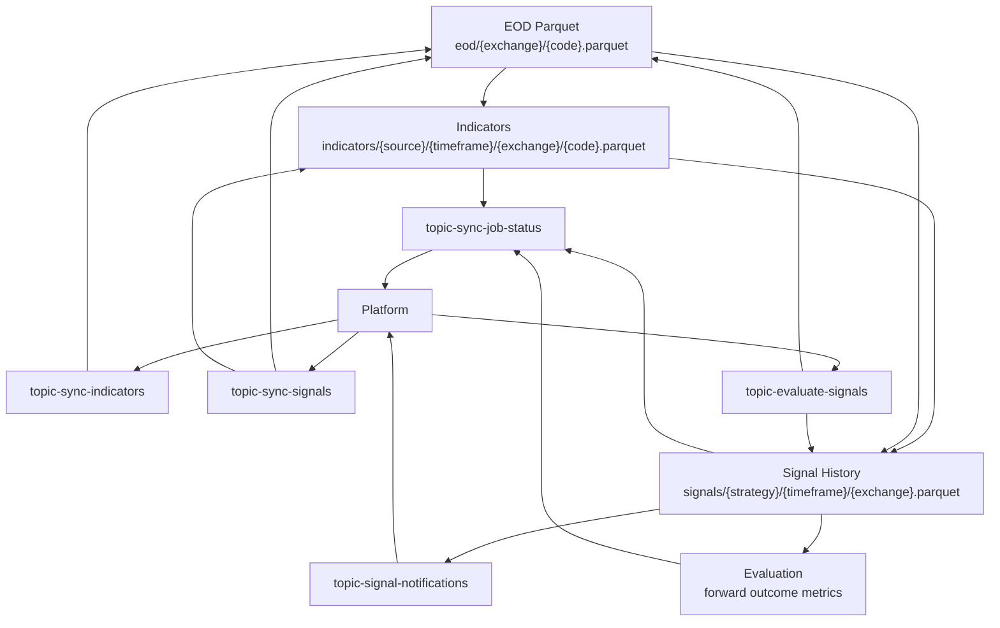
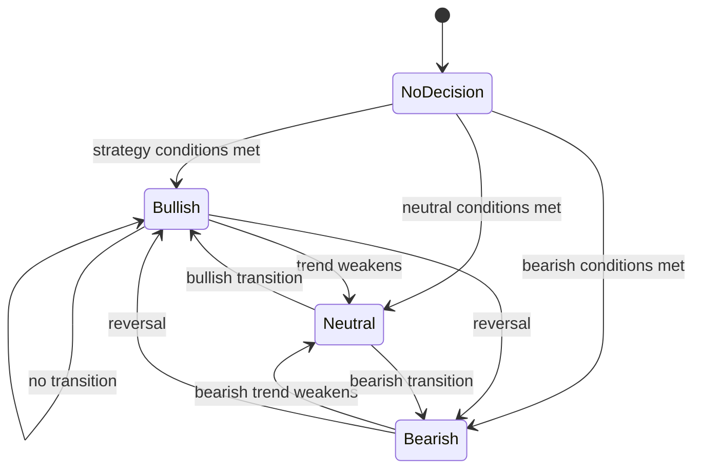

# Indicator and Signal Flow

Analyzer owns technical-indicator calculation, signal calculation, signal evaluation, and signal notification production.

## Flow



## Compact Flow

```text
EOD
 → Indicators
 → Signals
 → Signal History
 → Evaluation
 → Notification
```

## Topics

| Topic | Direction | Purpose |
| --- | --- | --- |
| [`topic-sync-indicators`](../data/kafka-contracts.md#topic-sync-indicators) | Platform → Analyzer | Compute indicator Parquet from EOD input. |
| [`topic-sync-signals`](../data/kafka-contracts.md#topic-sync-signals) | Platform → Analyzer | Compute signal history/current transition metadata. |
| [`topic-evaluate-signals`](../data/kafka-contracts.md#topic-evaluate-signals) | Platform → Analyzer | Evaluate prior signal outcomes after forward windows are available. |
| [`topic-signal-notifications`](../data/kafka-contracts.md#topic-signal-notifications) | Analyzer → Platform | Publish signal transition notifications. |
| [`topic-sync-job-status`](../data/kafka-contracts.md#topic-sync-job-status) | Analyzer → Platform | Report job execution status. |

## Datasets

| Dataset | Producer | Consumer | Path |
| --- | --- | --- | --- |
| [`eod`](../data/data-lake.md#eod) | Ingestor | Analyzer indicator/signal/evaluation jobs | `eod/{exchange}/{code}.parquet` |
| [`indicators`](../data/data-lake.md#indicators) | Analyzer indicator jobs | Analyzer signal jobs | `indicators/{source}/{timeframe}/{exchange}/{code}.parquet` |
| [`signals`](../data/data-lake.md#signals) | Analyzer signal jobs | Analyzer evaluation jobs, notification path | `signals/{strategy}/{timeframe}/{exchange}.parquet` |

## Responsibilities

| Component | Does | Does not do |
| --- | --- | --- |
| Platform | Schedules jobs, publishes analytical job requests, consumes status/notification events. | Does not compute technical indicators or signal decisions. |
| Analyzer | Reads EOD/indicator Parquet, computes indicators/signals/evaluations, writes Parquet outputs, publishes status/notification events. | Does not own stock ingestion or Platform database state. |
| Ingestor | Produces EOD input dataset. | Does not compute analytical outputs. |

## Signal Lifecycle



## Contract Notes

- Indicator jobs should identify symbol, source, timeframe, requested indicators, and job execution identity.
- Signal jobs should identify symbol, timeframe, strategy, and job execution identity.
- Signal transitions can produce notification events, while all jobs should publish job status.
- Evaluation jobs should use stable forward-return windows and avoid mutating historical signal meaning.

## Source Links

| Area | Path |
| --- | --- |
| Indicator calculations | [`apps/analyzer/app/calculations/indicators.py`](../../apps/analyzer/app/calculations/indicators.py) |
| Indicator worker | [`apps/analyzer/app/indicators`](../../apps/analyzer/app/indicators) |
| Signal worker/rules | [`apps/analyzer/app/signals`](../../apps/analyzer/app/signals) |
| Shared storage | [`libs/py-common/py_common/storage`](../../libs/py-common/py_common/storage) |
| Shared topics | [`configs/shared/topics.yaml`](../../configs/shared/topics.yaml) |
| Shared paths | [`configs/shared/s3-paths.yaml`](../../configs/shared/s3-paths.yaml) |
