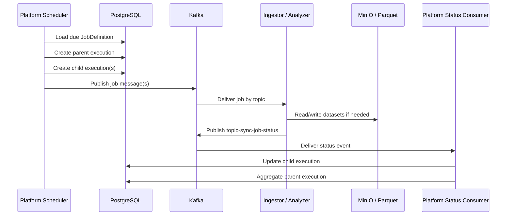
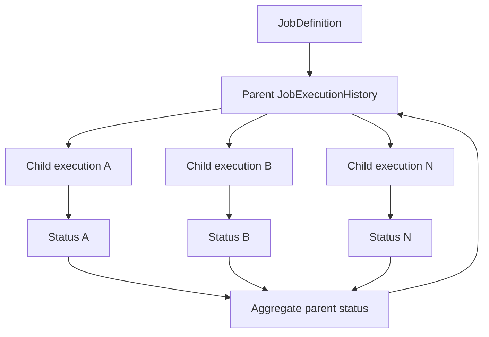

# Job Execution Flow

Platform owns job orchestration. Workers execute data-plane tasks and report status back through Kafka.

## Flow



## Compact Flow

```text
Scheduler
 → JobDefinition
 → Parent Execution
 → Child Execution
 → Kafka
 → Worker
 → Status Event
 → Platform
 → Parent Aggregation
```

## Responsibilities

| Step | Owner | Responsibility |
| --- | --- | --- |
| Schedule selection | Platform | Find enabled jobs due for execution. |
| Job definition | Platform/PostgreSQL | Store job type, schedule, and job-specific config. |
| Parent execution | Platform/PostgreSQL | Track an execution batch across child tasks. |
| Child execution | Platform/PostgreSQL | Track one executable unit sent to a worker. |
| Kafka command | Platform | Publish a worker-specific job payload. |
| Worker processing | Ingestor or Analyzer | Execute data-plane work. |
| Status event | Worker | Publish `topic-sync-job-status` with execution identity and metrics. |
| Aggregation | Platform | Update child status and roll up parent status when applicable. |

## Core Contracts

| Contract | Canonical doc/source |
| --- | --- |
| Status topic | [`topic-sync-job-status`](../data/kafka-contracts.md#topic-sync-job-status) |
| Job definitions | [`database/migrations/V1__create_job_definitions_table.sql`](../../database/migrations/V1__create_job_definitions_table.sql) |
| Job execution history | [`database/migrations/V2__create_job_execution_histories_table.sql`](../../database/migrations/V2__create_job_execution_histories_table.sql) |
| Java messaging records | [`apps/core/src/main/java/com/omni/platform/modules/scheduler/messaging`](../../apps/core/src/main/java/com/omni/platform/modules/scheduler/messaging) |
| Java producers | [`apps/core/src/main/java/com/omni/platform/modules/scheduler/producers`](../../apps/core/src/main/java/com/omni/platform/modules/scheduler/producers) |
| Java status consumer | [`apps/core/src/main/java/com/omni/platform/modules/scheduler/consumers/JobStatusConsumer.java`](../../apps/core/src/main/java/com/omni/platform/modules/scheduler/consumers/JobStatusConsumer.java) |

## Parent/Child Execution Model



## Failure Semantics

- Worker failures should publish a status event when possible.
- Status events should include `executionId`, optional `parentExecutionId`, final status, duration, metrics, and error details.
- Platform should update the child execution by execution identity, not by symbol alone.
- Parent aggregation should wait for all child executions to reach terminal states.
- Error details must not include credentials, object-store secrets, or provider tokens.

## Related Flows

- [Stock sync](stock-sync.md)
- [Indicator and signal](indicator-signal.md)
- [Sector wave](sector-wave.md)
