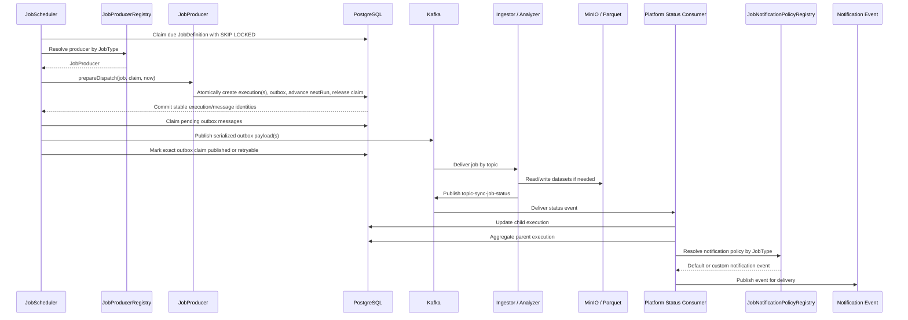
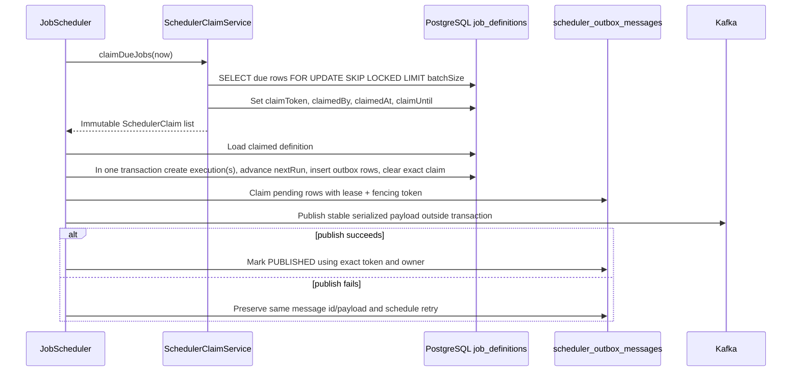
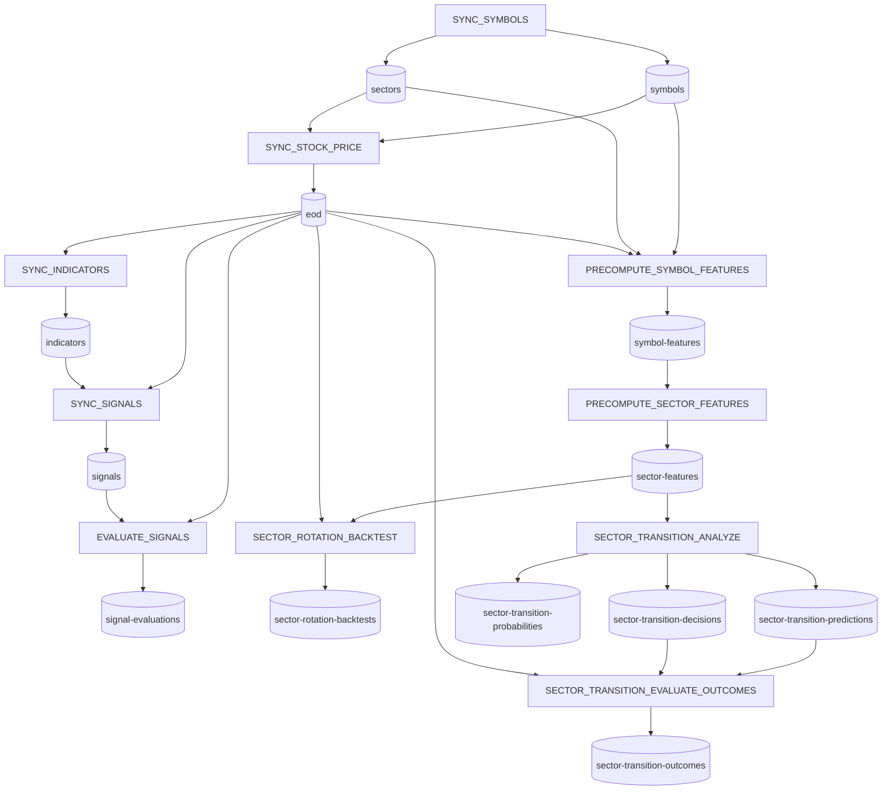
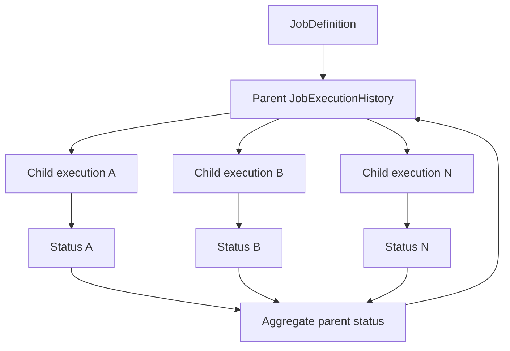

# Job Execution Flow

Platform owns job orchestration. Workers execute data-plane tasks and report status back through Kafka.

The repository now contains versioned `JobCommand` and `JobStatusEvent` Proto3 schemas in [`contracts/proto`](../../contracts/proto). They are a generated contract foundation only: the production flow described below remains on the existing JSON wire format until compatible consumers and adapters are delivered in later Phase 2 increments.

## Flow



## Compact Flow

```text
JobScheduler
 → JobProducerRegistry
 → JobProducer
 → SchedulerOutboxMessage
 → SchedulerOutboxDispatcher
 → Kafka
 → Worker / Analyzer
 → JobStatusMessage
 → JobService
 → JobNotificationPolicyRegistry
 → NotificationEvent
 → NotificationTemplate
 → TelegramNotificationService
```

## Responsibilities

| Step                  | Owner                | Responsibility                                                              |
| --------------------- | -------------------- | --------------------------------------------------------------------------- |
| Schedule selection    | Platform             | Atomically claim enabled jobs due for execution.                            |
| Producer resolution   | Platform             | Resolve `JobType` to a registered `JobProducer`; fail fast if none exists.  |
| Job definition        | Platform/PostgreSQL  | Store job type, schedule, and job-specific config.                          |
| Parent execution      | Platform/PostgreSQL  | Track an execution batch across child tasks.                                |
| Child execution       | Platform/PostgreSQL  | Track one executable work unit sent to a worker.                            |
| Kafka command         | Platform             | Persist then asynchronously publish a worker-specific job payload.          |
| Worker processing     | Ingestor or Analyzer | Execute data-plane work.                                                    |
| Status event          | Worker               | Publish `topic-sync-job-status` with execution identity, metrics, and meta. |
| Aggregation           | Platform             | Update child status and roll up parent status when applicable.              |
| Notification policy   | Platform             | Resolve custom policy by job type, or use the default generic policy.       |
| Notification delivery | Platform             | Publish a notification event for template rendering and Telegram delivery.  |

## Scheduler Claim and Transactional Outbox

The production scheduler uses PostgreSQL leases and a transactional outbox. Claim acquisition and outbox acquisition are separate short transactions; Kafka I/O never holds a database transaction open.



Claim candidates use the Phase 0 due semantics: active jobs where `nextRun <= now` or `nextRun IS NULL`. A live lease prevents reclaim; an expired claim receives a new UUID fencing token. Execution and outbox rows commit once, so a Kafka retry reuses the same execution id, outbox message id, key, and serialized payload instead of creating a second logical execution. Delivery remains at-least-once because a process may stop after Kafka accepts a message but before the database acknowledgement commits; consumers must therefore remain idempotent by execution identity.

## Dependency Tree Metadata

Seeded job definitions carry non-enforcing dependency metadata in [`JobDefinitionConfig.java`](../../apps/core/src/main/java/com/omni/platform/modules/scheduler/constants/JobDefinitionConfig.java). The metadata is stored under `dataDependencies` inside `config_json` for visibility and future orchestration work only. The scheduler does not block, reorder, or retry jobs from this metadata yet.



## Core Contracts

| Contract               | Canonical doc/source                                                                                                                                                                                                                                 |
| ---------------------- | ---------------------------------------------------------------------------------------------------------------------------------------------------------------------------------------------------------------------------------------------------- |
| Status topic           | [`topic-sync-job-status`](../data/kafka-contracts.md#topic-sync-job-status)                                                                                                                                                                          |
| Job definitions        | [`database/migrations/V1__create_job_definitions_table.sql`](../../database/migrations/V1__create_job_definitions_table.sql), [`database/migrations/V5__add_scheduler_claim_lease.sql`](../../database/migrations/V5__add_scheduler_claim_lease.sql) |
| Job execution history  | [`database/migrations/V2__create_job_execution_histories_table.sql`](../../database/migrations/V2__create_job_execution_histories_table.sql)                                                                                                         |
| Scheduler outbox       | [`database/migrations/V6__create_scheduler_outbox.sql`](../../database/migrations/V6__create_scheduler_outbox.sql)                                                                                                                                   |
| Java messaging records | [`apps/core/src/main/java/com/omni/platform/modules/scheduler/messaging`](../../apps/core/src/main/java/com/omni/platform/modules/scheduler/messaging)                                                                                               |
| Java producers         | [`apps/core/src/main/java/com/omni/platform/modules/scheduler/producers`](../../apps/core/src/main/java/com/omni/platform/modules/scheduler/producers)                                                                                               |
| Producer registry      | [`apps/core/src/main/java/com/omni/platform/modules/scheduler/producers/JobProducerRegistry.java`](../../apps/core/src/main/java/com/omni/platform/modules/scheduler/producers/JobProducerRegistry.java)                                             |
| Notification policies  | [`apps/core/src/main/java/com/omni/platform/modules/scheduler/notifications`](../../apps/core/src/main/java/com/omni/platform/modules/scheduler/notifications)                                                                                       |
| Java status consumer   | [`apps/core/src/main/java/com/omni/platform/modules/scheduler/consumers/JobStatusConsumer.java`](../../apps/core/src/main/java/com/omni/platform/modules/scheduler/consumers/JobStatusConsumer.java)                                                 |

## Parent/Child Execution Model



## Extending a Job Type

1. Add or reuse a `JobDefinition.JobType` value.
2. Implement a `JobProducer` and return that value from `getJobType()`.
3. Keep producer logic execution-focused: prepare execution, build Kafka messages, enqueue them transactionally, and run `postPublish()` if needed.
4. Do not add scheduler dispatch branches. Spring registers the producer in `JobProducerRegistry` automatically; duplicate producers for the same job type fail application startup.
5. Add or update producer and scheduler tests for the new registration.

## Notification Policies

`JobService` owns status updates and parent aggregation only. After a standalone or parent execution reaches a terminal status, it builds a `JobNotificationContext` and delegates event selection to `JobNotificationPolicyRegistry`.

Use `DefaultJobNotificationPolicy` for generic operational success/failure messages. Add a custom `JobNotificationPolicy` when a job type needs domain-specific rendering, such as Signal Digest summaries or actionable Sector Transition failures. Custom policies should return a notification event and keep template/Telegram delivery outside scheduler producers.

`symbolKey` remains in Kafka status messages for backward compatibility. New Platform child execution code also stores `workKey` in metadata via `createChildExecution(...)`; future contract changes can promote `workKey` only after producers, consumers, tests, and this document are updated together.

## Failure Semantics

- Worker failures should publish a status event when possible.
- Status events should include `executionId`, optional `parentExecutionId`, final status, duration, metrics, error details, and relevant `metaJson` context.
- Workers should preserve domain metadata on failures instead of replacing metadata with only `recordsProcessed = 0`.
- Platform should update the child execution by execution identity, not by symbol alone.
- Parent aggregation should wait for all child executions to reach terminal states.
- Error details must not include credentials, object-store secrets, or provider tokens.

## Related Flows

- [Stock sync](stock-sync.md)
- [Indicator and signal](indicator-signal.md)
- [Sector wave](sector-wave.md)
