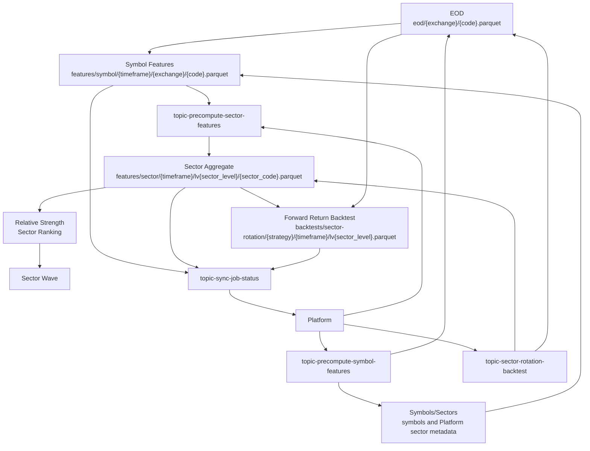
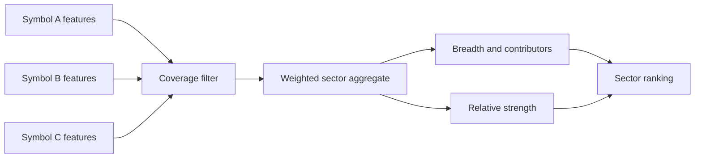

# Sector Wave Flow

Sector Wave precomputes symbol-level and sector-level analytical datasets so sector ranking and rotation backtests can run from stable Parquet inputs.

## Flow



## Compact Flow

```text
EOD
 → Symbol Features
 → Sector Aggregate
 → Relative Strength
 → Sector Ranking
 → Sector Wave
 → Forward Return Backtest
```

## Topics

| Topic | Direction | Purpose |
| --- | --- | --- |
| [`topic-precompute-symbol-features`](../data/kafka-contracts.md#topic-precompute-symbol-features) | Platform → Analyzer | Build symbol-level feature files. |
| [`topic-precompute-sector-features`](../data/kafka-contracts.md#topic-precompute-sector-features) | Platform → Analyzer | Aggregate symbol features into sector-level metrics. |
| [`topic-sector-rotation-backtest`](../data/kafka-contracts.md#topic-sector-rotation-backtest) | Platform → Analyzer | Run sector rotation backtests from sector features and forward returns. |
| [`topic-sync-job-status`](../data/kafka-contracts.md#topic-sync-job-status) | Analyzer → Platform | Report job execution outcome. |

## Datasets

| Dataset | Producer | Consumer | Path |
| --- | --- | --- | --- |
| [`eod`](../data/data-lake.md#eod) | Ingestor | Symbol feature and backtest jobs | `eod/{exchange}/{code}.parquet` |
| [`symbol-features`](../data/data-lake.md#symbol-features) | Analyzer | Sector aggregation jobs | `features/symbol/{timeframe}/{exchange}/{code}.parquet` |
| [`sector-features`](../data/data-lake.md#sector-features) | Analyzer | Ranking/wave/backtest jobs | `features/sector/{timeframe}/lv{sector_level}/{sector_code}.parquet` |
| [`sector-rotation-backtests`](../data/data-lake.md#sector-rotation-backtests) | Analyzer | Analytical/reporting consumers | `backtests/sector-rotation/{strategy}/{timeframe}/lv{sector_level}.parquet` |

## Core Metrics

| Metric | Meaning |
| --- | --- |
| T5/T10/T15/T20 | Forward return or holding windows used to evaluate sector strength and rotation outcomes. |
| Breadth | Share/count of symbols in a sector contributing positively to the sector move. |
| Contributors | Symbols that materially influence sector aggregate movement. |
| Coverage | Ratio of symbols with enough valid data to total eligible symbols in the sector. |
| Contribution share | Per-symbol share of sector aggregate contribution. |
| Relative strength | Sector performance normalized against peer sectors or market baseline. |
| Ranking | Ordered sector list by selected strength/quality score. |

## Aggregation Model



## Responsibilities

| Component | Does | Does not do |
| --- | --- | --- |
| Platform | Schedules precompute/backtest jobs and tracks execution state. | Does not calculate Sector Wave metrics. |
| Analyzer | Computes symbol features, sector features, rankings, and backtest outputs. | Does not ingest raw provider data or own Platform database projection state. |
| Ingestor | Produces EOD and metadata inputs. | Does not aggregate sector analytics. |

## Source Links

| Area | Path |
| --- | --- |
| Sector-wave calculations | [`apps/analyzer/app/sector_wave/calculations.py`](../../apps/analyzer/app/sector_wave/calculations.py) |
| Sector-wave handler | [`apps/analyzer/app/sector_wave/handler.py`](../../apps/analyzer/app/sector_wave/handler.py) |
| Sector-wave Kafka worker | [`apps/analyzer/app/sector_wave/kafka.py`](../../apps/analyzer/app/sector_wave/kafka.py) |
| Sector-wave messages | [`apps/analyzer/app/sector_wave/messages.py`](../../apps/analyzer/app/sector_wave/messages.py) |
| Platform sector-wave producers | [`apps/core/src/main/java/com/omni/platform/modules/scheduler/producers`](../../apps/core/src/main/java/com/omni/platform/modules/scheduler/producers) |
| Shared path config | [`configs/shared/s3-paths.yaml`](../../configs/shared/s3-paths.yaml) |
