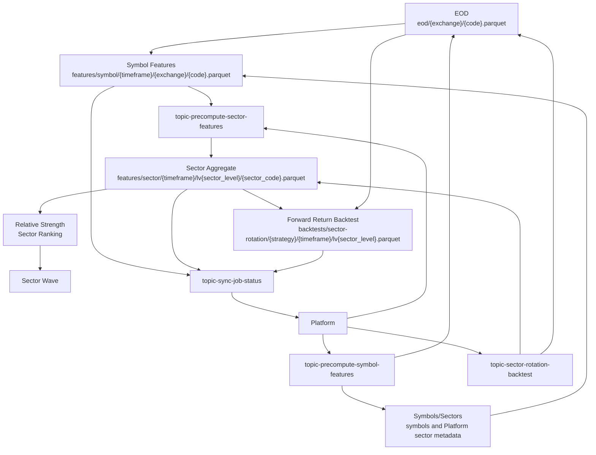
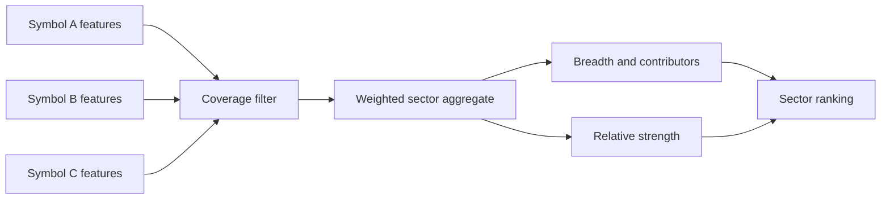
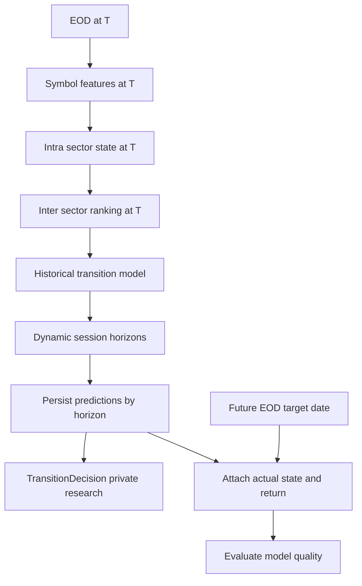

# Sector Wave Flow

Sector Wave precomputes symbol-level and sector-level analytical datasets so sector ranking and rotation backtests can run from stable Parquet inputs.

## Flow



## Compact Flow

```text
EOD
 → Symbol Features
 → Sector Aggregate
 → Relative Strength
 → Sector Ranking
 → Sector Wave
 → Forward Return Backtest
```

## Topics

| Topic                                                                                             | Direction           | Purpose                                                                 |
| ------------------------------------------------------------------------------------------------- | ------------------- | ----------------------------------------------------------------------- |
| [`topic-precompute-symbol-features`](../data/kafka-contracts.md#topic-precompute-symbol-features) | Platform → Analyzer | Build symbol-level feature files.                                       |
| [`topic-precompute-sector-features`](../data/kafka-contracts.md#topic-precompute-sector-features) | Platform → Analyzer | Aggregate symbol features into sector-level metrics.                    |
| [`topic-sector-rotation-backtest`](../data/kafka-contracts.md#topic-sector-rotation-backtest)     | Platform → Analyzer | Run sector rotation backtests from sector features and forward returns. |
| [`topic-sync-job-status`](../data/kafka-contracts.md#topic-sync-job-status)                       | Analyzer → Platform | Report job execution outcome.                                           |

## Datasets

| Dataset                                                                       | Producer | Consumer                         | Path                                                                        |
| ----------------------------------------------------------------------------- | -------- | -------------------------------- | --------------------------------------------------------------------------- |
| [`eod`](../data/data-lake.md#eod)                                             | Ingestor | Symbol feature and backtest jobs | `eod/{exchange}/{code}.parquet`                                             |
| [`symbol-features`](../data/data-lake.md#symbol-features)                     | Analyzer | Sector aggregation jobs          | `features/symbol/{timeframe}/{exchange}/{code}.parquet`                     |
| [`sector-features`](../data/data-lake.md#sector-features)                     | Analyzer | Ranking/wave/backtest jobs       | `features/sector/{timeframe}/lv{sector_level}/{sector_code}.parquet`        |
| [`sector-rotation-backtests`](../data/data-lake.md#sector-rotation-backtests) | Analyzer | Analytical/reporting consumers   | `backtests/sector-rotation/{strategy}/{timeframe}/lv{sector_level}.parquet` |

## Core Metrics

| Metric             | Meaning                                                                                   |
| ------------------ | ----------------------------------------------------------------------------------------- |
| T5/T10/T15/T20     | Forward return or holding windows used to evaluate sector strength and rotation outcomes. |
| Breadth            | Share/count of symbols in a sector contributing positively to the sector move.            |
| Contributors       | Symbols that materially influence sector aggregate movement.                              |
| Coverage           | Ratio of symbols with enough valid data to total eligible symbols in the sector.          |
| Contribution share | Per-symbol share of sector aggregate contribution.                                        |
| Relative strength  | Sector performance normalized against peer sectors or market baseline.                    |
| Ranking            | Ordered sector list by selected strength/quality score.                                   |

## Aggregation Model



## Responsibilities

| Component | Does                                                                       | Does not do                                                                  |
| --------- | -------------------------------------------------------------------------- | ---------------------------------------------------------------------------- |
| Platform  | Schedules precompute/backtest jobs and tracks execution state.             | Does not calculate Sector Wave metrics.                                      |
| Analyzer  | Computes symbol features, sector features, rankings, and backtest outputs. | Does not ingest raw provider data or own Platform database projection state. |
| Ingestor  | Produces EOD and metadata inputs.                                          | Does not aggregate sector analytics.                                         |

## Deferred Research: Sector Transition and Recommendation

Status: **parked research prototype**. This track is not part of the locked Signal V1 delivery sequence and must not silently expand Signal V1 scope. Existing Sector Wave components can be reused after Signal V1 stabilization, but transition decisions remain private/internal research outputs unless product/legal approval explicitly makes them user-facing.

### Activation Boundary

| Boundary               | Decision                                                                                                                                                                           |
| ---------------------- | ---------------------------------------------------------------------------------------------------------------------------------------------------------------------------------- |
| Roadmap position       | Deferred research track until explicitly assigned to a roadmap phase.                                                                                                              |
| Signal V1 relationship | Do not merge with Signal V1 `DecisionResult`, `MarketSignal`, or `TradeRecommendation` ownership.                                                                                  |
| Visibility             | Keep transition decisions internal by default. Public BUY/SELL/HOLD wording requires explicit product/legal review.                                                                |
| Reuse                  | Reuse symbol features, sector aggregation, ranking, state classification, contributors, rotation history, Kafka topics, and Parquet paths only after calculation issues are fixed. |

### T-Anchored Request Contract

Every run starts from an explicit trading date T. Inputs must describe the analysis universe, not a preselected transition pair.

```json
{
  "evaluationDate": "2026-08-07",
  "sectorLevel": 2,
  "sectorCodes": [],
  "focusSectorCodes": ["BANKS"],
  "timeframe": "1d",
  "predictionHorizons": [1, 5, 10]
}
```

Rules:

- `evaluationDate` is the anchor for what was knowable at T.
- `sectorLevel` defines the taxonomy boundary.
- `sectorCodes` remains a list and defines the Sector Transition universe filter only for Sector Transition jobs; an empty list resolves to all eligible sectors at `sectorLevel` before Kafka publication.
- `focusSectorCodes` controls focused prediction, decision, and outcome rows only; an empty list resolves to the full universe and a non-empty list must be a subset of the resolved universe.
- `fromSector` and `toSector` are derived outputs, not request parameters.
- The historical transition model is always calculated across the full resolved universe; focus must not become a focus-only training subset.
- `predictionHorizons` is runtime configuration and must not become hard-coded `T1`, `T5`, or `T10` schema columns.
- Horizon dates are resolved by trading sessions, not calendar-day offsets.
- Current-state features must use data available at or before T only.
- Forward return and future state belong to outcome evaluation, not state calculation.

### Target Research Flow



### Layer Boundaries

| Layer    | Owns                                                                                                                                         | Must not own                                                    |
| -------- | -------------------------------------------------------------------------------------------------------------------------------------------- | --------------------------------------------------------------- |
| FACT     | Symbol and sector state at T, breadth, sector return, relative strength, volume ratio, MA20 position, contributors, ranking.                 | Future labels, forward returns, or BUY/SELL/HOLD actions.       |
| MODEL    | Historical intra-sector state transition probabilities and inter-sector leadership/ranking transition probabilities by configurable horizon. | User-facing recommendations or immutable decision records.      |
| DECISION | Multi-horizon prediction interpretation, action, score, strategy, model version, reasons, and links to persisted predictions.                | Signal V1 `DecisionResult` naming or automatic public exposure. |

### Data Readiness Contract

Analyzer should validate prerequisites for T and return one of these statuses:

| Status    | Meaning                                                                                                                             |
| --------- | ----------------------------------------------------------------------------------------------------------------------------------- |
| `SUCCESS` | Analysis completed and outputs were persisted.                                                                                      |
| `BLOCKED` | Request is valid, but prerequisite data is missing. Analyzer declares missing data; Platform decides how to schedule upstream work. |
| `FAILED`  | Processing, code, storage, or provider error.                                                                                       |

Example `BLOCKED` response:

```json
{
  "status": "BLOCKED",
  "evaluationDate": "2026-08-07",
  "missingData": [
    {
      "dataset": "SYMBOL_FEATURE",
      "key": "HOSE-VCB",
      "requiredDate": "2026-08-07"
    },
    {
      "dataset": "SECTOR_FEATURE",
      "key": "REAL_ESTATE",
      "requiredDate": "2026-08-07"
    }
  ]
}
```

### Persistence Model

Predictions and probabilities should use row-based horizon storage:

| Field              | Purpose                                                                                           |
| ------------------ | ------------------------------------------------------------------------------------------------- |
| `evaluation_date`  | Anchor trading date T.                                                                            |
| `horizon_sessions` | Runtime horizon such as 1, 5, or 10 sessions.                                                     |
| `target_date`      | Real trading date resolved from horizon.                                                          |
| `from_sector`      | Source sector for transition probability/prediction.                                              |
| `to_sector`        | Candidate destination sector; self-transitions such as `BANKS -> BANKS` remain normal candidates. |
| `probability`      | Full-universe transition probability.                                                             |
| `sample_count`     | Historical sample count for the `(from_sector, horizon_sessions)` row distribution.               |
| `strategy`         | Strategy identifier.                                                                              |
| `model_version`    | Model/version identifier.                                                                         |

For each `(from_sector, horizon_sessions)`, probabilities across all `to_sector` rows should sum to approximately `1.0` when historical samples exist. `TransitionDecision` records should be immutable private research outputs with fields for evaluation date, source sector, target sector, horizon sessions, action, score, confidence, strategy, model version, reasons, and linked predictions. Later actual outcomes attach to outcome rows instead of rewriting original prediction probabilities or decisions.

### Known Calculation Fixes Before Trusting Outputs

Before using Sector Wave outputs as transition-model input, revisit these prototype issues:

| Area                        | Required correction                                                                                            |
| --------------------------- | -------------------------------------------------------------------------------------------------------------- |
| Relative strength           | Use a real benchmark or explicitly defined peer-universe baseline.                                             |
| Coverage                    | Correct the coverage denominator to eligible members for the requested sector and taxonomy level.              |
| MA20 readiness              | Missing MA20 history must not be interpreted as below MA20.                                                    |
| Contributor influence       | Rank influence by absolute contribution.                                                                       |
| Contribution reconciliation | Ensure contributor weights reconcile with sector return.                                                       |
| Taxonomy consistency        | Compare all requested sectors at the same sector level.                                                        |
| Universe size               | Single-sector runs can validate intra-sector state only; inter-sector rotation requires multiple sector codes. |

### Recommended Execution Order When Resumed

1. Freeze current prototype behavior and finish Signal V1 first.
2. Refactor Sector Wave research around explicit `evaluationDate = T`.
3. Add runtime `predictionHorizons` and trading-session target-date resolution.
4. Add Analyzer `SUCCESS` / `BLOCKED` / `FAILED` readiness responses.
5. Stabilize symbol features, intra-sector state, and inter-sector ranking.
6. Fix known Sector Wave calculation issues.
7. Build intra-sector and inter-sector transition matrices by horizon.
8. Persist multi-horizon prediction rows.
9. Add `TransitionDecision` engine and persist private/internal reasons.
10. Add incremental outcome evaluation that fills actual state and return.
11. Measure accuracy by action, sector, probability bucket, horizon, and strategy version.
12. Add correlation later as a separate model feature dimension.

### Shared Contract Candidates

Generic contracts such as `MissingData`, `PredictionHorizon`, and `TransitionProbability` can move to `py_common` if reused across Analyzer features. Domain-scoped outputs such as `TransitionDecision` should remain in the sector-transition research module unless they become genuinely reusable.

## Source Links

| Area                           | Path                                                                                                                                                   |
| ------------------------------ | ------------------------------------------------------------------------------------------------------------------------------------------------------ |
| Sector-wave calculations       | [`apps/analyzer/app/sector_wave/calculations.py`](../../apps/analyzer/app/sector_wave/calculations.py)                                                 |
| Sector-wave handler            | [`apps/analyzer/app/sector_wave/handler.py`](../../apps/analyzer/app/sector_wave/handler.py)                                                           |
| Sector-wave Kafka worker       | [`apps/analyzer/app/sector_wave/kafka.py`](../../apps/analyzer/app/sector_wave/kafka.py)                                                               |
| Sector-wave messages           | [`apps/analyzer/app/sector_wave/messages.py`](../../apps/analyzer/app/sector_wave/messages.py)                                                         |
| Platform sector-wave producers | [`apps/core/src/main/java/com/omni/platform/modules/scheduler/producers`](../../apps/core/src/main/java/com/omni/platform/modules/scheduler/producers) |
| Shared path config             | [`configs/shared/s3-paths.yaml`](../../configs/shared/s3-paths.yaml)                                                                                   |
