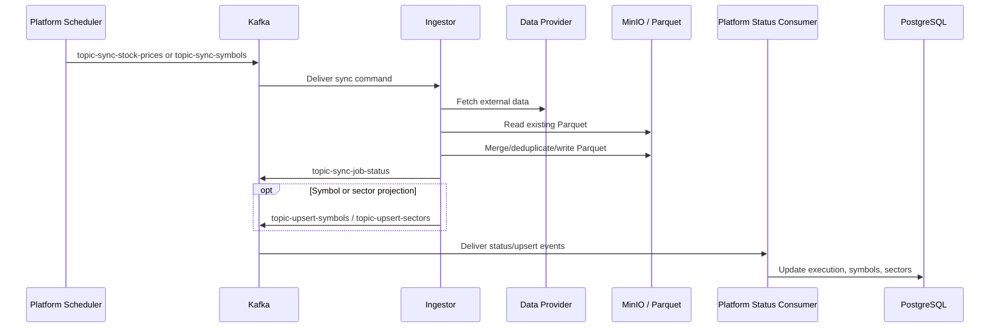

# Stock Sync Flow

Stock sync moves external market data into Omni's Parquet data lake and projects symbol/sector metadata back into Platform state.

## Flow



## Compact Flow

```text
Platform
 → Kafka
 → Ingestor
 → Data Provider
 → Parquet
 → Status
 → Platform
```

## Topics

| Topic | Direction | Purpose |
| --- | --- | --- |
| [`topic-sync-stock-prices`](../data/kafka-contracts.md#topic-sync-stock-prices) | Platform → Ingestor | Request EOD price sync for one symbol/task. |
| [`topic-sync-symbols`](../data/kafka-contracts.md#topic-sync-symbols) | Platform → Ingestor | Request symbol metadata sync. |
| [`topic-sync-job-status`](../data/kafka-contracts.md#topic-sync-job-status) | Ingestor → Platform | Report job execution outcome. |
| [`topic-upsert-symbols`](../data/kafka-contracts.md#topic-upsert-symbols) | Ingestor → Platform | Project symbol metadata into Platform database. |
| [`topic-upsert-sectors`](../data/kafka-contracts.md#topic-upsert-sectors) | Ingestor → Platform | Project sector metadata into Platform database. |

## Datasets

| Dataset | Producer | Consumer | Path |
| --- | --- | --- | --- |
| [`symbols`](../data/data-lake.md#symbols) | Ingestor | Analyzer, Platform projection path | `symbols/{exchange}.parquet` |
| [`eod`](../data/data-lake.md#eod) | Ingestor | Analyzer | `eod/{exchange}/{code}.parquet` |

## Responsibilities

| Component | Does | Does not do |
| --- | --- | --- |
| Platform | Schedules stock/symbol sync jobs, creates execution records, publishes Kafka commands, consumes status/upsert events. | Does not fetch external provider data or route workers by S3 object path in Kafka messages. |
| Ingestor | Fetches provider data, normalizes records, derives paths, merges Parquet, publishes status/upsert events. | Does not own Platform database schema or scheduler state. |
| Data provider | Supplies external market data. | Does not define Omni contracts. |
| MinIO/S3 | Stores Parquet datasets. | Does not own schema evolution decisions. |

## Object Path Rule

Kafka job messages should carry business identity such as `symbolKey`, `source`, job identifiers, and metadata. They should not carry bucket or object path routing fields. Ingestor derives storage paths from shared path builders backed by [`configs/shared/s3-paths.yaml`](../../configs/shared/s3-paths.yaml).

## Source Links

| Area | Path |
| --- | --- |
| Ingestor stock handlers | [`apps/ingestor/app/handlers`](../../apps/ingestor/app/handlers) |
| Ingestor stock clients | [`apps/ingestor/app/stocks`](../../apps/ingestor/app/stocks) |
| Platform stock/symbol producers | [`apps/core/src/main/java/com/omni/platform/modules/scheduler/producers`](../../apps/core/src/main/java/com/omni/platform/modules/scheduler/producers) |
| Platform upsert consumers | [`apps/core/src/main/java/com/omni/platform/modules/scheduler/consumers`](../../apps/core/src/main/java/com/omni/platform/modules/scheduler/consumers) |
| Shared path config | [`configs/shared/s3-paths.yaml`](../../configs/shared/s3-paths.yaml) |
| Shared topic config | [`configs/shared/topics.yaml`](../../configs/shared/topics.yaml) |
