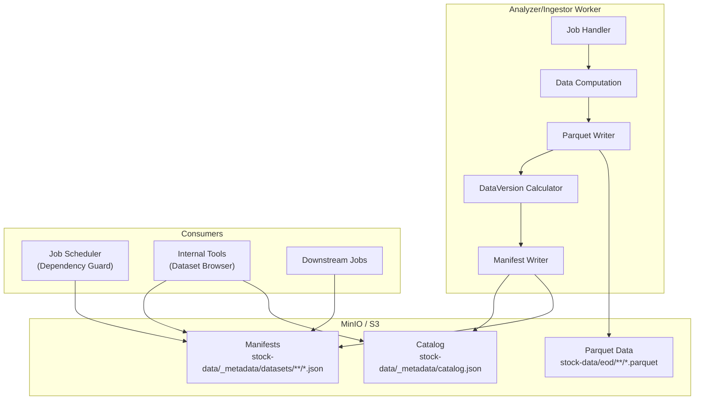

# Dataset Metadata Manifest Implementation Plan

## Goal

Store dataset statistics, readiness and version lineage in the same S3-compatible object storage as Omni analytical data.

Do not introduce PostgreSQL/Redis as the source of truth for dataset statistics in V1.

## Outcome

After this phase Internal Tools and downstream jobs can answer, using small JSON object reads:

- object count / total bytes / total rows;
- schema/column information;
- min/max date or timestamp;
- READY state and last successful generation;
- deterministic dataset `dataVersion`;
- which upstream dataset versions produced the current output;
- physical data path/glob for authorized data access.

The manifest becomes both a fast UI metadata source and the primary dataset dependency/readiness contract.

## Dataset Outputs

No new market dataset is required by the metadata layer itself.

Metadata objects:

```text
_metadata/catalog.json
_metadata/datasets/<dataset>/<partition_path>/READY.json
_metadata/datasets/<dataset>/<partition_path>/versions/<dataVersion>.json
```

Partition keys are normalized and sorted as `key=value` path segments. An empty
partition uses the reserved `_default` segment.

Keep `_metadata/` outside Parquet data prefixes so DuckDB globs remain clean.

## Manifest Schema

Recommended V1 shape:

```json
{
  "version": 1,
  "dataset": "intraday-bars",
  "partition": {
    "timeframe": "1m",
    "date": "2026-08-11",
    "exchange": "HOSE"
  },
  "status": "READY",
  "path": "intraday/bars/timeframe=1m/date=2026-08-11/exchange=HOSE/*.parquet",
  "dataVersion": "sha256:...",
  "objectCount": 2,
  "totalBytes": 18342112,
  "rowCount": 184210,
  "columnCount": 12,
  "columns": [
    { "name": "bar_time", "type": "TIMESTAMP" },
    { "name": "symbol", "type": "VARCHAR" },
    { "name": "close", "type": "DOUBLE" }
  ],
  "schemaVersion": 1,
  "schemaHash": "sha256:...",
  "minTimestamp": "2026-08-11T09:00:00+07:00",
  "maxTimestamp": "2026-08-11T14:45:00+07:00",
  "inputs": [
    {
      "dataset": "intraday-trades",
      "partition": {
        "date": "2026-08-11",
        "exchange": "HOSE"
      },
      "dataVersion": "sha256:..."
    }
  ],
  "sourceExecutionId": "...",
  "generatedAt": "2026-08-11T15:30:00+07:00"
}
```

Nullable fields are allowed where not applicable.

## `dataVersion` Semantics

`generatedAt` is not a sufficient data version because an idempotent retry with unchanged contents should not necessarily invalidate every downstream dataset.

The deterministic fingerprint is based on canonical output identity/content and
exact upstream lineage:

```text
sha256(
  dataset
  + normalized partition
  + schemaHash
  + ordered object keys and SHA-256 checksums
  + canonically ordered inputs[].dataset/partition/dataVersion
)
```

`generatedAt` is excluded. Canonicalization is defined and tested once in shared
storage code. Writers use the SHA-256 and byte length of the exact persisted
Parquet bytes rather than rescanning a prefix or relying on provider-specific
ETag semantics.

Downstream manifests copy each upstream `dataVersion` into `inputs[]`.

This enables `CURRENT_INPUTS` checks without reading Parquet.

## Write / Commit Semantics

The mutable READY pointer is written **last**:

```text
write exact Parquet bytes
   -> validate persisted data
   -> calculate stats/schema/dataVersion
   -> PUT immutable versions/<dataVersion>.json
   -> replace READY.json
   -> consumers may use partition
```

Rules:

1. Never publish READY before data validation and immutable-manifest publication succeed.
2. A failed immutable write does not attempt READY publication.
3. A failed READY replacement performs no compensating pointer write, preserving the object store's prior READY value.
4. Reprocessing equivalent content replaces READY idempotently with the same `dataVersion`.
5. `generatedAt` is operational time; trading/evaluation time belongs in the partition/data.
6. Readiness checks use manifest reads, not full prefix scans.
7. `inputs[]` must contain the exact upstream data versions actually consumed.

## Catalog

`_metadata/catalog.json` stores stable dataset definitions:

```json
{
  "version": 1,
  "datasets": [
    {
      "name": "intraday-bars",
      "metadataPrefix": "_metadata/datasets/intraday-bars/",
      "dataPrefix": "intraday/bars/"
    }
  ]
}
```

Avoid one globally-mutated counter/statistics object updated by every data writer.

## Shared Contract Placement

Persisted manifest contract remains JSON.

Shared Python writer/read/path logic belongs in `py_common`.

Platform may have a small read-only Java manifest client/adapter for scheduler/Internal Tools APIs.

Cross-service Kafka references to datasets use protobuf `DatasetRef`/`DatasetOutput`; protobuf does not replace the persisted JSON manifest.

See `CROSS_SERVICE_PROTOBUF_CONTRACTS_IMPLEMENTATION_PLAN.md`.

## Scheduler / Dependency Integration

Dependency guard can validate:

```text
EXISTS
READY
PARTITION_MATCH
MIN_ROW_COUNT
SUPPORTED_SCHEMA_VERSION
MAX_FRESHNESS_LAG
CURRENT_INPUTS
```

`CURRENT_INPUTS` compares downstream `inputs[].dataVersion` with current upstream manifests.

See `JOB_DEPENDENCY_GUARD_IMPLEMENTATION_PLAN.md`.

## Internal Tools

Dataset Browser reads manifests for fast cards/tables:

```text
Dataset
Status
Objects
Size
Rows
Columns
Range
Generated At
Data Version
Input Versions / lineage
```

Only when the user drills into data should the private Query Service resolve the
READY manifest and run a bounded native DuckDB query. The browser receives
neither object-storage credentials nor physical object paths.

## Intraday / Realtime

Intraday EOD publishes one READY manifest per completed partition.

Realtime micro-batches do not rewrite the canonical manifest for every flush. Publish final session READY metadata after compaction/reconciliation.

## Algorithm Feature Outputs

No direct market algorithm feature output.

Operational/data-quality values such as row count, freshness and versions are not market features unless a later research model explicitly chooses to use them.

## Algorithms Unlocked

No trading algorithm directly. The layer enables safer backtests, dependency-aware pipelines, realtime/batch reconciliation and feature input validation.

## Implementation Steps

1. Define JSON DatasetManifest schema including `dataVersion` and `inputs[]`.
2. Add shared deterministic manifest/data-version builder in `py_common`.
3. Reserve `_metadata/` paths in shared storage config.
4. Integrate writer-last manifest publishing into important existing/new datasets.
5. Add Platform read client for dependency checks.
6. Add Internal Tools manifest/lineage display.
7. Add dependency guard conditions, especially `CURRENT_INPUTS`.
8. Keep realtime micro-batch writes off the canonical manifest hot path.

## Repository Guidance Updates

Implementation must review/update:

```text
AGENTS.md
CLAUDE.md when storage/tool workflow guidance changes
.roo/rules/
docs/data/002-data-lake.md
docs/flows/001-job-execution.md
```

Guidance must describe READY-last semantics, centralized S3/R2 metadata, `dataVersion` lineage and the rule against scanning Parquet merely to test readiness.

## Verification

- deterministic `dataVersion` tests;
- manifest serialization/schema tests;
- failed-write preserves old READY manifest test;
- CURRENT_INPUTS lineage tests;
- S3/R2/MinIO compatibility tests where supported;
- targeted/affected Nx checks.

## Acceptance Criteria

- common dataset stats/readiness are available from JSON manifests;
- `dataVersion` is deterministic for equivalent canonical output;
- downstream manifests record exact upstream versions consumed;
- dependency checks require no normal Parquet prefix scan;
- metadata works with MinIO/S3/R2-compatible storage;
- no PostgreSQL/Redis metadata cache is required;
- repository guidance and Zoo Code rules are synchronized.

---

## Detailed Implementation Record

## Executive Summary

This plan implements dataset metadata manifests stored in MinIO/S3 alongside Parquet data. Manifests provide fast O(1) access to dataset statistics, readiness state, schema information, and version lineage without requiring PostgreSQL/Redis caches or full Parquet prefix scans.

**Key Decision**: Metadata lives in object storage as JSON files, eliminating the need for a separate metadata database in V1.

## Implemented Contract Reconciliation

The canonical persisted contract is defined by
[`docs/plans/003-dataset-metadata-manifest.md`](003-dataset-metadata-manifest.md)
and the shared implementation. Where older pseudocode below shows a single
`<partition>.json` object, read it as the implemented pair:

```text
_metadata/datasets/<dataset>/<partition_path>/READY.json
_metadata/datasets/<dataset>/<partition_path>/versions/<dataVersion>.json
```

The immutable version is published before READY. Physical identity uses SHA-256
and byte length from the exact persisted Parquet bytes, and deterministic
`dataVersion` includes canonical object checksums and exact lineage inputs while
excluding `generatedAt`.

## Reference Documents

- Base Plan: [`docs/plans/003-dataset-metadata-manifest.md`](003-dataset-metadata-manifest.md)
- Storage Paths: [`configs/shared/s3-paths.yaml`](../../configs/shared/s3-paths.yaml)
- Parquet Storage: [`libs/py-common/py_common/storage/parquet.py`](../../libs/py-common/py_common/storage/parquet.py)
- System Overview: [`docs/architecture/001-system-overview.md`](../architecture/001-system-overview.md)

## Architecture Overview



## Metadata Storage Structure

```text
stock-data/
├── _metadata/
│   ├── catalog.json
│   └── datasets/
│       ├── eod/
│       │   └── exchange=hose/
│       │       ├── READY.json
│       │       └── versions/<dataVersion>.json
│       ├── indicators/
│       │   └── code=hpg/exchange=hose/source=ad_close/timeframe=1d/
│       │       ├── READY.json
│       │       └── versions/<dataVersion>.json
│       └── market-calendar/
│           └── _default/
│               ├── READY.json
│               └── versions/<dataVersion>.json
└── [data files as before...]
```

## Domain Models

### Python Models (py_common)

```python
# libs/py-common/py_common/storage/manifest.py

from dataclasses import dataclass
from datetime import datetime
from typing import Literal, Optional

@dataclass
class ColumnMetadata:
    """Schema column information."""
    name: str
    type: str
    nullable: bool = True

@dataclass
class DatasetInput:
    """Upstream dataset reference with version."""
    dataset: str
    partition: dict[str, str]
    dataVersion: str

@dataclass
class DatasetManifest:
    """Complete dataset partition manifest."""
    version: int
    dataset: str
    partition: dict[str, str]
    status: Literal['READY', 'PROCESSING', 'FAILED']
    path: str
    dataVersion: str
    objectCount: int
    totalBytes: int
    rowCount: int
    columnCount: int
    columns: list[ColumnMetadata]
    schemaVersion: int
    schemaHash: str
    minTimestamp: Optional[str] = None
    maxTimestamp: Optional[str] = None
    inputs: list[DatasetInput] = None
    sourceExecutionId: Optional[str] = None
    generatedAt: str

@dataclass
class DatasetDefinition:
    """Catalog entry for a dataset."""
    name: str
    metadataPrefix: str
    dataPrefix: str
    description: Optional[str] = None

@dataclass
class DatasetCatalog:
    """Root catalog of all datasets."""
    version: int
    datasets: list[DatasetDefinition]
    lastUpdated: str
```

## DataVersion Calculation

### Deterministic Fingerprint

The `dataVersion` must be deterministic and content-based, not time-based:

```python
# libs/py-common/py_common/storage/manifest.py

import hashlib
import json
from typing import Any

def calculate_data_version(
    dataset: str,
    partition: dict[str, str],
    schema_hash: str,
    object_checksums: list[tuple[str, str]],  # [(path, etag), ...]
) -> str:
    """Calculate deterministic data version fingerprint.

    Args:
        dataset: Dataset name
        partition: Normalized partition keys (sorted)
        schema_hash: Hash of Parquet schema
        object_checksums: Sorted list of (object_path, etag) tuples

    Returns:
        sha256:... data version string

    Example:
        >>> calculate_data_version(
        ...     'eod',
        ...     {'exchange': 'hose'},
        ...     'sha256:abc...',
        ...     [('eod/hose/hpg.parquet', '"etag-1"')]
        ... )
        'sha256:def...'
    """
    # Canonical representation
    canonical = {
        'dataset': dataset,
        'partition': dict(sorted(partition.items())),
        'schemaHash': schema_hash,
        'objects': sorted(object_checksums),
    }

    # Deterministic JSON encoding
    canonical_json = json.dumps(
        canonical,
        sort_keys=True,
        separators=(',', ':'),
        ensure_ascii=True,
    )

    # SHA256 fingerprint
    digest = hashlib.sha256(canonical_json.encode('utf-8')).hexdigest()
    return f'sha256:{digest}'


def calculate_schema_hash(columns: list[ColumnMetadata]) -> str:
    """Calculate hash of schema columns.

    Args:
        columns: List of column metadata

    Returns:
        sha256:... schema hash string
    """
    schema_dict = {
        'columns': [
            {'name': col.name, 'type': col.type, 'nullable': col.nullable}
            for col in sorted(columns, key=lambda c: c.name)
        ]
    }

    schema_json = json.dumps(
        schema_dict,
        sort_keys=True,
        separators=(',', ':'),
    )

    digest = hashlib.sha256(schema_json.encode('utf-8')).hexdigest()
    return f'sha256:{digest}'
```

### Schema Extraction

```python
# libs/py-common/py_common/storage/manifest.py

import pandas as pd
import pyarrow.parquet as pq

def extract_schema_from_dataframe(df: pd.DataFrame) -> list[ColumnMetadata]:
    """Extract schema metadata from pandas DataFrame.

    Args:
        df: DataFrame to inspect

    Returns:
        List of column metadata
    """
    columns = []
    for col_name in df.columns:
        dtype = df[col_name].dtype
        nullable = df[col_name].isnull().any()

        # Map pandas dtype to SQL-like type
        if pd.api.types.is_integer_dtype(dtype):
            sql_type = 'BIGINT'
        elif pd.api.types.is_float_dtype(dtype):
            sql_type = 'DOUBLE'
        elif pd.api.types.is_bool_dtype(dtype):
            sql_type = 'BOOLEAN'
        elif pd.api.types.is_datetime64_any_dtype(dtype):
            sql_type = 'TIMESTAMP'
        elif pd.api.types.is_string_dtype(dtype) or pd.api.types.is_object_dtype(dtype):
            sql_type = 'VARCHAR'
        else:
            sql_type = 'VARCHAR'  # Fallback

        columns.append(ColumnMetadata(
            name=col_name,
            type=sql_type,
            nullable=nullable,
        ))

    return columns


async def get_parquet_file_metadata(
    readable: ReadableStorage,
    bucket: str,
    object_name: str,
) -> tuple[int, str]:
    """Get row count and ETag from Parquet file.

    Args:
        readable: Storage adapter
        bucket: Bucket name
        object_name: Object path

    Returns:
        (row_count, etag) tuple
    """
    # Read minimal metadata (not full file)
    data = await readable.read_bytes(bucket, object_name)

    # Parse Parquet metadata
    parquet_file = pq.ParquetFile(io.BytesIO(data))
    row_count = parquet_file.metadata.num_rows

    # Get ETag from storage (implementation-specific)
    # For now, compute content hash
    etag = hashlib.md5(data).hexdigest()

    return row_count, f'"{etag}"'
```

## Manifest Writer

```python
# libs/py-common/py_common/storage/manifest.py

import json
from pathlib import PurePosixPath
from datetime import datetime, timezone

class ManifestWriter:
    """Write dataset manifests to object storage."""

    def __init__(
        self,
        registry: StorageProviderRegistry,
        provider: StorageProvider,
        bucket: str,
    ):
        self._writable = registry.get_port(provider, WritableStorage)
        self._readable = registry.get_port(provider, ReadableStorage)
        self._listable = registry.get_port(provider, ListableStorage)
        self._bucket = bucket

    async def write_manifest(
        self,
        manifest: DatasetManifest,
    ) -> None:
        """Write manifest to object storage.

        Args:
            manifest: Manifest to write

        Raises:
            StorageWriteError: If write fails
        """
        # Build manifest path
        path = self._build_manifest_path(manifest.dataset, manifest.partition)

        # Serialize to JSON
        manifest_json = self._serialize_manifest(manifest)

        # Write to storage
        await self._writable.write_bytes(
            bucket=self._bucket,
            object_name=path,
            data=manifest_json.encode('utf-8'),
            content_type='application/json',
        )

        logger.info(
            "Wrote manifest for %s partition=%s to %s",
            manifest.dataset,
            manifest.partition,
            path,
        )

    def _build_manifest_path(
        self,
        dataset: str,
        partition: dict[str, str],
    ) -> str:
        """Build manifest object path.

        Example:
            >>> _build_manifest_path('eod', {'exchange': 'hose'})
            '_metadata/datasets/eod/exchange=hose.json'
        """
        base = f'_metadata/datasets/{dataset}'

        if not partition:
            return f'{base}/default.json'

        # Build partition path
        partition_parts = [
            f'{key}={value}'
            for key, value in sorted(partition.items())
        ]
        partition_path = '/'.join(partition_parts)

        return f'{base}/{partition_path}.json'

    def _serialize_manifest(self, manifest: DatasetManifest) -> str:
        """Serialize manifest to JSON."""
        # Convert dataclass to dict
        manifest_dict = {
            'version': manifest.version,
            'dataset': manifest.dataset,
            'partition': manifest.partition,
            'status': manifest.status,
            'path': manifest.path,
            'dataVersion': manifest.dataVersion,
            'objectCount': manifest.objectCount,
            'totalBytes': manifest.totalBytes,
            'rowCount': manifest.rowCount,
            'columnCount': manifest.columnCount,
            'columns': [
                {
                    'name': col.name,
                    'type': col.type,
                    'nullable': col.nullable,
                }
                for col in manifest.columns
            ],
            'schemaVersion': manifest.schemaVersion,
            'schemaHash': manifest.schemaHash,
            'generatedAt': manifest.generatedAt,
        }

        # Add optional fields
        if manifest.minTimestamp:
            manifest_dict['minTimestamp'] = manifest.minTimestamp
        if manifest.maxTimestamp:
            manifest_dict['maxTimestamp'] = manifest.maxTimestamp
        if manifest.inputs:
            manifest_dict['inputs'] = [
                {
                    'dataset': inp.dataset,
                    'partition': inp.partition,
                    'dataVersion': inp.dataVersion,
                }
                for inp in manifest.inputs
            ]
        if manifest.sourceExecutionId:
            manifest_dict['sourceExecutionId'] = manifest.sourceExecutionId

        return json.dumps(manifest_dict, indent=2, ensure_ascii=False)


async def publish_dataset_manifest(
    writer: ManifestWriter,
    dataset: str,
    partition: dict[str, str],
    data_path: str,
    dataframe: pd.DataFrame,
    inputs: list[DatasetInput] = None,
    execution_id: str = None,
) -> DatasetManifest:
    """Publish READY manifest after successful data write.

    This is the last step after Parquet data is written and validated.

    Args:
        writer: Manifest writer
        dataset: Dataset name
        partition: Partition keys
        data_path: Glob path to data files
        dataframe: DataFrame that was written
        inputs: Upstream dataset inputs
        execution_id: Source job execution ID

    Returns:
        Published manifest

    Example:
        >>> await publish_dataset_manifest(
        ...     writer=manifest_writer,
        ...     dataset='eod',
        ...     partition={'exchange': 'hose'},
        ...     data_path='eod/hose/*.parquet',
        ...     dataframe=eod_df,
        ...     inputs=[DatasetInput(...)],
        ... )
    """
    # Extract schema
    columns = extract_schema_from_dataframe(dataframe)
    schema_hash = calculate_schema_hash(columns)

    # Calculate statistics
    row_count = len(dataframe)
    column_count = len(dataframe.columns)

    # Get timestamp range if applicable
    min_timestamp = None
    max_timestamp = None
    for ts_col in ['date', 'bar_time', 'timestamp']:
        if ts_col in dataframe.columns:
            min_timestamp = dataframe[ts_col].min().isoformat()
            max_timestamp = dataframe[ts_col].max().isoformat()
            break

    # Calculate data version (simplified - need object checksums)
    data_version = calculate_data_version(
        dataset=dataset,
        partition=partition,
        schema_hash=schema_hash,
        object_checksums=[],  # TODO: Get from storage
    )

    # Build manifest
    manifest = DatasetManifest(
        version=1,
        dataset=dataset,
        partition=partition,
        status='READY',
        path=data_path,
        dataVersion=data_version,
        objectCount=1,  # TODO: Count actual objects
        totalBytes=0,  # TODO: Get from storage
        rowCount=row_count,
        columnCount=column_count,
        columns=columns,
        schemaVersion=1,
        schemaHash=schema_hash,
        minTimestamp=min_timestamp,
        maxTimestamp=max_timestamp,
        inputs=inputs or [],
        sourceExecutionId=execution_id,
        generatedAt=datetime.now(timezone.utc).isoformat(),
    )

    # Write manifest (READY-last semantics)
    await writer.write_manifest(manifest)

    return manifest
```

## Manifest Reader

```python
# libs/py-common/py_common/storage/manifest.py

class ManifestReader:
    """Read dataset manifests from object storage."""

    def __init__(
        self,
        registry: StorageProviderRegistry,
        provider: StorageProvider,
        bucket: str,
    ):
        self._readable = registry.get_port(provider, ReadableStorage)
        self._listable = registry.get_port(provider, ListableStorage)
        self._bucket = bucket

    async def read_catalog(self) -> DatasetCatalog:
        """Read dataset catalog.

        Returns:
            Dataset catalog

        Raises:
            StorageObjectNotFoundError: If catalog doesn't exist
        """
        path = '_metadata/catalog.json'

        try:
            data = await self._readable.read_bytes(self._bucket, path)
            catalog_dict = json.loads(data.decode('utf-8'))

            return DatasetCatalog(
                version=catalog_dict['version'],
                datasets=[
                    DatasetDefinition(**ds)
                    for ds in catalog_dict['datasets']
                ],
                lastUpdated=catalog_dict['lastUpdated'],
            )
        except StorageObjectNotFoundError:
            # Return empty catalog if not found
            return DatasetCatalog(
                version=1,
                datasets=[],
                lastUpdated=datetime.now(timezone.utc).isoformat(),
            )

    async def read_manifest(
        self,
        dataset: str,
        partition: dict[str, str],
    ) -> Optional[DatasetManifest]:
        """Read specific dataset partition manifest.

        Args:
            dataset: Dataset name
            partition: Partition keys

        Returns:
            Manifest if exists, None otherwise
        """
        path = self._build_manifest_path(dataset, partition)

        try:
            data = await self._readable.read_bytes(self._bucket, path)
            return self._deserialize_manifest(data.decode('utf-8'))
        except StorageObjectNotFoundError:
            return None

    async def list_dataset_manifests(
        self,
        dataset: str,
    ) -> list[DatasetManifest]:
        """List all manifests for a dataset.

        Args:
            dataset: Dataset name

        Returns:
            List of manifests
        """
        prefix = f'_metadata/datasets/{dataset}/'

        # List all JSON files in dataset prefix
        objects = await self._listable.list_objects(
            bucket=self._bucket,
            prefix=prefix,
        )

        manifests = []
        for obj in objects:
            if obj.endswith('.json'):
                data = await self._readable.read_bytes(self._bucket, obj)
                manifest = self._deserialize_manifest(data.decode('utf-8'))
                manifests.append(manifest)

        return manifests

    def _deserialize_manifest(self, json_str: str) -> DatasetManifest:
        """Deserialize JSON to manifest."""
        data = json.loads(json_str)

        columns = [
            ColumnMetadata(**col)
            for col in data['columns']
        ]

        inputs = [
            DatasetInput(**inp)
            for inp in data.get('inputs', [])
        ]

        return DatasetManifest(
            version=data['version'],
            dataset=data['dataset'],
            partition=data['partition'],
            status=data['status'],
            path=data['path'],
            dataVersion=data['dataVersion'],
            objectCount=data['objectCount'],
            totalBytes=data['totalBytes'],
            rowCount=data['rowCount'],
            columnCount=data['columnCount'],
            columns=columns,
            schemaVersion=data['schemaVersion'],
            schemaHash=data['schemaHash'],
            minTimestamp=data.get('minTimestamp'),
            maxTimestamp=data.get('maxTimestamp'),
            inputs=inputs,
            sourceExecutionId=data.get('sourceExecutionId'),
            generatedAt=data['generatedAt'],
        )

    def _build_manifest_path(
        self,
        dataset: str,
        partition: dict[str, str],
    ) -> str:
        """Build manifest object path (same as ManifestWriter)."""
        base = f'_metadata/datasets/{dataset}'

        if not partition:
            return f'{base}/default.json'

        partition_parts = [
            f'{key}={value}'
            for key, value in sorted(partition.items())
        ]
        partition_path = '/'.join(partition_parts)

        return f'{base}/{partition_path}.json'
```

## Integration Example: Analyzer

```python
# apps/analyzer/app/indicators/handler.py

from py_common.storage.manifest import DatasetInput, ManifestReader

async def handle_indicator_job(job: IndicatorJob) -> None:
    """Handle an indicator job with mandatory EOD lineage."""
    eod_partition = {
        'exchange': job.exchange,
        'code': job.code,
    }
    eod_manifest = await manifest_reader.read_manifest('eod', eod_partition)
    if eod_manifest.status != 'READY':
        raise ManifestInvalidError('EOD manifest must be READY')

    eod_df = await parquet_storage.read_dataframe(eod_manifest.path)
    indicator_df = calculate_indicators(eod_df)
    write_result = await parquet_storage.write_dataframe(
        object_name=indicator_path,
        dataframe=indicator_df,
    )

    # Publish the immutable version and READY pointer last. There is no
    # empty-lineage fallback: EOD manifest errors fail the indicator job.
    await publish_dataset_manifest(
        writer=manifest_writer,
        dataset='indicators',
        partition={
            'source': job.indicator_source,
            'timeframe': job.timeframe,
            'exchange': job.exchange,
            'code': job.code,
        },
        data_path=indicator_path,
        dataframe=indicator_df,
        object_checksums=[
            (write_result.object_name, write_result.checksum),
        ],
        inputs=[
            DatasetInput(
                dataset='eod',
                partition=eod_partition,
                dataVersion=eod_manifest.dataVersion,
            )
        ],
        execution_id=job.execution_id,
        total_bytes=write_result.total_bytes,
    )

    logger.info("Published READY manifest for indicators")
```

## Catalog Management

```python
# libs/py-common/py_common/storage/manifest.py

async def update_catalog(
    writer: ManifestWriter,
    datasets: list[DatasetDefinition],
) -> None:
    """Update dataset catalog.

    Args:
        writer: Manifest writer
        datasets: List of dataset definitions
    """
    catalog = DatasetCatalog(
        version=1,
        datasets=datasets,
        lastUpdated=datetime.now(timezone.utc).isoformat(),
    )

    catalog_json = json.dumps(
        {
            'version': catalog.version,
            'datasets': [
                {
                    'name': ds.name,
                    'metadataPrefix': ds.metadataPrefix,
                    'dataPrefix': ds.dataPrefix,
                    'description': ds.description,
                }
                for ds in catalog.datasets
            ],
            'lastUpdated': catalog.lastUpdated,
        },
        indent=2,
    )

    await writer._writable.write_bytes(
        bucket=writer._bucket,
        object_name='_metadata/catalog.json',
        data=catalog_json.encode('utf-8'),
        content_type='application/json',
    )


# Bootstrap catalog with known datasets
OMNI_DATASETS = [
    DatasetDefinition(
        name='eod',
        metadataPrefix='_metadata/datasets/eod/',
        dataPrefix='eod/',
        description='End-of-day price data by exchange',
    ),
    DatasetDefinition(
        name='indicators',
        metadataPrefix='_metadata/datasets/indicators/',
        dataPrefix='indicators/',
        description='Technical indicators by source and timeframe',
    ),
    DatasetDefinition(
        name='signals',
        metadataPrefix='_metadata/datasets/signals/',
        dataPrefix='signals/',
        description='Trading signals by strategy',
    ),
    DatasetDefinition(
        name='symbol-features',
        metadataPrefix='_metadata/datasets/symbol-features/',
        dataPrefix='features/symbol/',
        description='Symbol-level sector wave features',
    ),
    DatasetDefinition(
        name='sector-features',
        metadataPrefix='_metadata/datasets/sector-features/',
        dataPrefix='features/sector/',
        description='Sector-level aggregated features',
    ),
]
```

## Implementation Phases

### Phase 1: Core Infrastructure

1. Create [`libs/py-common/py_common/storage/manifest.py`](../../libs/py-common/py_common/storage/manifest.py)
2. Implement dataclasses for manifest models
3. Implement `calculate_data_version()`
4. Implement `calculate_schema_hash()`
5. Implement `extract_schema_from_dataframe()`
6. Write unit tests for version calculations

### Phase 2: Manifest Writer

1. Implement `ManifestWriter` class
2. Implement `publish_dataset_manifest()` helper
3. Implement catalog management functions
4. Write unit tests for manifest serialization
5. Test READY-last write semantics

### Phase 3: Manifest Reader

1. Implement `ManifestReader` class
2. Implement catalog reading
3. Implement manifest listing
4. Write unit tests for deserialization
5. Test missing manifest handling

### Phase 4: Integration

1. Add manifest publishing to analyzer indicator handler
2. Add manifest publishing to analyzer sector wave handler
3. Add manifest publishing to ingestor EOD handler
4. Bootstrap catalog with known datasets
5. Create sample manifests for testing

### Phase 5: Validation & Documentation

1. Test deterministic dataVersion calculation
2. Test manifest read/write round-trip
3. Test lineage tracking with inputs[]
4. Update [`AGENTS.md`](../../AGENTS.md) with manifest rules
5. Update [`docs/data/002-data-lake.md`](../data/002-data-lake.md)
6. Create manifest contract documentation

## Testing Strategy

### Unit Tests

```python
# libs/py-common/tests/storage/test_manifest.py

def test_calculate_schema_hash_is_deterministic():
    """Schema hash should be same for equivalent columns."""
    columns1 = [
        ColumnMetadata('date', 'TIMESTAMP', False),
        ColumnMetadata('close', 'DOUBLE', False),
    ]

    columns2 = [
        ColumnMetadata('close', 'DOUBLE', False),
        ColumnMetadata('date', 'TIMESTAMP', False),
    ]

    hash1 = calculate_schema_hash(columns1)
    hash2 = calculate_schema_hash(columns2)

    assert hash1 == hash2


def test_calculate_data_version_is_deterministic():
    """Data version should be same for equivalent inputs."""
    version1 = calculate_data_version(
        dataset='eod',
        partition={'exchange': 'hose'},
        schema_hash='sha256:abc',
        object_checksums=[('eod/hose/hpg.parquet', '"etag-1"')],
    )

    version2 = calculate_data_version(
        dataset='eod',
        partition={'exchange': 'hose'},
        schema_hash='sha256:abc',
        object_checksums=[('eod/hose/hpg.parquet', '"etag-1"')],
    )

    assert version1 == version2


def test_data_version_changes_with_content():
    """Data version should change when content changes."""
    version1 = calculate_data_version(
        dataset='eod',
        partition={'exchange': 'hose'},
        schema_hash='sha256:abc',
        object_checksums=[('eod/hose/hpg.parquet', '"etag-1"')],
    )

    version2 = calculate_data_version(
        dataset='eod',
        partition={'exchange': 'hose'},
        schema_hash='sha256:abc',
        object_checksums=[('eod/hose/hpg.parquet', '"etag-2"')],
    )

    assert version1 != version2


@pytest.mark.asyncio
async def test_manifest_write_read_roundtrip(manifest_writer, manifest_reader):
    """Written manifest should be readable."""
    manifest = DatasetManifest(
        version=1,
        dataset='test',
        partition={'key': 'value'},
        status='READY',
        path='test/key=value/*.parquet',
        dataVersion='sha256:test',
        objectCount=1,
        totalBytes=1000,
        rowCount=100,
        columnCount=5,
        columns=[],
        schemaVersion=1,
        schemaHash='sha256:schema',
        generatedAt='2026-08-18T12:00:00Z',
    )

    await manifest_writer.write_manifest(manifest)

    read_manifest = await manifest_reader.read_manifest(
        dataset='test',
        partition={'key': 'value'},
    )

    assert read_manifest.dataVersion == manifest.dataVersion
    assert read_manifest.status == 'READY'
```

## Repository Guidance Updates

### AGENTS.md

Add section:

```markdown
## Dataset Manifest Rule

When modifying dataset write operations:

1. Use code-review-graph to identify all dataset producers
2. Publish manifest LAST after successful Parquet write and validation
3. Never publish READY status before data is validated
4. Record exact upstream dataVersions in inputs[]
5. Use deterministic dataVersion calculation from py_common
6. Do not scan Parquet prefixes for statistics - read manifests instead
7. Update catalog.json when adding new datasets
8. Test dataVersion determinism in unit tests
```

### docs/data/002-data-lake.md

Add section documenting manifest structure, READY-last semantics, and dataVersion lineage.

## Open Questions

### 1. Object Checksums

**Question**: How should we efficiently get ETags for all objects in a partition?

**Options**:

- **Option A**: List objects with metadata (efficient but MinIO-specific)
- **Option B**: Store checksums during write (requires tracking)
- **Option C**: Use content hash instead of ETag (portable but slower)

**Recommendation**: Option A for V1, Option C as fallback for compatibility.

### 2. Manifest Atomicity

**Question**: What if manifest write fails after successful Parquet write?

**Options**:

- **Option A**: Leave old manifest, manual recovery required
- **Option B**: Retry manifest write automatically
- **Option C**: Mark dataset as PROCESSING until manifest succeeds

**Recommendation**: Option B with exponential backoff, fallback to Option A.

### 3. Catalog Updates

**Question**: When should catalog.json be updated?

**Options**:

- **Option A**: Bootstrap once, manual updates
- **Option B**: Auto-update on first manifest write for new dataset
- **Option C**: Periodic scan and reconciliation

**Recommendation**: Option A for V1, simplest and most predictable.

## Success Criteria

After implementation:

1. ✅ Manifests provide row count, size, schema without Parquet scans
2. ✅ dataVersion is deterministic for equivalent content
3. ✅ Downstream manifests record upstream versions in inputs[]
4. ✅ READY manifests only exist after successful validation
5. ✅ Failed writes preserve previous READY manifest
6. ✅ Catalog lists all Omni datasets
7. ✅ Unit tests verify determinism and serialization
8. ✅ Repository guidance documents manifest contract

## Next Steps

Once approved:

1. Create manifest.py in py_common
2. Implement core data structures
3. Implement version calculation with tests
4. Implement writer with READY-last semantics
5. Implement reader
6. Integrate into analyzer handlers
7. Bootstrap catalog
8. Update documentation
