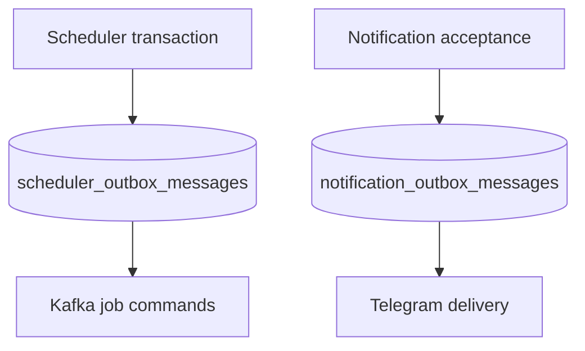

# Notification Outbox and Durable Delivery Plan

Canonical status and schedule owner: [P8-I5 in implementation increments](../../plans/roadmap/implementation-increments.md). This document is supporting implementation detail only and must not define an independent execution schedule.

## Goal

Add a durable notification-delivery boundary without mixing Telegram lifecycle
semantics into the existing scheduler Kafka outbox. Reuse only the claim, lease,
fencing, retry metadata, and auditing mechanics that are genuinely common.

Preserve these responsibilities:

- scheduler_outbox_messages guarantees Platform job-command publication to Kafka;
- notification_outbox_messages guarantees delivery of an accepted notification to
  an external provider;
- Analyzer owns signal calculation and never calls Telegram;
- credentials, provider URLs, and concrete chat identifiers are never persisted.

## Outcome

Platform commits a typed notification request before delivery, claims it with a
database lease, rate-limits provider calls, retries transient failures, and exposes a
terminal failure instead of silently dropping the message. Signal bursts remain
durable across process restarts and Telegram 429/5xx responses.

Immediate signal notifications and parent digests use the notification outbox. Digest
eligibility includes truthful transitions and eligible first-persisted daily confirmed
results. Oversized digests become deterministic complete Telegram pages.

## Canonical Priority and Provider Scope

Owner decision (2026-09-19): P9-I5 VCI health metrics is superseded into
post-MVP technical debt and is not a P8-I5 prerequisite. P8-I5 depends on
completed P8-I1 and P8-I2. The owner's direction authorizes implementation but
does not authorize promoting either prerequisite or marking P8-I5 complete
without the registry's required verification and CI evidence.

P8-I5 implements only the notification outbox and durable Telegram delivery
path. VCI capacity assessment and multi-provider ingestion remain deferred and
require separate owner reactivation and approval.

VCI remains the primary provider. P8-I5 must not add provider rotation, IP
rotation, automatic fallback, source mixing, or concurrency intended to bypass
an upstream limit. Deferred P9-I5 work does not establish realtime provider
capability or unblock P10-I0/P10-I3.

## Architectural Decision

Use two tables and two dispatchers with one small shared persistence superclass and
one reusable claim-processing contract.



Do not use one polymorphic outbox table or dispatcher. Kafka acknowledgement and
Telegram delivery have different destinations, retry rules, rate limits, terminal
states, and operational ownership.

### Shared superclass

Add an @MappedSuperclass named AbstractClaimableOutboxMessage, extending
AuditableEntity, with only:

    attempts
    availableAt
    claimToken
    claimedBy
    claimUntil
    lastError

SchedulerOutboxMessage extends it without changing the existing scheduler table or its
PENDING/PUBLISHED behavior. NotificationOutboxMessage extends it but owns its
notification-specific status and delivery fields.

Do not put status, payload interpretation, provider, destination, delivered timestamp,
deduplication identity, or backoff policy in the superclass.

### Shared behavior contract

Extract only the fencing-sensitive processing shape:

```java
public interface ClaimableOutboxStore<C> {
    List<C> claimPending(Instant now, String instanceId, Duration lease, int batchSize);
    boolean markDelivered(C claim, Instant deliveredAt);
    boolean scheduleRetry(C claim, Instant retryAt, String sanitizedError);
}
```

`SchedulerOutboxService` implements this contract by mapping delivered to
`PUBLISHED` and retry to its existing stable Kafka publication retry. A
notification-specific extension adds payload decoding, terminal `DEAD`, and the
provider permit; `NotificationOutboxService` implements that extension and maps
shared delivery/retry operations to `SENT` and retryable `PENDING`.

Keep SQL repositories and dispatchers separate. Shared helpers may sanitize bounded
errors and validate leases; provider-specific failure classification remains in the
notification dispatcher. Do not introduce a generic dispatcher: Kafka and Telegram
retain separate acknowledgement, timeout, rate-limit, and terminal-state behavior.

## Notification Persistence Model

Create notification_outbox_messages:

| Column                     | Purpose                                                     |
| -------------------------- | ----------------------------------------------------------- |
| id                         | Stable delivery identifier                                  |
| audit columns              | Existing AuditableEntity contract                           |
| provider                   | Bounded value such as TELEGRAM                              |
| channel                    | Logical OPERATIONS or SIGNALS destination                   |
| notification_kind          | Typed renderer selection                                    |
| schema_version             | Persisted payload compatibility boundary                    |
| payload                    | Serialized canonical NotificationRequest, not rendered HTML |
| deduplication_key          | Stable logical delivery identity                            |
| status                     | PENDING, SENT, or DEAD                                      |
| shared claim/retry columns | Lease, attempt, availability, and bounded error             |
| sent_at                    | Provider acknowledgement time                               |

Add uniqueness over (provider, channel, deduplication_key). Duplicate enqueue returns
the existing record. Resolve the configured destination at dispatch time; never write
the bot token or concrete chat identifier into PostgreSQL.

Persist the typed request before transport rendering. schema_version must fail closed
when a payload cannot be decoded; it must not fall back to generic rendering.

## Transaction Boundaries

### Immediate Kafka signal notification

Replace asynchronous direct sending with durable acceptance:

1. Consume and validate topic-signal-notifications.
2. Apply configured strategy and eligibility policy.
3. Convert to a typed NotificationRequest.
4. Insert the notification outbox row in a Platform transaction.
5. Return from the Kafka listener only after the database commit.

Kafka replay can repeat enqueue, so the unique delivery identity must make it
idempotent. Do not acknowledge the input merely because an @Async task was scheduled.

### Parent signal digest

Enqueue the digest in the same transaction as the guarded parent terminal transition.
Do not rely on an in-memory AFTER_COMMIT event as the only durable handoff.

The manual `/api/v1/notifications/manual/signal` endpoint also accepts by inserting a
notification outbox row and returns `202 ACCEPTED` with its delivery identity; the
scheduled dispatcher performs provider delivery. For
`/api/v1/notifications/manual/signal/latest`, Analyzer synchronously reads and returns
the authoritative latest signal with `200 OK` and does not publish Kafka. Platform
converts that result to the canonical typed `SIGNAL_CHANGED` request, assigns a stable
per-request delivery identity, commits it through the notification outbox, and only
then returns `202 ACCEPTED`. The automatic Kafka signal path remains unchanged.

Operational notifications may migrate incrementally. Once a producer uses the
notification outbox, it must not also call Telegram directly. The legacy async signal
event listener is removed so automatic and manual signals cannot bypass durability.

## Signal Eligibility Correction

Preserve signalChanged as the truthful transition flag. Include a child when
signalChanged is true, or when every condition below is true:

    newSignalDate == true
    strategy == CONFIRMED_TREND_EQUALS
    timeframe == 1d
    persisted == true

Update immediate and digest policies consistently. NO_DECISION, same-date
recalculation, and unchanged component-strategy results remain suppressed.

## Delivery, Retry, and Rate Limiting

The notification dispatcher must:

1. Claim a bounded batch using FOR UPDATE SKIP LOCKED and a fencing token.
2. Enforce a configurable Telegram rate limit before HTTP delivery.
3. Mark SENT only after Telegram acknowledgement.
4. Retry 429, timeout, connection failure, and 5xx responses.
5. Honor Retry-After when present.
6. Use bounded exponential backoff with jitter otherwise.
7. Mark permanent 4xx and exhausted retries as DEAD.
8. Retain only a sanitized, length-bounded error.

Add configuration:

    app.notifications.outbox.fixed-delay
    app.notifications.outbox.claim.lease-duration
    app.notifications.outbox.claim.batch-size
    app.notifications.outbox.max-attempts
    app.notifications.telegram.rate-limit
    app.notifications.telegram.retry.initial-delay
    app.notifications.telegram.retry.max-delay

Defaults must be safe for one bot. Multiple Platform instances need distributed
rate-limit coordination; an in-memory limiter alone is insufficient.

## Digest Pagination

Retain Telegram's 4,096-character limit and complete-block rendering:

- sort entries by symbolKey;
- never split a symbol block;
- use <digest identity>:<page number> as page delivery identity;
- persist each page as a separate delivery row;
- include Page X/Y and counts derived from the complete input;
- consider the logical digest complete only when every page is SENT.

Pagination must not fabricate notifications for NO_DECISION.

## Dataset Outputs

No analytical dataset output. The PostgreSQL table is operational delivery state.

## Metadata Outputs

No dataset metadata output.

## Algorithm Feature Outputs

No direct algorithm feature output.

## Algorithms Unlocked

No new analytical algorithm. Existing signal delivery becomes reliable and auditable.

## Contract Impact

| Contract area                     | Impact                                                    |
| --------------------------------- | --------------------------------------------------------- |
| Kafka/service-to-service protobuf | No change; existing signal notification JSON remains      |
| Object-storage JSON manifest      | No change                                                 |
| Storage path/dataset ownership    | No analytical change; add one Platform PostgreSQL table   |
| Public Java/Python API            | No public change; internal Java abstractions are additive |
| Configuration/environment         | Add notification outbox, retry, and rate-limit settings   |

Persisted NotificationRequest JSON is an internal compatibility contract. Version it
and cover serialization with tests.

## Migration and Rollout

1. Add the mapped superclass without changing scheduler column names or behavior.
2. Create notification_outbox_messages and pending-claim/uniqueness indexes.
3. Add repository, enqueue service, dispatcher, retry classifier, and metrics.
4. Route immediate signal notifications through durable enqueue.
5. Correct digest eligibility and enqueue digests transactionally.
6. Add deterministic digest pagination.
7. Migrate manual signal acceptance to durable enqueue; make latest-signal lookup a
   synchronous Analyzer read followed by one Platform-owned outbox handoff.
8. Remove direct signal transport calls after proving no dual-send path remains.
9. Migrate operational notifications only after signal delivery is stable.

Deploy the schema before writer code. Rollback disables the dispatcher and may restore
direct delivery while retaining the table and pending rows. Never drop pending rows.

## Observability and Operations

Expose at minimum:

    notification_outbox_pending
    notification_outbox_oldest_pending_age
    notification_outbox_sent_total
    notification_outbox_retry_total
    notification_outbox_dead_total
    notification_delivery_duration
    notification_delivery_rate_limited_total

Log messageId, provider, channel, kind, attempt, status, and sanitized error category.
Do not log payloads, tokens, or resolved chat identifiers. Provide status/count
visibility before adding manual retry or replay.

## Likely Files and Modules

- apps/core/src/main/java/com/omni/platform/shared/ for the shared abstraction;
- SchedulerOutboxMessage for superclass adoption;
- apps/core notification module for entity, repository, enqueue, dispatcher, retry,
  and metrics;
- SignalDigestNotificationPolicy for eligibility;
- SignalChangedNotificationConsumer for durable acceptance;
- TelegramRendering for deterministic pagination;
- application.yaml and environment examples;
- database/migrations for the new table;
- focused Platform tests;
- job flow and database documentation.

## Repository Guidance Updates

Implementation must review and update:

- docs/flows/001-job-execution.md;
- docs/data/003-database.md;
- docs/development/001-where-to-change.md;
- apps/core/README.md;
- docs/README.md and docs/INDEX.md.

Review AGENTS.md, CLAUDE.md, and .roo/rules/. Update them only when workflow rules
change; this design does not currently require a new agent rule.

## Verification

Required checks are not run for this plan-only commit.

Before implementation completion, obtain owner approval for the relevant Nx commands
and verify:

- Platform tests and build;
- PostgreSQL migration tests;
- unchanged scheduler outbox schema and behavior;
- enqueue idempotency plus concurrent claim/fencing;
- Kafka replay producing one logical notification row;
- restart recovery with pending rows;
- Telegram 429/Retry-After, timeout, 5xx, permanent 4xx, and max attempts;
- multi-instance claiming and rate limiting;
- digest newSignalDate eligibility and stable multi-page rendering;
- configuration binding and secret redaction.

Mocked HTTP acknowledgement is not live Telegram rollout evidence.

## Acceptance Criteria

- Scheduler and notification messages use separate tables and dispatchers.
- Both entities share only claim/retry/audit fields through a mapped superclass.
- Both outbox services implement the shared claim/deliver/retry protocol; notification-only decode, provider-permit, and `DEAD` operations remain in its extension contract.
- Scheduler schema and Kafka retry behavior remain backward compatible.
- Accepted automatic and manual signal notifications commit before asynchronous provider delivery.
- Manual signal HTTP acceptance returns `202 ACCEPTED` plus a stable row identity and never claims synchronous `SENT`.
- No async signal event listener can bypass the notification outbox; operational events remain on their existing incremental-migration path.
- Enqueue is idempotent under replay and concurrent attempts are fenced.
- Transient failures retry; exhausted/permanent failures become visible DEAD records.
- Credentials and concrete destination identifiers are not persisted or logged.
- Immediate and digest eligibility includes qualified newSignalDate results.
- Pagination sends every eligible complete item with deterministic page identities.
- P8-I1 and P8-I2 completion evidence remains required; implementation direction
  does not promote either prerequisite or waive P8-I5 verification/CI gates.
- Capacity assessment, superseded P9-I5 work, and multi-provider ingestion remain
  outside P8-I5 and deferred until separately reactivated and approved.
- This increment introduces no automatic market-data provider fallback or rate-limit-bypass concurrency.
- Metrics, operator visibility, docs, and approved verification evidence are complete.

## Stop Conditions

Stop and request an owner decision if implementation would:

- combine scheduler and notification records into one table;
- persist Telegram credentials or concrete chat identifiers;
- introduce cross-service Kafka/protobuf changes;
- auto-replay DEAD messages without an audited operator action;
- use only in-memory deduplication/rate limiting for multiple instances;
- delete pending records during migration or rollback;
- add automatic market-data provider routing or silently mix provider lineage;
- change the NO_DECISION product policy.
