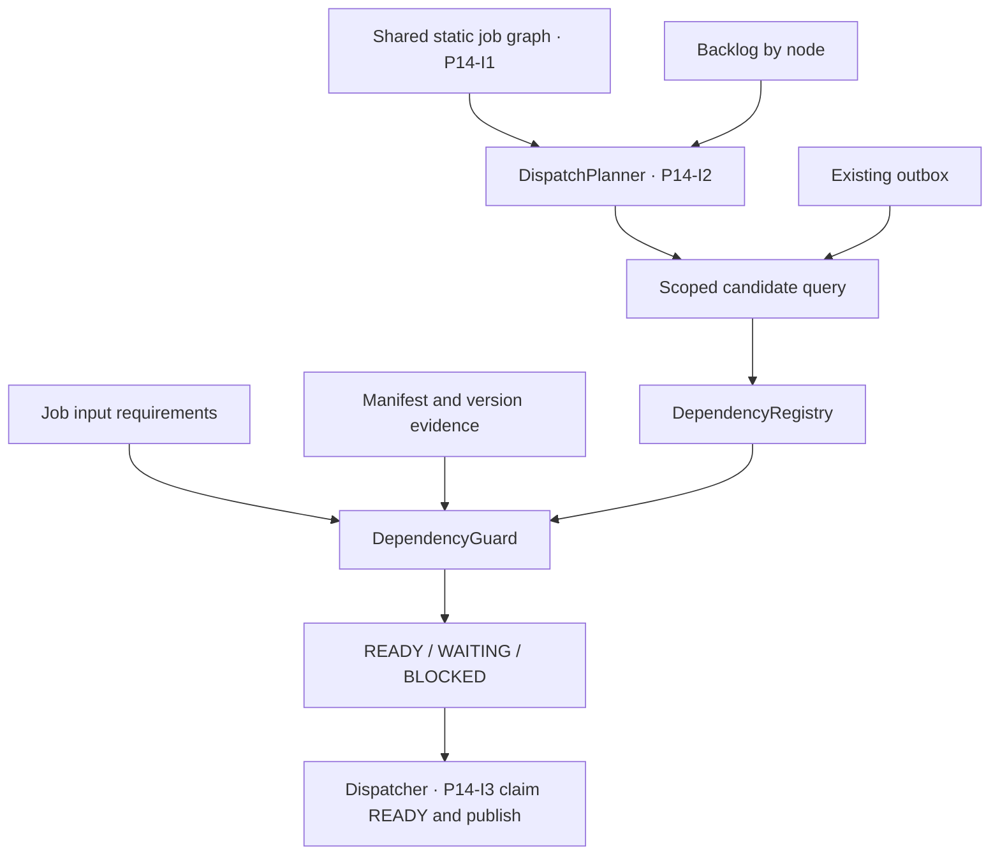

# Dependency-Aware Outbox Dispatch

Canonical status and schedule owner: [the increment registry](roadmap/implementation-increments.md). P4-I3 is `superseded`; this document preserves the implemented dependency-aware dispatch baseline. [Plan 030 P14-I3](030-static-graph-dispatch-planner.md) owns the final planner-integrated dispatcher delivery, and [TD-014](../technical-debt/014-dependency-aware-dispatch-verification-residue.md) retains unclosed evidence. This document must not define a competing schedule or imply that historical source is completed.

## Goal

Prevent overdue scheduled jobs from starting nearly simultaneously after a service restart by moving dependency eligibility to the outbox dispatch boundary. Reuse one dependency model for Scheduler, Outbox, and future modules, with a static Vietnam-market definition in V1.

## Outcome

- Scheduled and accepted manual work create executions and PENDING outbox messages without blocking on dependencies.
- `SchedulerOutboxDispatcher` is the one dependency gate for scheduled and manual work before claim/publish.
- The scheduler-owned dependency package exposes a small `DependencyRegistry` boundary and immutable request/result types to the dispatcher while keeping evaluators and manifest readers internal to the same orchestration owner.
- Do not create a facade-only application module that imports its implementation back from Scheduler; a future independent module requires a neutral request contract with no `JobDefinition` or scheduler-repository dependency.
- V1 uses static definitions; no dependency repository or dependency table is introduced.
- Dispatch is scoped to the same logical run and work item so an older success cannot unlock a new run.
- Metadata jobs use a global barrier and cannot race upstream sync/manifest updates after evening startup.
- Terminal upstream failure marks the downstream execution `BLOCKED` with a bounded structured reason; it does not fabricate a worker `FAILED` result.

## Current Problem

The scheduler currently checks dependencies before enqueue, while the outbox claims PENDING messages FIFO without dependency awareness. After downtime, multiple overdue jobs can be enqueued or become runnable together, causing concurrent database, Kafka, MinIO, and metadata activity. The metadata job currently has no effective dependency barrier, which allows metadata updates to overlap incomplete upstream work.

## Proposed Package Boundary

Keep dependency evaluation under `modules.scheduler.dependencies`, its established owner. The scheduler dispatcher depends on the registry interface rather than concrete evaluators.

Internal API:

```java
public interface DependencyRegistry {
    DependencySpec get(DependencyKey key);
    DependencyDecision evaluate(DependencyRequest request);
}
```

The minimum dispatcher-facing immutable types are `DependencyRequest` and `DependencyDecision`. Manifest readers, condition evaluators, and context construction stay in the scheduler dependency package.

A future domain-policy registry may use the same registration pattern as `JobNotificationPolicyRegistry` once a neutral cross-module request contract exists:

```text
DependencyRegistry
  -> List<DependencyPolicy>
       -> VNDependencyPolicy
       -> future USDependencyPolicy
       -> future CryptoDependencyPolicy
```

- `PlatformDependencyRegistry` adapts the established manifest guard into dispatcher decisions.
- Scheduler outbox injects only `DependencyRegistry`; it never calls concrete condition evaluators.
- Unsupported or incompatible dependency evidence fails closed with a diagnosable decision.
- The existing guard treats manifests as the hard data-readiness source and uses execution/outbox state only for exact same-run/work matching and global barriers.
- No separate application-module facade, factory layer, dependency repository/table, or runtime write API is introduced in V1.

## Runtime Flow

1. Scheduler or the audited manual-trigger path accepts work, creates the execution, and writes a PENDING outbox message without a pre-enqueue dependency block.
2. Manual API responses expose the stable request/execution identity; later status reflects dependency `WAITING`, publication, or terminal `BLOCKED`.
3. Dispatcher over-fetches PENDING candidates so blocked rows do not consume the publish batch.
4. For each candidate, dispatcher builds a request with `domain`, `jobDefinitionId`, `executionId`, `parentExecutionId`, `workType`, `workKey`, and `runKey`/trading date.
5. Registry selects the registered `DependencyPolicy`; V1 routes `VN` to `VNDependencyPolicy`.
6. The selected policy evaluates its static specs and returns:
   - `READY`: atomically claim and publish.
   - `WAITING`: keep PENDING, do not increment delivery attempts, persist bounded diagnostics, and return an optional `retryAt`.
   - `BLOCKED`: atomically stop future claims, mark the downstream execution terminal `BLOCKED`, and persist a bounded structured dependency reason.
7. On the next poll, completed upstream work unlocks eligible downstream messages.

Eligibility is evaluated before the atomic claim without holding a transaction across manifest I/O. The atomic claim must revalidate that the row is still PENDING and eligible under its fencing identity. Concurrent dispatchers continue to rely on the database claim/locking boundary to prevent duplicate publication.

## Dependency Semantics

- Dataset manifests and exact `dataVersion` lineage are the hard data dependency contract.
- Execution/outbox state is used only to match dependencies within the same `runKey`/trading date and, for item-level pipelines, the same `workType + workKey`, plus the metadata global barrier.
- Never use an unscoped “latest success” from a previous run.
- Prefer item-level streaming: one symbol may advance from price to indicators to signals while other symbols remain in progress.
- Use a global barrier for metadata: all required upstream executions/datasets for the run must be complete and no relevant work may remain pending or in flight.
- Initial VN catalog:
  - indicators depend on stock-price EOD readiness;
  - signals depend on indicator readiness;
  - confirmed signals retain any exact-date intraday requirement defined by their algorithm plan;
  - metadata depends on the required upstream executions and dataset readiness for that run.

## Static Graph & DispatchPlanner Promotion — 2026-10-08

The 2026-10-07 design note was promoted into the active [Plan 030 — Static Graph & DispatchPlanner](030-static-graph-dispatch-planner.md) epic with stories P14-I1, P14-I2, and P14-I3. [TD-012](../technical-debt/012-static-dag-dispatch-planner.md) preserves deferred extensions. Owner priority on 2026-10-08 superseded P4-I3 rather than requiring completion of the old dispatcher path; all READY/WAITING/BLOCKED, no-starvation, claim/fencing, retry, compatibility, migration, fallback, and runtime evidence moves into P14-I3 acceptance through TD-014.

- `DependencyGuard` serves job dependency semantics: required inputs, scope and exact version readiness. Its declarations remain valid; `DependencyRegistry` is the dispatcher-facing evaluation boundary.
- `DispatchPlanner` serves scheduler dispatch after P14 implementation: group a bounded pending/dispatchable/in-flight snapshot by static graph node, traverse from independent roots, and select node/scope/quota for the next candidate query. It does not implement job readiness or create upstream work.
- `SchedulerOutboxDispatcher` continues to execute selection, evaluate candidates through the existing registry/guard, atomically claim READY work, and publish with preserved fencing.
- The static DAG is a shared view of job dependency topology, not a second source of truth or a DAG recreated at each publish. Empty upstream backlog does not establish READY.
- [Plan 028 — Reusable Date-Range Job Backfill](028-reusable-date-range-backfill.md) may reuse this topology for tracing missing dated work; its graph persistence migration remains separately gated.



Planner selection is advisory scheduling; the guard remains the job readiness authority. Plan 030 freezes all-root reconciliation, in-flight/backoff behavior, baseline bounded fairness, and node-wide versus item-level selection across separate stories before activation. Persisted graphs, expanded provider policy, advanced fairness, Kafka changes, and runtime DAGs remain deferred. Existing item-level and no-starvation acceptance remains unchanged.

## Implementation Increments

1. Add the registry request/decision boundary to the scheduler dependency package and adapt the existing manifest guard without introducing a facade-only module.
2. Migrate existing scheduler dependency definitions into the registry without changing manifest READY or `dataVersion` semantics.
3. Remove dependency blocking from both `JobScheduler` and the audited manual-trigger acceptance path; always enqueue accepted work transactionally.
4. Add the registry gate to outbox candidate selection/claim and prevent head-of-line blocking.
5. Add an additive migration for terminal execution `BLOCKED`, structured dependency reasons, and a terminal outbox disposition that cannot be reclaimed.
6. Define aggregation, status API, notification, and operator visibility semantics for `BLOCKED`.
7. Add terminal upstream-failure propagation and metadata global-barrier rules.
8. Remove the old scheduler blocked-job retry path only after equivalent outbox retry and visibility behavior is covered.
9. Add package-boundary, scheduler, manual-trigger, dispatcher, migration, concurrency, and run/work-scope tests.
10. Update canonical job-flow, database, architecture, developer-navigation, and relevant service documentation.

## Dataset Outputs

No analytical dataset output.

## Metadata Outputs

No dataset metadata output. This change only controls when the existing metadata workflow may run.

## Algorithm Feature Outputs

No direct algorithm feature output.

## Algorithms Unlocked

No new algorithm. Existing price, indicator, signal, intraday-confirmation, and metadata pipelines gain deterministic dependency-aware dispatch.

## Contract Impact

| Area                              | Decision                                                                                                                                                                                                                                                                                       |
| --------------------------------- | ---------------------------------------------------------------------------------------------------------------------------------------------------------------------------------------------------------------------------------------------------------------------------------------------- |
| Kafka/service-to-service protobuf | Unchanged in V1; dispatch uses existing execution and work identity.                                                                                                                                                                                                                           |
| Object-storage JSON manifest      | Unchanged; dependency evaluation reads existing readiness/version evidence.                                                                                                                                                                                                                    |
| Storage path/dataset ownership    | Unchanged.                                                                                                                                                                                                                                                                                     |
| Public Java/Python API            | Add an internal Java registry boundary in the scheduler dependency package and extend existing execution-status responses with terminal `BLOCKED`; no cross-service or Python API and no new service endpoint are added.                                                                       |
| Configuration/environment         | No new environment variable in V1; VN definitions are static.                                                                                                                                                                                                                                  |
| Database                          | No dependency repository/table. Add an additive migration for terminal execution `BLOCKED`, a bounded structured dependency reason, and a terminal outbox disposition/status. Deploy schema and compatible readers before writers; preserve existing PENDING/PUBLISHED rows and audit history. |

## Repository Guidance Updates

Implementation must review and update, where behavior changes:

- `docs/flows/001-job-execution.md`;
- `docs/architecture/001-system-overview.md`;
- `docs/data/003-database.md`;
- `docs/development/001-where-to-change.md`;
- `docs/plans/005-job-dependency-guard.md` as historical/canonical dependency context;
- relevant Core/Platform README files;
- `AGENTS.md`, `CLAUDE.md`, and `.roo/rules/` only if ownership or workflow guidance changes.

## Verification

Not run for this implementation. The owner explicitly withheld test, build, lint,
and format approval. Static source reasoning and post-edit graph analysis do not
replace executable verification.

Required implementation evidence:

- Package-boundary tests prove scheduler outbox depends on the registry boundary rather than concrete evaluators.
- Registry tests prove READY/WAITING/BLOCKED adaptation and fail-closed behavior for incompatible evidence.
- Scheduler and manual-trigger tests prove unmet dependencies do not prevent accepted work from creating execution and PENDING outbox identities.
- Dispatcher tests cover `READY`, `WAITING`, `BLOCKED`, no attempt increment while waiting, and no blocked-row starvation.
- Scope tests prove exact run/trading-date and work-key matching.
- Metadata test proves the global barrier blocks while upstream work is pending/in flight.
- Execution aggregation, status API, notification, and sanitization tests cover terminal `BLOCKED` without treating it as worker `FAILED`.
- Migration tests cover old PENDING/PUBLISHED rows, schema-first rollout, terminal outbox exclusion, and non-destructive rollback.
- PostgreSQL integration tests prove concurrent eligibility/claim/publish remains duplicate-safe and terminal rows cannot be reclaimed.
- After separate approval under the verification gate, run `nx run platform:test` and `nx run platform:build` from the workspace root; record exact-head CI separately before completion. Platform defines no lint or format target.

## Acceptance Criteria

- Restarting after downtime does not dispatch dependent stages simultaneously.
- Scheduled and accepted manual enqueue are independent from dependency readiness.
- Outbox publishes only `READY` messages.
- `WAITING` messages stay retryable without consuming delivery attempts.
- Terminal upstream failure produces downstream terminal `BLOCKED` with a bounded structured reason and never fabricates worker `FAILED`.
- Terminally blocked outbox rows cannot be reclaimed or published.
- Blocked candidates cannot starve unrelated ready work.
- Dependency resolution is exact to the same run and work item.
- Metadata dispatch waits for the complete upstream run barrier.
- Dispatcher code uses only the registry request/decision boundary; concrete manifest evaluators remain isolated in the scheduler dependency package.
- A future independent VN/US/Crypto module must first define a neutral request contract and may not import scheduler entities or repositories back into that module.
- V1 has no dependency repository and no Kafka, manifest, or storage-path contract change.
- Migration/rollback preserves pending work, terminal records, and existing audit history.
- Canonical flow, database, architecture, developer-navigation, service, and applicable repository guidance are synchronized.

## Non-goals

- Provider rate limiting or a general resource-capacity scheduler.
- Dynamic dependency administration UI/API.
- Persisted dependency definitions in V1.
- Kafka payload redesign.
- New Query Service or Console features; existing Platform execution-status responses may expose terminal `BLOCKED`.

## Implementation Evidence

Implemented locally:

- scheduled and manual preparation no longer evaluate dependencies before enqueue;
- execution plus PENDING scheduler-outbox identity commits first;
- the dispatcher over-fetches unclaimed candidates, evaluates Platform-local
  dependency decisions, and claims only READY work with the existing lease/fence;
- WAITING defers without consuming attempts; terminal BLOCKED atomically closes the
  outbox and execution with a bounded structured reason;
- additive V11 schema and focused scheduler/manual/dispatcher coverage are present;
- reusable safe-write guidance is mechanics-only and does not share dependency logic;
- Kafka/Proto3, manifest JSON, storage paths, dataset ownership, and environment
  contracts remain unchanged.

No guidance update was required in `AGENTS.md`, `CLAUDE.md`, or `.roo/rules`: their
existing Platform-local dependency, logical-path, claim-fencing, verification-gate,
and READY-last rules already describe the required repository workflow.

## Field/DTO Inventory and Bounded Delivery — 2026-10-07

Design inventory, not a claim that fields are missing from source or already implemented. [Cross-plan register](../reference/002-planned-field-dto-impact.md) defines ADD/REUSE/SEMANTIC/DERIVED/UNRESOLVED and LOW/MEDIUM/HIGH impact. Exact names/types/nullability/defaults/transport must be reconciled with source before code or migration. Existing statuses, dependencies and owner gates remain unchanged.

| Surface              | Field/DTO change                                                                                | Impact and behavior                                                                                                        |
| -------------------- | ----------------------------------------------------------------------------------------------- | -------------------------------------------------------------------------------------------------------------------------- |
| DependencyRequest    | domain, jobDefinitionId, executionId, parentExecutionId, workType, workKey, runKey/trading date | MEDIUM internal interface; exact same-run/work matching, no broad latest-success fallback.                                 |
| DependencyDecision   | READY/WAITING/BLOCKED, bounded reason, optional retryAt                                         | HIGH dispatcher/status behavior; WAITING does not consume publish retries; BLOCKED cannot be reclaimed.                    |
| Execution/outbox/API | Terminal BLOCKED and structured dependency disposition/reasons                                  | HIGH schema/aggregation/compatibility; distinguish accepted/enqueued from publishable; no new dependency repository in V1. |

Historical small tasks: adapt registry/request/decision boundary → transactionally enqueue scheduled/manual work → dispatcher gate/fencing/FIFO → terminal BLOCKED aggregation/API/migration → upstream-failure/global-barrier evidence. Source is reusable baseline; TD-014 records unclosed evidence, and P14-I3 must prove the final integrated behavior rather than completing P4-I3 separately.
