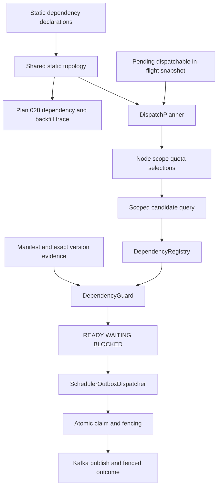

# Plan 030 — Static Graph & DispatchPlanner

Status: Owner-approved active epic in Milestone 1. Canonical story status, dependencies, readiness, and execution order belong to the [increment registry](roadmap/implementation-increments.md). This planning document does not claim that the runtime implementation exists.

Owner decision recorded: 2026-10-08.

## Goal

Provide one validated static job topology for shared Platform use and add bounded top-down scheduler-outbox planning without duplicating job input-readiness logic or weakening existing claim/fencing behavior.

The epic is split into three independently reviewable and deliverable stories:

1. **P14-I1 — Static topology and validation**;
2. **P14-I2 — Snapshot-based dispatch planning**;
3. **P14-I3 — Dispatcher integration with preserved claim/fencing**.

The static graph answers which logical job nodes are upstream or downstream. `DispatchPlanner` answers which node/scope/quota should be considered next from a bounded backlog snapshot. `DependencyGuard`, through `DependencyRegistry`, remains the authority for whether a selected job's exact required input is READY, WAITING, or terminally BLOCKED.

## Outcome

After the epic is implemented and verified:

- Platform exposes one immutable, validated static topology with stable logical node identity and explicit mapping to existing job definitions;
- topology consumers, including scheduler planning and proposed backfill tracing, reuse the same boundary rather than maintaining competing graphs;
- scheduler planning consumes a bounded snapshot of pending, dispatchable, and in-flight work and traverses independent roots top down;
- planning returns typed node/scope/quota selections and never reads manifests, declares data READY, creates upstream work, or returns raw SQL;
- the dispatcher queries selected candidates, evaluates every candidate through the existing `DependencyRegistry`, and claims/publishes only READY work;
- existing atomic claims, lease fencing, retry identity, WAITING behavior, terminal BLOCKED behavior, item-level readiness, and unrelated-ready-work guarantees remain intact;
- persisted graph ownership, expanded provider policy, adaptive resource scheduling, and advanced fairness remain deferred.

## Verified Source Baseline and Gaps

Source inspection and code-review-graph analysis establish the following planning baseline. Source presence is not implementation or verification evidence for P14.

| Area                       | Reusable source capability                                                                                                                                                                                                                                                                                                                              | Gap owned by this epic                                                                                                                                        |
| -------------------------- | ------------------------------------------------------------------------------------------------------------------------------------------------------------------------------------------------------------------------------------------------------------------------------------------------------------------------------------------------------- | ------------------------------------------------------------------------------------------------------------------------------------------------------------- |
| Dependency declarations    | [`JobDefinitionConfig`](../../apps/core/src/main/java/com/omni/platform/modules/scheduler/constants/JobDefinitionConfig.java) already seeds `dependsOnJobs`, `dependsOnDatasets`, and produced datasets.                                                                                                                                                | No shared typed topology boundary, stable logical node mapping, validation report, deterministic traversal, or topology export exists.                        |
| Job readiness              | [`PlatformDependencyRegistry`](../../apps/core/src/main/java/com/omni/platform/modules/scheduler/dependencies/PlatformDependencyRegistry.java) adapts [`JobDependencyGuard`](../../apps/core/src/main/java/com/omni/platform/modules/scheduler/dependencies/JobDependencyGuard.java) into READY/WAITING/BLOCKED decisions with approved input versions. | Planner integration must preserve this boundary and must not reproduce manifest, exact-version, or dependency-mode evaluation.                                |
| Candidate loading          | [`SchedulerOutboxService.findCandidates()`](../../apps/core/src/main/java/com/omni/platform/modules/scheduler/services/SchedulerOutboxService.java) loads bounded candidate IDs and materializes execution/work identity.                                                                                                                               | There is no node/scope backlog projection or selected-scope candidate query. Current loading parses payloads before planning.                                 |
| Candidate order            | [`SchedulerOutboxRepositoryImpl.findPendingCandidateIds()`](../../apps/core/src/main/java/com/omni/platform/modules/scheduler/repositories/SchedulerOutboxRepositoryImpl.java) selects eligible unclaimed PENDING rows FIFO by availability/creation/ID.                                                                                                | No pending/dispatchable/in-flight snapshot grouped by topology node and scope, no top-down selection, and no quota result.                                    |
| Dispatch safety            | [`SchedulerOutboxDispatcher.dispatchBatch()`](../../apps/core/src/main/java/com/omni/platform/modules/scheduler/SchedulerOutboxDispatcher.java) over-fetches, invokes the registry, claims READY rows atomically, and preserves publish retry fencing.                                                                                                  | The planner is not integrated before candidate fetch. Integration must retain all guard and claim semantics and provide a safe fallback to current selection. |
| Stable definition identity | [`JobDefinition`](../../apps/core/src/main/java/com/omni/platform/modules/scheduler/entities/JobDefinition.java) has a UUID plus source/type/cron uniqueness, while several definitions can share one `JobType`.                                                                                                                                        | P14-I1 must freeze a stable static logical node identity and deterministic definition mapping without introducing the deferred persisted graph migration.     |

The graph impact radius is Platform-centered: dispatcher, outbox service/repository, dependency registry/guard, job-definition seeding, producers, job service, blocked-job compatibility, PostgreSQL scheduler tests, configuration, and operations are directly or transitively relevant. Analyzer, Ingestor, Query Service, Console, shared transport contracts, dataset writers, manifests, and storage paths have no runtime change in this epic unless a later story explicitly changes a contract; their no-impact boundaries must still be reconciled during verification.

## Legacy Readiness and Disposition Review

Reviewed on 2026-10-08 against Plans 001, 005, 006, and 023; TD-005, TD-007, and TD-012; current Platform scheduler/dependency source; database migrations; and code-review-graph relationships. This is a planning classification, not executed verification and not a status promotion.

Classification meanings:

- **MUST COMPLETE** — a canonical dependency or safety contract that must close before the named P14 story can activate;
- **PENDING EVIDENCE** — source exists, but required impact/coverage/runtime evidence is incomplete;
- **MISSING IN P14 SCOPE** — behavior does not exist and is intentionally delivered by a P14 story rather than treated as prior debt;
- **TECHNICAL DEBT / MOVE ON** — useful or corrective follow-up that is not required for the bounded P14 path when the stated guardrail is preserved.

| Legacy plan or source concern                                                             | Current evidence                                                                                                                                                                                                | Classification                                                                     | P14 gate                                                            | Disposition                                                                                                                                                 |
| ----------------------------------------------------------------------------------------- | --------------------------------------------------------------------------------------------------------------------------------------------------------------------------------------------------------------- | ---------------------------------------------------------------------------------- | ------------------------------------------------------------------- | ----------------------------------------------------------------------------------------------------------------------------------------------------------- |
| P4-I2 dependency policy/enforcement foundation                                            | Canonically `completed`; static dependency declarations and manifest guard exist.                                                                                                                               | MUST COMPLETE — already satisfied                                                  | P14-I1                                                              | No further Phase 4 implementation prerequisite. Preserve P4-I2 semantics.                                                                                   |
| P4-I3 dependency-aware outbox dispatch                                                    | Source and focused tests are present, but the old increment is superseded because P14-I3 will materially change the dispatcher path. Its unclosed evidence is retained in TD-014.                               | TECHNICAL DEBT / SAFETY TRANSFER                                                   | No separate gate                                                    | Reuse the source as baseline; prove all transferred safety invariants against final P14-I3 behavior rather than completing the old path first.              |
| Stable logical node identity and unambiguous definition mapping                           | `JobDefinition` has UUID plus source/type/cron uniqueness; multiple definitions can share one `JobType`; no static node-key abstraction exists.                                                                 | MISSING IN P14 SCOPE                                                               | P14-I1 acceptance                                                   | Implement in P14-I1. Stop if mapping requires persisted identity or a product decision.                                                                     |
| One shared topology declaration, validation, traversal, and export                        | `dependsOnJobs` is seeded as untyped config/traceability metadata; no typed topology owner or validation exists.                                                                                                | MISSING IN P14 SCOPE                                                               | P14-I1 acceptance                                                   | Implement in P14-I1, preserving dataset readiness as a separate guard concern.                                                                              |
| Backlog snapshot and node/scope/quota planner                                             | Current repository performs bounded FIFO candidate selection and payload materialization; no grouped snapshot or planner exists.                                                                                | MISSING IN P14 SCOPE                                                               | P14-I2 after P14-I1                                                 | Implement in P14-I2 without activating runtime dispatch.                                                                                                    |
| Scoped candidate query and planner fallback                                               | Current dispatcher over-fetches FIFO candidates, evaluates the registry, and atomically claims READY rows.                                                                                                      | MISSING IN P14 SCOPE                                                               | P14-I3                                                              | Implement after P14-I2 and prove the transferred TD-014 safety contract on the final path. Preserve FIFO fallback.                                          |
| Legacy `blocked_jobs` table and `BlockedJobTracker`                                       | V7 table/entity/service exist, but current `JobScheduler` no longer calls the tracker and graph analysis found no caller of the tracker class; scheduler-outbox WAITING/BLOCKED now owns active dispatch state. | TECHNICAL DEBT / MOVE ON                                                           | None for P14-I1/P14-I2; no runtime dependency for P14-I3            | Do not integrate it into topology/planning. Track non-destructive decommission/schema-retention review separately; never delete audit state as part of P14. |
| Missing `PARTITION_MATCH`, `SUPPORTED_SCHEMA_VERSION`, and `MAX_FRESHNESS_LAG` evaluators | Enum/config parameter support exists, but no evaluator is registered; unsupported configured conditions fail closed as dependency errors. Current explicit P4-I2 enforced path uses EXISTS/READY.               | TECHNICAL DEBT / MOVE ON unless a selected active job requires one                 | None for current P14 scope                                          | Keep out of P14. Promote a bounded guard-contract story only before enabling a declaration that uses one of these conditions.                               |
| Async dependency evaluation lifecycle/admission                                           | Virtual-thread parallel evaluation source exists; executor shutdown, downstream admission bounds, and representative load evidence remain open in TD-007.                                                       | TECHNICAL DEBT / MOVE ON for P14-I1/P14-I2; operational activation risk for P14-I3 | Reassess before P14-I3 load/activation evidence                     | Keep TD-007 separate. Planner must not increase guard concurrency or claim a capacity improvement.                                                          |
| Empty-output versus execution-success semantics                                           | TD-005 confirms execution SUCCESS does not prove dataset completeness; guard readiness remains manifest/version based.                                                                                          | TECHNICAL DEBT / MOVE ON                                                           | None if planner never interprets SUCCESS/backlog emptiness as READY | Preserve the explicit rule that topology position, empty backlog, and execution SUCCESS are not data-readiness evidence.                                    |
| P1-I3 canonical sector writer evidence                                                    | `verification_pending`, but it does not provide scheduler topology identity, candidate selection, or claim safety and is not a P14 dependency.                                                                  | TECHNICAL DEBT / MOVE ON relative to P14                                           | None                                                                | Retain its independent evidence queue; do not couple P14 delivery to sector-writer completion.                                                              |
| Persisted topology and Plan 028 graph migration                                           | Proposed and unscheduled; P14-I1 intentionally owns static topology only.                                                                                                                                       | TECHNICAL DEBT / MOVE ON                                                           | None                                                                | Keep deferred. If promoted later, require parity and one-authority cutover behind the P14 topology boundary.                                                |
| Provider-aware policy, adaptive quotas, and advanced fairness                             | No approved requirement or measured need for P14 baseline.                                                                                                                                                      | TECHNICAL DEBT / MOVE ON                                                           | None                                                                | Keep deferred under TD-012/Plan 030 deferred scope. Baseline deterministic bounded allocation remains sufficient.                                           |

### Move-on decision

- **P14-I1 is ready and may start after normal module-conflict reconciliation** because P4-I2 is completed and no unresolved old-plan item is a canonical dependency.
- **P14-I2 may follow completed P14-I1** without waiting for historical P4-I3, TD-005, TD-007, optional evaluators, blocked-job cleanup, P1-I3, Plan 028, provider policy, or advanced fairness.
- **P14-I3 may follow completed P14-I2** and owns the final integrated dependency-aware dispatcher proof. TD-014 safety invariants are mandatory acceptance, while a separate P4-I3 completion is not required. Re-evaluate TD-007 only if measured integration/load evidence makes it relevant.
- Moving residual work to technical debt means retaining explicit activation triggers and safety boundaries; it does not mean marking the work complete, deleting legacy state, or weakening P14/P4 acceptance criteria.

## Architecture and Responsibility Boundaries

| Component                            | Owns                                                                                                                      | Must not own                                                                                       |
| ------------------------------------ | ------------------------------------------------------------------------------------------------------------------------- | -------------------------------------------------------------------------------------------------- |
| Static topology                      | Stable node identity, directed edges, definition mapping, roots, deterministic traversal, validation, diagnostics/export. | Runtime backlog, manifest readiness, claim state, provider quotas, persisted dependency authority. |
| DispatchPlanner                      | Selection of node/scope/quota from one bounded snapshot using top-down traversal and baseline bounded allocation.         | Dependency readiness, upstream enqueue, payload parsing, SQL construction, claims, publication.    |
| DependencyRegistry / DependencyGuard | Required input scope, dependency mode, manifest readiness, exact `dataVersion`, READY/WAITING/BLOCKED decision.           | Cross-node priority, dispatch quota, backlog fairness.                                             |
| SchedulerOutboxDispatcher            | Orchestration of plan, scoped candidate fetch, guard decision, atomic claim, publish, and fenced outcome.                 | Duplicate topology or manifest policy.                                                             |
| Repository/service                   | Parameterized snapshot and candidate projections plus existing atomic state transitions.                                  | Scheduling policy or raw-SQL output from the planner.                                              |

An empty upstream backlog is not readiness evidence. A selected candidate can still be WAITING or BLOCKED. Snapshot values are advisory and stale by construction; the atomic claim must revalidate status, availability, lease, and fence identity.

## Story Sequence

### P14-I1 — Static topology and validation

**Dependencies:** P4-I2.  
**Blocks:** P14-I2 and the topology-dependent trace slice of Plan 028.

Outcome:

- define an immutable Platform-local topology API with stable logical node keys, directed edges, roots, direct upstream/downstream lookup, bounded ancestor/descendant traversal, and deterministic topological order;
- map existing seeded job definitions to nodes explicitly, including the case where several definitions share one `JobType`;
- derive the initial graph from one static declaration boundary and remove competing static edge declarations where safe;
- validate unknown nodes, missing/ambiguous definition mappings, duplicate edges, self-edges, cycles, unreachable mappings, and configured graph bounds at startup/test time;
- expose deterministic diagnostic and Mermaid-friendly output without introducing a public API or persistence migration;
- document the mapping between job-to-job topology and dataset dependency declarations while keeping their meanings distinct.

Bounded tasks:

1. inventory current job definitions and freeze node-key/mapping rules;
2. add immutable topology model and one declaration provider;
3. add validation and deterministic traversal;
4. add definition mapping and diagnostics/export;
5. reconcile Plan 028 reuse and canonical docs.

Rollback removes the topology consumer wiring and restores the previous static declaration reads. No execution, outbox, or dataset state is migrated.

### P14-I2 — Planning from pending/dispatchable/in-flight snapshots

**Dependencies:** P14-I1.  
**Blocks:** P14-I3 and the graph-backed Job Operations presentation slice of Plan 029.

Outcome:

- add a bounded, timestamped, completeness-aware backlog projection grouped by node and explicit scope;
- distinguish pending, currently dispatchable, retry-delayed, and in-flight work without interpreting leases or empty counts as completion/readiness;
- traverse each independent root top down and choose the first occupied eligible node per path under baseline rules;
- reconcile shared descendants once and allocate bounded quotas within one dispatch budget;
- return typed node/scope/quota selections with deterministic ordering;
- preserve item-level progress and unrelated-ready-work behavior through explicit WAITING/backoff and stale/incomplete snapshot rules.

Baseline allocation is deliberately simple and bounded: independent roots receive deterministic allocation within the configured dispatch budget, unused quota can be reassigned in stable order, and no root with dispatchable work is starved indefinitely under repeated complete snapshots. Weighted fairness, aging algorithms, provider-aware budgets, adaptive concurrency, and persisted counters remain deferred.

Bounded tasks:

1. freeze snapshot scope and completeness semantics;
2. add repository projection for pending/dispatchable/retry-delayed/in-flight counts;
3. implement pure deterministic planner traversal and quota selection;
4. cover multiple roots, joins, stale/incomplete snapshots, backoff, and bounded baseline fairness;
5. add diagnostics without activating dispatcher behavior.

Rollback leaves the current FIFO candidate path active because this story does not integrate runtime dispatch.

### P14-I3 — Dispatcher integration with claim/fencing preservation

**Dependencies:** P14-I2.
**Blocks:** no whole Plan 028 dependency; only consumers explicitly requiring planner-driven dispatch.

Outcome:

- invoke the planner before payload materialization and query candidates only for selected node/scope quotas;
- evaluate every returned candidate through the existing `DependencyRegistry` and retain READY/WAITING/BLOCKED semantics;
- preserve atomic `claimEligible`, lease/token/instance fencing, approved-input persistence, publish acknowledgement, retry identity, and terminal BLOCKED non-reclaimability;
- preserve no-starvation behavior when selected candidates wait, block, disappear, or lose a concurrent claim;
- add a configuration-controlled rollback path to the existing bounded FIFO candidate selection;
- expose bounded operational diagnostics for snapshot completeness, selections, selected-vs-claimed counts, and fallback use without high-cardinality labels.

Bounded tasks:

1. add scoped candidate repository/service boundary;
2. integrate plan → query → registry → claim while retaining the existing publish loop;
3. define underfill/refill behavior for WAITING/BLOCKED/lost claims;
4. add fallback/rollback configuration and bounded diagnostics;
5. verify PostgreSQL concurrency, fencing, compatibility, and no-starvation behavior.

Rollback disables planner selection and restores the current candidate-selection path. It must not delete pending outbox rows, execution history, claims, approved inputs, or publication evidence.

## Relationship to Other Plans

### Plan 023 and DependencyGuard

[Plan 023](023-dependency-aware-outbox-dispatch.md) preserves the dependency-aware dispatcher source/design baseline, while [TD-014](../technical-debt/014-dependency-aware-dispatch-verification-residue.md) records its unclosed evidence. P4-I3 is superseded. P14-I3 owns the final READY/WAITING/BLOCKED, claim/fencing, retry, compatibility, concurrency, migration, fallback, and runtime proof after planner integration.

### Plan 028

[Plan 028](028-reusable-date-range-backfill.md) may use P14-I1's shared topology to trace ancestors/descendants and generate deterministic backfill work. It does not need to wait for P14-I2 or P14-I3 because `DispatchPlanner` selects already-enqueued scheduler-outbox work and does not expand backfills. Plan 028's proposed persisted graph, stable persisted job keys, dated identity, producer changes, and backfill execution remain separate unscheduled scope. If persisted topology is later promoted, it must replace the static provider through one topology boundary with parity/cutover evidence; two runtime authorities are forbidden.

### Plan 029

[Plan 029](029-operator-trust-console.md) basic Job Operations, Data Health, and shell delivery do not depend on P14. A graph-specific presentation that groups or traces scheduler backlog by topology node depends on P14-I2's accepted snapshot/selection semantics. Plan 029 must not infer graph state from UI data or wait for P14-I3 merely to deliver existing operational views.

## Deferred Scope

The following remain deferred and are not acceptance criteria for P14:

- persisted job graph, graph administration API/UI, or migration away from static ownership;
- provider-specific rate policy, provider rotation, or an expanded provider-policy framework;
- weighted/aging/priority-class fairness, adaptive quotas, resource-aware placement, or automatic concurrency changes;
- runtime-generated DAG edges, conditional branches, ANY/quorum dependencies, remaining-dependency counters, or a workflow engine;
- backfill expansion, dated execution identity, producer historical-date contracts, or repair actions;
- Kafka, protobuf, manifest, dataset-path, dataset-writer, or worker-runtime changes.

## Dataset Outputs

No analytical dataset output.

## Metadata Outputs

No dataset metadata output.

The epic does not read or write dataset manifests as topology state. `DependencyGuard` continues to read existing readiness and exact-version evidence, and existing producers retain READY-last publication semantics.

## Algorithm Feature Outputs

No direct algorithm feature output.

## Algorithms Unlocked

No trading or research algorithm is introduced. The shared topology makes deterministic dependency/backfill tracing possible, and bounded planning makes scheduler selection explainable and independently testable.

## Contract Impact

| Contract area                        | Decision                                                                                                                                                                                                                                                              |
| ------------------------------------ | --------------------------------------------------------------------------------------------------------------------------------------------------------------------------------------------------------------------------------------------------------------------- |
| Kafka or service-to-service protobuf | Unchanged. No producer/consumer payload change is planned.                                                                                                                                                                                                            |
| Object-storage JSON manifest         | Unchanged. The planner does not read manifests; the existing guard remains the readiness consumer.                                                                                                                                                                    |
| Storage paths or dataset ownership   | Unchanged. No dataset writer or logical path changes.                                                                                                                                                                                                                 |
| Public Java or Python API            | Internal Java APIs are added for topology, snapshot, planner, and scoped candidate selection. No Python or external HTTP API is required.                                                                                                                             |
| Configuration or environment         | Additive Platform configuration may control graph bounds, snapshot/query limits, planner activation, fallback, and baseline quota limits. Defaults must be bounded and preserve the current path until P14-I3 activation evidence is approved.                        |
| PostgreSQL/persistence               | P14-I1 introduces no migration. P14-I2/P14-I3 add bounded read projections/index review only; persisted graph/count tables and new outbox status values are out of scope. Any index change requires measured query evidence and a separate migration/rollback review. |

## Field/DTO Inventory and Bounded Delivery

Candidate names are design labels until the owning story freezes exact Java types.

| Surface                  | Candidate facts                                                                                               | Change / impact                 | Behavior and compatibility                                                              | Delivery story |
| ------------------------ | ------------------------------------------------------------------------------------------------------------- | ------------------------------- | --------------------------------------------------------------------------------------- | -------------- |
| Static node              | nodeKey, display label, upstream/downstream keys, definition matcher, root marker                             | ADD internal, MEDIUM            | Immutable and deterministic; no UUID/`JobType` ambiguity and no persisted authority.    | P14-I1         |
| Topology validation      | errors/warnings, paths, topological order, mapping cardinality, bounds                                        | ADD internal, MEDIUM            | Startup/test diagnostics fail closed for invalid active mappings.                       | P14-I1         |
| NodeBacklogSnapshot      | nodeKey, scope, pendingCount, dispatchableCount, retryDelayedCount, inFlightCount, snapshotTime, completeness | DERIVED, MEDIUM                 | Missing/incomplete evidence is UNKNOWN, never zero; counts are hints, not reservations. | P14-I2         |
| DispatchSelection        | nodeKey, scope, quota, deterministic reason/order                                                             | ADD internal + SEMANTIC, MEDIUM | Selects candidate-query scope only; does not imply readiness.                           | P14-I2         |
| Scoped candidate request | selected node/scope/quota plus current eligibility time                                                       | ADD internal, HIGH              | Must remain parameterized, bounded, and compatible with atomic claim revalidation.      | P14-I3         |
| Planner activation       | enabled/fallback/bounds                                                                                       | ADD configuration, HIGH         | Safe default and rapid fallback to existing FIFO path; no record deletion.              | P14-I3         |

No new public DTO, transport schema, persisted count, dependency table, or status enum is approved by this epic.

## Cross-Service Blast Radius

| Surface                    | Impact or no-impact reason                                                                                                                                               |
| -------------------------- | ------------------------------------------------------------------------------------------------------------------------------------------------------------------------ |
| Platform                   | Primary owner: static declarations/topology, snapshot projection, planner, scheduler outbox repository/service/dispatcher, configuration, diagnostics, and tests.        |
| Analyzer                   | No runtime change: planner selection is Platform-local and worker payloads remain unchanged. Reconcile only if a later story changes transport, which this epic forbids. |
| Ingestor                   | No runtime change for the same reason; provider behavior and ingestion concurrency remain deferred.                                                                      |
| Query Service              | No runtime change. It does not own scheduler topology or dispatch planning.                                                                                              |
| Omni Console               | No P14 runtime scope. A later Plan 029 graph visualization may consume an explicitly approved Platform read projection after P14-I2.                                     |
| Shared contracts/libraries | No protobuf, Kafka, or shared Python change. Hand-written Java abstractions remain in Platform because current ownership is scheduler-local.                             |
| Persistence                | Existing scheduler-outbox rows and claim columns are reused. Snapshot queries/indexes require bounded PostgreSQL review; no graph/count persistence.                     |
| Configuration              | Additive Platform-local bounded settings in P14-I3; no provider credentials, regions, topics, or storage paths.                                                          |
| Tests                      | Platform unit and PostgreSQL integration tests are directly impacted; producer/worker contract tests are no-impact while payloads remain unchanged.                      |
| Operations                 | Add bounded planner diagnostics, fallback visibility, and query-cost evidence; no deployment topology, capacity, or provider-policy change.                              |

## Repository Guidance Updates

Implementation must review and update, where applicable:

- [`AGENTS.md`](../../AGENTS.md), [`CLAUDE.md`](../../CLAUDE.md), and [`.roo/rules`](../../.roo/rules) only if architecture/workflow guidance changes;
- [`docs/README.md`](../README.md), [`docs/INDEX.md`](../INDEX.md), and the canonical roadmap;
- [`docs/architecture/001-system-overview.md`](../architecture/001-system-overview.md);
- [`docs/flows/001-job-execution.md`](../flows/001-job-execution.md);
- [`docs/data/003-database.md`](../data/003-database.md) if snapshot indexes or query ownership change;
- [`docs/development/001-where-to-change.md`](../development/001-where-to-change.md);
- Plans 023, 028, and 029 plus TD-012.

This planning update clarifies roadmap hierarchy and approved architecture but changes no runtime coding rule. Existing repository guidance already requires Platform-local dependency policy, graph impact analysis, claim/fencing preservation, and explicit cross-service reconciliation; therefore no immediate `AGENTS.md`, `CLAUDE.md`, or `.roo/rules` edit is required.

## Verification

No build, test, lint, format, coverage, migration, load, deployment, or runtime command was run for this documentation-only planning change.

Implementation verification must inspect exact Nx targets and receive approval before execution. Required evidence includes:

- code-review-graph impact analysis before shared API/configuration/persistence changes and change detection after edits;
- explicit reconciliation of Platform, Analyzer, Ingestor, Query Service, Console, shared contracts/libraries, persistence, configuration, tests, and operations;
- an impact-to-test matrix for every changed/directly impacted production path and acceptance criterion;
- independently attributable coverage of at least 80% line and 80% branch for topology validation/traversal, snapshot classification, planner selection, scoped candidate query, and integration/fallback components;
- P14-I1 tests for deterministic identity/mapping, multiple definitions per type, roots, joins, ancestors/descendants, duplicate/self/unknown/dangling edges, cycles, graph bounds, and stable export;
- P14-I2 tests for pending/dispatchable/retry-delayed/in-flight classification, multiple roots, joins, empty upstream nodes, shared descendants, incomplete/stale snapshots, deterministic quotas, underfilled budgets, WAITING/backoff isolation, and baseline no-starvation;
- P14-I3 dispatcher and PostgreSQL tests for selected-scope querying, guard invocation for every candidate, READY/WAITING/BLOCKED, concurrent claim loss, lease expiry, token/instance fencing, attempt accounting, retry identity, publication acknowledgement, terminal non-reclaimability, underfill/refill, fallback, and legacy rows;
- bounded query-plan/load evidence before asserting a performance benefit;
- static documentation-consistency audit after documentation synchronization;
- approved targeted Platform test/coverage/build checks and applicable exact-head CI/runtime evidence before any story is marked completed.

Aggregate project coverage, source presence, graph reachability, broad suite success, or Git/CI identifiers cannot substitute for story-attributable behavior evidence.

## Acceptance Criteria

### P14-I1

- [ ] One immutable static topology boundary owns active job-to-job node relationships.
- [ ] Every active topology node has a stable logical key and an explicit, unambiguous mapping to existing definitions, including multiple definitions sharing one `JobType`.
- [ ] Direct and transitive traversal is deterministic, bounded, cycle-safe, and available in both directions.
- [ ] Unknown/dangling mappings, duplicate/self edges, cycles, ambiguous definitions, and graph-bound violations fail with actionable diagnostics.
- [ ] Topology and dataset readiness remain distinct; no manifest evaluation moves into the graph.
- [ ] Deterministic diagnostic/export output is available without adding persistence or a public API.

### P14-I2

- [ ] A bounded snapshot distinguishes pending, dispatchable, retry-delayed, and in-flight work by node and explicit scope, with snapshot time and completeness.
- [ ] Missing/incomplete evidence is not represented as zero or completion.
- [ ] Planner traversal is deterministic from independent roots toward descendants and reconciles shared descendants once.
- [ ] Selections contain only node, scope, quota, and bounded diagnostic reason/order; they do not declare readiness or return SQL.
- [ ] Baseline quota allocation is bounded and prevents indefinite starvation of independent roots under repeated complete snapshots.
- [ ] WAITING/backoff or unrelated scope at one node does not silently impose a whole-node barrier on ready work.

### P14-I3

- [ ] Dispatcher obtains planner selections before candidate payload materialization and uses bounded parameterized scoped queries.
- [ ] Every selected candidate is evaluated through the existing `DependencyRegistry`; planner state never bypasses READY/WAITING/BLOCKED.
- [ ] Atomic claim revalidation, lease/token/instance fencing, approved-input persistence, attempts, retries, and publish acknowledgement preserve P4-I3 semantics.
- [ ] WAITING/BLOCKED/lost-claim candidates cannot starve unrelated selected work or consume a publish slot incorrectly.
- [ ] A bounded, observable configuration fallback restores the previous candidate-selection path without deleting or rewriting execution/outbox history.
- [ ] No Kafka/protobuf, manifest, dataset path/ownership, Python worker, provider policy, or persisted graph contract is introduced.

### Documentation and completion

- [ ] Canonical roadmap, ID mappings, Plans 023/028/029, TD-012, architecture, flow, database/development docs, indexes, and repository guidance are synchronized or carry explicit no-update reasons.
- [ ] Each story has a reconciled blast radius, impact-to-test matrix, attributable coverage, approved checks, and applicable runtime evidence before its status becomes `completed`.
- [ ] Persisted graph, expanded provider policy, advanced fairness, runtime DAGs, and backfill implementation remain deferred unless separately approved and scheduled.

## Risks and Stop Conditions

Stop and request owner input if:

- one stable static node cannot map unambiguously to current definitions without a persisted identity migration;
- topology and dataset dependency declarations materially disagree and selecting an authority changes product semantics;
- top-down traversal would require a whole-node barrier that weakens item-level progress or unrelated-ready-work guarantees;
- provider/resource quotas or advanced fairness become necessary for acceptable behavior;
- a snapshot query requires unbounded scans or a material schema/index migration without measured evidence;
- integration cannot preserve current claim/fencing, attempt, retry, BLOCKED, or legacy compatibility semantics;
- Plan 028 persisted topology is promoted, requiring an explicit one-authority cutover decision.

## Rollback

- P14-I1: remove consumers of the static topology boundary and restore prior static declaration reads; no persisted state is changed.
- P14-I2: leave the pure planner and projections inactive or remove them; runtime dispatch remains unchanged.
- P14-I3: disable planner selection and use the existing bounded FIFO candidate path while retaining the guard, claims, pending rows, execution history, approved inputs, and publication evidence.
- Never roll back by deleting scheduler-outbox rows, rewinding execution history, bypassing dependencies, or weakening fencing.
