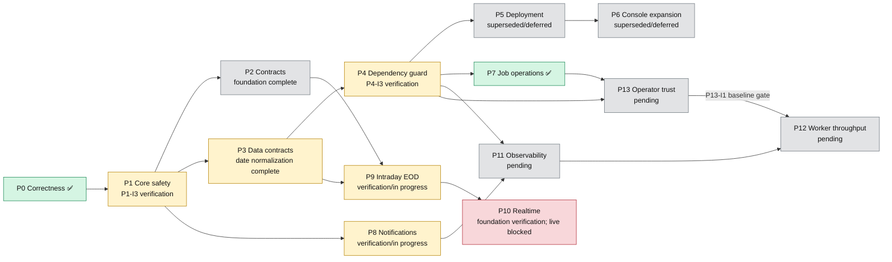

# Omni — Consolidated Implementation Roadmap

Status: Canonical autonomous-delivery roadmap

Application name: Omni Console

Primary repository: tanlocit9/omni

Planning baseline: main

Default integration branch: main

Current increment status and dependencies are canonical in [`implementation-increments.md`](implementation-increments.md). Durable historical evidence and reconciliation decisions are recorded in the root [`ReleaseNotes.md`](../../../ReleaseNotes.md).

## Objective

This roadmap moves Omni from a working single-node data pipeline toward a contract-driven, observable, portable platform with safe scheduling, typed integration contracts, versioned datasets, dependency enforcement, portable deployment, Omni Console, safe operator job controls, notification routing, intraday processing, realtime ingestion, cross-service correlation with structured logging, and an operator-trust landing experience that shows truthful pipeline stages, EOD data health, and a small fixed market review.

Roadmap delivery starts from canonical status and dependencies, implements one bounded increment, reconciles its cross-service blast radius, proves attributable test coverage, records approved verification evidence, and updates the roadmap without overstating source, CI, deployment, provider, or production state. Pull requests, commits, and CI remain traceability unless an increment declares them as explicit delivery gates.

## Canonical hierarchy

```text
Pre-roadmap capability baseline (historical; not scheduled)
└── Roadmap
    └── Capability group
        └── Phase
            └── Increment
                └── Task
```

A capability group is a navigation layer over related phases; it does not change phase numbers, dependencies, increment IDs, or selection rules. A phase is a coherent architectural capability. An increment is the smallest independently reviewable and verifiable delivery unit. A task is an implementation step inside an increment and is not independently scheduled.

## Inherited Pre-Roadmap Platform

Phase 0 starts from an existing working platform, not a greenfield repository. The inherited baseline already includes:

- an Nx monorepo with Platform/Core, Ingestor, and Analyzer services plus shared Python infrastructure;
- PostgreSQL-backed job definitions and execution history, cron scheduling, parent/child aggregation, Kafka job/status flows, and basic Telegram delivery;
- provider-backed symbol and EOD ingestion with normalized Parquet persistence and symbol/sector projections;
- indicator calculation, signal generation/history, forward evaluation, and signal notifications;
- Sector Wave symbol/sector features, ranking, rotation backtests, and an early Sector Transition research track;
- MinIO/S3-compatible Parquet datasets with shared topic and logical-path configuration;
- local Docker/Compose assets for the service and infrastructure stack.

This baseline describes capability presence only. It does not imply the later correctness, claim/outbox safety, Proto3 migration, deterministic manifests, dependency enforcement, portability, Console, or higher-frequency acceptance criteria were already complete. See the [pre-roadmap capability baseline](pre-roadmap-capability-baseline.md) for boundaries and canonical source links.

## Current source baseline

| Area                | Current verified source state                                                                                                                                                                                                                                                                                          | Roadmap implication                                                                                                             |
| ------------------- | ---------------------------------------------------------------------------------------------------------------------------------------------------------------------------------------------------------------------------------------------------------------------------------------------------------------------- | ------------------------------------------------------------------------------------------------------------------------------- |
| Scheduler due query | [`JobDefinitionRepository.findJobsDue()`](../../../apps/core/src/main/java/com/omni/platform/modules/scheduler/repositories/JobDefinitionRepository.java) applies the active predicate to both due conditions with deterministic ordering, and repository coverage is present.                                         | P0-I1 is completed with merged source and successful CI evidence.                                                               |
| Scheduler claiming  | Claim fields, PostgreSQL `SKIP LOCKED` acquisition, atomic execution/outbox preparation, fenced release, stable publish retry identity, and Testcontainers concurrency coverage are implemented and CI-verified in PR #8.                                                                                              | P1-I2 is completed; its autonomous direct dependents are ready.                                                                 |
| Dependency metadata | [`JobDefinitionConfig`](../../../apps/core/src/main/java/com/omni/platform/modules/scheduler/constants/JobDefinitionConfig.java) seeds dependency metadata; P4-I1/P4-I2 enforcement and P4-I3 dispatch-time gating source are present.                                                                                 | P4-I3 remains `verification_pending` until its impact, coverage, migration, and applicable runtime evidence is complete.        |
| Sector execution    | P1-I3 seeds one canonical-universe analysis writer and one outcome writer for shared Sector Transition outputs; Platform/Analyzer checks, graph review, commit, and exact-head CI pass on draft PR #16, but the PR is owned by P3-I4 rather than increment-specific.                                                   | P1-I3 remains `verification_pending` and does not yet unblock manifest-dependent sector publication work.                       |
| Contracts           | The [`contracts`](../../../libs/contracts) Nx project owns versioned common/job Proto3 schemas under `libs/contracts/proto`. P1-I4 completed the active JSON execution/status hard cutover to required `workType`/`workKey`; P2-I2/P2-I3 were later superseded by the MVP audit.                                       | Preserve the completed hard-cutover evidence; do not reactivate the superseded Proto3 migration without a new owner decision.   |
| Dataset manifests   | [`py_common`](../../../libs/py-common/py_common) implements canonical JSON manifests, deterministic lineage-inclusive identity, immutable version manifests, READY-last pointers, and shared compatibility fixtures. The unfinished P3-I1/P3-I2/P3-I3 sequence is superseded; completed P3-I4 evidence remains intact. | Treat the implemented manifest foundation as current source capability while keeping superseded roadmap work in technical debt. |
| Notifications       | Typed Telegram rendering, signal presentation, bounded strategy filtering, and the separate durable notification outbox source are present. P8-I1, P8-I2, and P8-I5 have fresh local Platform test/build evidence but still lack complete increment-specific impact/coverage and applicable runtime evidence; PR/CI are traceability unless an increment explicitly requires them.                                           | Follow the active Phase 8 evidence order; source presence and local checks do not make these increments completed.              |
| Web app             | [`apps/omni-console`](../../../apps/omni-console) and [`apps/query-service`](../../../apps/query-service) contain the focused V1 source, including P8-I4 strategy-aware exact-symbol signal history. P6-I1 through P6-I4 are superseded as scheduling items.                                                           | Preserve existing source; do not reactivate deferred Console/query expansion without owner approval.                            |
| Deployment          | Dockerfiles and Compose files exist.                                                                                                                                                                                                                                                                                   | Harden existing assets instead of creating production deployment assumptions.                                                   |

## Roadmap at a glance

The diagram is navigational. Increment-level status, dependencies, and ownership remain canonical in [`implementation-increments.md`](implementation-increments.md).



| Active execution order                                        | Status summary                                                                                                                            |
| ------------------------------------------------------------- | ----------------------------------------------------------------------------------------------------------------------------------------- |
| P4-I3 → P13-I1 → P13-I2 → P13-I4; then P8-I1 → P8-I2 → P8-I4 → P8-I5 → P9-I1 → P9-I4 → P1-I3 | Revised owner priority (2026-10-07); preserve dependencies, truthful status, active-work handoffs, and module-conflict checks.                           |
| P11-I1 → P11-I2 → P11-I3 → P11-I4 → P11-I5                    | Starts only after completed P4-I3 and P8-I5.                                                                                              |
| P13-I1 → P13-I2 → P13-I4; P13-I3 separately                          | Owner-approved operator-trust scope; P13-I1 requires completed P4-I3/P7-I3, while P13-I3 uses Query Service memory cache; calendar evidence or explicit classification narrowing remains an owner decision and does not block the shell. |
| P12-I1 → P12-I2 → P12-I3 → P12-I4                             | Starts only after P11-I5 and the completed P13-I1 truthful-stage measurement gate.                                                        |

Proto3 owns cross-service messages; JSON owns persisted dataset manifests. Superseded, blocked, deferred, and approval-required work is not autonomously selectable.

## Canonical Files by Group

- **Inherited baseline:** [Pre-roadmap capability baseline](pre-roadmap-capability-baseline.md)
- **Group A — Control-plane safety:** [Phase 0 — Immediate correctness hotfixes](../001-backend-core-stabilization.md), [Phase 1 — Backend/Core stabilization](../001-backend-core-stabilization.md)
- **Group B — Deterministic contracts and data:** [Phase 2 — Cross-service Proto3 contracts](../002-cross-service-protobuf-contracts.md), [Phase 3 — Dataset manifests and version lineage](../003-dataset-metadata-manifest.md), [Phase 4 — Job dependency guard](../005-job-dependency-guard.md)
- **Group C — Portable operations and product:** [Phase 5 — Portable containers and centralized object storage](../007-portable-docker-deployment.md), [Phase 6 — Omni Console and server-side query](../008-omni-metadata-console-dashboard-execution-plan.md), [Phase 7 — Omni Console job operations](../008-omni-metadata-console-dashboard-execution-plan.md), [Phase 8 — Multi-channel notification routing](../010-telegram-multi-channel.md)
- **Group D — Higher-frequency market data:** [Phase 9 — Intraday EOD](../013-intraday-eod.md), [Phase 10 — Realtime per tick](../014-realtime-per-tick.md)
- **Group E — Cross-service observability:** [Phase 11 — Cross-service observability](../024-polyglot-correlation-structured-logging.md)
- **Group F — Worker throughput:** [Phase 12 — Python worker throughput and dataset writer](../027-concurrent-workers-and-writer-batching.md)
- **Group G — Operator trust:** [Phase 13 — Job Operations, EOD Data Health, and fixed Console order](../029-operator-trust-console.md)

### Execution and Governance

1. [Numbered architecture decision registry](../../adr/README.md)
2. [Dependency-ordered implementation increments](implementation-increments.md)
3. [Automation rules](automation-rules.md)
4. [Cross-phase rules and definition of done](cross-phase-rules.md)
5. [Root release notes and historical evidence](../../../ReleaseNotes.md)
6. [Increment template](templates/increment.md)
7. [Daily report template](templates/daily-report.md)

## Current focused execution plan

The active MVP remains the existing daily/EOD pipeline, usable Telegram operational and signal notifications, and basic Phase 7 operator controls. Follow the compact execution-order table above and the exact exit conditions in [`implementation-increments.md`](implementation-increments.md). The owner additionally approved bounded Phase 13 operator-trust scope on 2026-10-06; the 2026-10-07 revision prioritizes P4-I3 verification and operational visibility before the remaining queue without bypassing declared dependencies.

P9-I5 provider health, arbitrary SQL expansion, broad Dataset Explorer polish, customizable dashboards, automatic Data Health scanning/repair, capacity changes, and multi-provider expansion remain deferred in [`docs/technical-debt/004-post-mvp-roadmap-work.md`](../../technical-debt/004-post-mvp-roadmap-work.md). Phase 13 promotes only truthful Job Operations, manual read-only EOD Data Health, and a small fixed Market Review. Existing source and historical evidence remain valid, but other deferred increments are not eligible for automation.

## Supporting plan inventory

| Document                                                                                                                       | Classification                          | Canonical owner                                                                       |
| ------------------------------------------------------------------------------------------------------------------------------ | --------------------------------------- | ------------------------------------------------------------------------------------- |
| [`docs/plans/001-backend-core-stabilization.md`](../001-backend-core-stabilization.md)                                         | Supporting detail                       | Phase 1 increments in [`implementation-increments.md`](implementation-increments.md)  |
| [`docs/plans/002-cross-service-protobuf-contracts.md`](../002-cross-service-protobuf-contracts.md)                             | Supporting detail                       | Phase 2 increments                                                                    |
| [`docs/plans/003-dataset-metadata-manifest.md`](../003-dataset-metadata-manifest.md)                                           | Consolidated supporting detail          | Phase 3 increments                                                                    |
| [`docs/plans/004-parquet-date-normalization-increment.md`](../004-parquet-date-normalization-increment.md)                     | Increment record                        | P3-I4 date normalization evidence and scope                                           |
| [`docs/plans/005-job-dependency-guard.md`](../005-job-dependency-guard.md)                                                     | Consolidated supporting detail          | Phase 4 increments                                                                    |
| [`docs/plans/006-job-dependency-guard-progress.md`](../006-job-dependency-guard-progress.md)                                   | Historical progress record              | Phase 4 implementation history                                                        |
| [`docs/plans/007-portable-docker-deployment.md`](../007-portable-docker-deployment.md)                                         | Deferred technical debt                 | Phase 5 increments                                                                    |
| [`docs/plans/008-omni-metadata-console-dashboard-execution-plan.md`](../008-omni-metadata-console-dashboard-execution-plan.md) | Deferred technical-debt record          | Phase 6 metadata, explorer, viewer, and dashboard sequence                            |
| [`docs/plans/009-dataset-component-market-dashboard.md`](../009-dataset-component-market-dashboard.md)                         | Deferred technical debt                 | Canonical fixed Market Dashboard scope is scheduled as P6-I4                          |
| [`docs/plans/010-telegram-multi-channel.md`](../010-telegram-multi-channel.md)                                                 | Supporting detail                       | Phase 8 routing increments                                                            |
| [`docs/plans/011-telegram-notification-format-modernization.md`](../011-telegram-notification-format-modernization.md)         | Scheduled Phase 8 detail                | P8-I1/P8-I2 formats; P8-I3 historical; P8-I5 durable delivery is detailed by plan 022 |
| [`docs/plans/012-confirmed-trend-equals-mvp.md`](../012-confirmed-trend-equals-mvp.md)                                         | Scheduled P8-I4 MVP detail              | Equal-vote combined signal, symbol query, and Telegram strategy selection             |
| [`docs/plans/013-intraday-eod.md`](../013-intraday-eod.md)                                                                     | Active bounded P9-I1 detail             | VCI normalized trades for HOSE/HNX/UPCOM; later bars/sector increments deferred       |
| [`docs/plans/021-intraday-confirmed-rules.md`](../021-intraday-confirmed-rules.md)                                             | Active bounded P9-I4 detail             | Exact-date intraday confirmation/suppression for the existing confirmed daily signal  |
| [`docs/plans/014-realtime-per-tick.md`](../014-realtime-per-tick.md)                                                           | Reactivated gated Phase 10 plan         | P10-I1/P10-I2 evidence plus blocked VCI discovery and live collector/control runtime  |
| [`docs/plans/015-cross-service-observability-correlation.md`](../015-cross-service-observability-correlation.md)               | Superseded historical design            | Replaced by Plan 024 and Phase 11; do not schedule                                    |
| [`docs/plans/016-shared-api-contract-and-unified-openapi.md`](../016-shared-api-contract-and-unified-openapi.md)               | Deferred technical debt                 | Not roadmap-scheduled                                                                 |
| [`docs/plans/017-global-dataset-metadata-refactor.md`](../017-global-dataset-metadata-refactor.md)                             | Implemented historical plan             | Phase 3 metadata migration history                                                    |
| [`docs/plans/018-internal-tools-parquet-viewer.md`](../018-internal-tools-parquet-viewer.md)                                   | Compatibility pointer                   | Canonical execution is the focused Omni Console plan                                  |
| [`docs/plans/019-consolidated-numbered-implementation-phases.md`](../019-consolidated-numbered-implementation-phases.md)       | Compatibility roadmap index             | This roadmap; navigation only                                                         |
| [`docs/plans/020-next-phase-implementation-plan.md`](../020-next-phase-implementation-plan.md)                                 | Superseded compatibility document       | This roadmap; do not update status or schedule from it                                |
| [`docs/plans/022-notification-outbox.md`](../022-notification-outbox.md)                                                       | Active P8-I5 supporting detail          | Canonical registry owns status, dependencies, and execution order                     |
| [`docs/plans/023-dependency-aware-outbox-dispatch.md`](../023-dependency-aware-outbox-dispatch.md)                             | Active P4-I3 supporting detail          | Canonical registry owns status, dependencies, readiness, and execution order          |
| [`docs/plans/024-polyglot-correlation-structured-logging.md`](../024-polyglot-correlation-structured-logging.md)               | Canonical Phase 11 supporting plan      | P11-I1 through P11-I5; canonical registry owns status and execution order             |
| [`docs/plans/027-concurrent-workers-and-writer-batching.md`](../027-concurrent-workers-and-writer-batching.md)                 | Phase 12 supporting implementation plan | P12-I1 through P12-I4; P12-I1 is pending after P11-I5 and P13-I1                      |
| [`docs/plans/029-operator-trust-console.md`](../029-operator-trust-console.md)                                                 | Phase 13 supporting implementation plan | P13-I1 through P13-I4; canonical registry owns status, dependencies, and order        |
| [`docs/reference/001-algorithm-feature-catalog.md`](../../reference/001-algorithm-feature-catalog.md)                          | Supporting reference                    | Phase 9 and Phase 10 feature naming                                                   |

## Selection summary

Select P4-I3 verification first, then P13-I1/P13-I2/P13-I4, then follow the compact execution-order table and the canonical registry exit conditions. Do not skip an incomplete evidence gate because later source is already present. P4-I3 requires complete blast-radius, impact-to-test, attributable coverage, migration, concurrency, and applicable runtime evidence; commit/PR/CI metadata alone does not close those gaps.

Automation must not select superseded, blocked, deferred, approval-required, or manual work until the canonical registry and owner decisions make it eligible.

## Codex execution entry point

Use [`automation-rules.md`](automation-rules.md) as the detailed operating protocol. Every run must produce a report matching [`templates/daily-report.md`](templates/daily-report.md), update canonical increment metadata when current status changes, and append a concise entry to [`ReleaseNotes.md`](../../../ReleaseNotes.md) only for durable implementation, verification, release, deferral, or owner-policy milestones.
