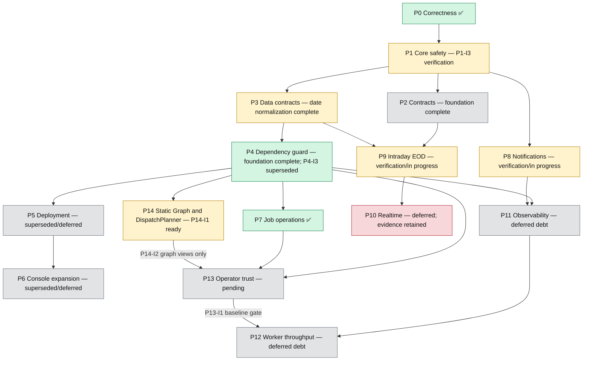

# Omni Roadmap Diagram

This diagram is a navigational view of roadmap phases and selected cross-phase dependencies. Canonical story status, dependencies, ownership, and execution eligibility remain in the [increment registry](implementation-increments.md). The [roadmap index](README.md) owns milestone and epic navigation.

Color describes evidence state, not urgency.

## Reading the Diagram

- P14 is the active [Static Graph & DispatchPlanner epic](../030-static-graph-dispatch-planner.md).
- The P14 → P13 edge applies only to graph-specific Job Operations presentation after P14-I2; basic P13 operations remain independently deliverable.
- P10, P11, and P12 retain historical status/evidence but remain owner-gated deferred work.
- Diagram edges summarize planning relationships and never replace exact `depends_on` metadata in the increment registry.
