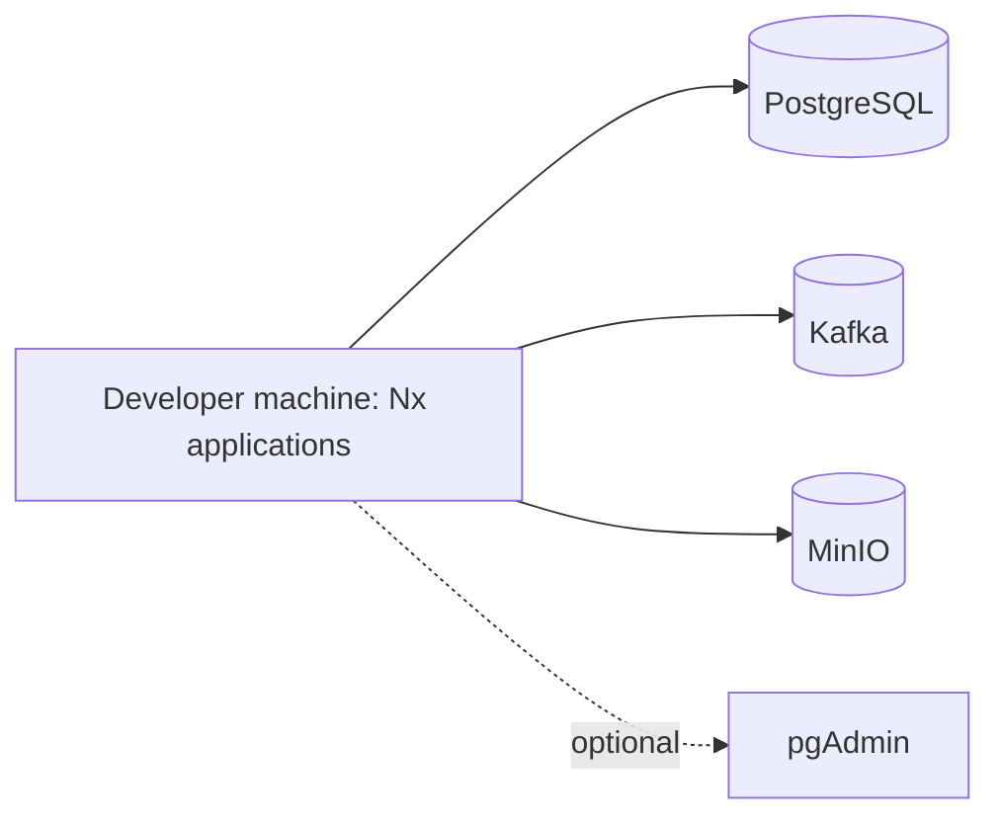
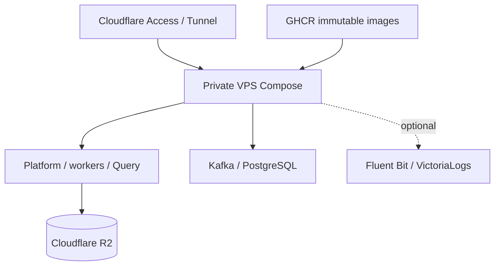
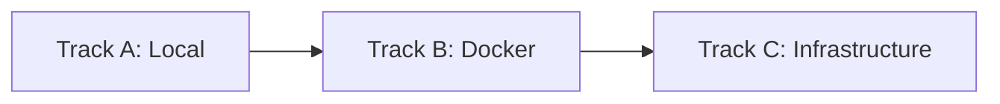

# Post-MVP Roadmap Work

## Decision

On 2026-09-05, the owner narrowed the active MVP to the existing daily/EOD pipeline, usable Telegram operational and signal notifications, and basic operator controls. On 2026-09-14, the owner reactivated bounded VCI health visibility as P9-I5 and Notification Outbox durable delivery as P8-I5. On 2026-09-19, the owner superseded P9-I5 back into technical debt and removed it as a prerequisite for P8-I5.

Work that primarily adds migration machinery, advanced metadata, deployment hardening, Console/query polish, out-of-scope notification operations, intraday features beyond active increments, or realtime processing remains deferred. It must not be selected by roadmap automation until the owner explicitly promotes it into the canonical increment registry.

This is prioritization debt, not a claim that the work has no long-term value. Existing implementations and verification evidence remain valid historical evidence even when their roadmap increment is superseded for MVP scheduling.

## Deferred Increments

| Area                            | Deferred increments        | Reason for deferral                                                                                                                                                                                                                                                                                                             |
| ------------------------------- | -------------------------- | ------------------------------------------------------------------------------------------------------------------------------------------------------------------------------------------------------------------------------------------------------------------------------------------------------------------------------- |
| Proto3 migration                | P2-I2, P2-I3               | Generated adapters, cross-language migration, dual-read operation, and cutover do not add immediate MVP user value while the current daily/EOD boundary remains usable.                                                                                                                                                         |
| Advanced manifests and metadata | P3-I1, P3-I2, P3-I3, P3-I5 | Generalized manifest infrastructure, migration, and reconciliation are post-MVP platform hardening. P3-I4 remains completed because its date-contract correction already protects the active EOD pipeline.                                                                                                                      |
| Portable deployment hardening   | P5-I1, P5-I2, P5-I3        | Image hardening, cloud/storage profiles, backup rehearsal, and immutable publication are deferred until an MVP deployment target is selected.                                                                                                                                                                                   |
| Console and query polish        | P6-I1, P6-I2, P6-I3, P6-I4 | Dataset exploration, SQL tooling, Arrow workflows, and dashboard work are outside the basic operator-control MVP. Existing merged source is retained but is not an active completion priority.                                                                                                                                  |
| Notification follow-ups         | Outside P8-I5              | P8-I5 now owns durable enqueue, distributed idempotency, bounded retries/backoff/jitter, `Retry-After`, `DEAD`, pagination, metrics, and operator status visibility. Audited manual replay of `DEAD`, broader notification-provider expansion, and optional operational tooling beyond status/count visibility remain deferred. |
| Intraday EOD                    | P9-I1, P9-I2, P9-I3, P9-I5 | Higher-frequency post-close datasets, features, and VCI health visibility are outside the daily/EOD MVP. P9-I5 requires explicit owner reactivation before scheduling.                                                                                                                                                          |
| Realtime per tick               | Historical deferral lifted | On 2026-09-13 the owner reactivated P10-I0/P10-I3 for a VCI-first live collector plan. The canonical registry now owns their blocked status and gates; this document retains the prior deferral as history only.                                                                                                                |

## Deferred Supporting Plans

The following consolidated supporting plans are retained as design or historical records, but they are technical debt for current scheduling and must not create MVP prerequisites:

| Plan                                                                                                                                 | Classification                  | MVP rule                                                                                                                                                         |
| ------------------------------------------------------------------------------------------------------------------------------------ | ------------------------------- | ---------------------------------------------------------------------------------------------------------------------------------------------------------------- |
| [`docs/plans/006-job-dependency-guard-progress.md`](../plans/006-job-dependency-guard-progress.md)                                   | Historical Phase 4 progress     | Remaining tracking, cache, dashboard, alerting, and retry-polish checklist items are deferred; completed Phase 4 behavior remains part of the safety baseline.   |
| [`docs/plans/007-portable-docker-deployment.md`](../plans/007-portable-docker-deployment.md)                                         | Deployment hardening debt       | Do not require cloud profiles, backup rehearsal, restore proof, or immutable image publication without an approved deployment target.                            |
| [`docs/plans/008-omni-metadata-console-dashboard-execution-plan.md`](../plans/008-omni-metadata-console-dashboard-execution-plan.md) | Console/query expansion debt    | Its internal milestone gates apply only after reactivation and cannot block daily/EOD, Phase 7 controls, or Telegram completion.                                 |
| [`docs/plans/009-dataset-component-market-dashboard.md`](../plans/009-dataset-component-market-dashboard.md)                         | Dashboard product debt          | Existing source may remain, but dashboard completion and polish are not current MVP gates.                                                                       |
| [`docs/plans/013-intraday-eod.md`](../plans/013-intraday-eod.md)                                                                     | Future product debt             | Intraday contracts, bars, features, and manifests require a new product decision.                                                                                |
| [`docs/plans/014-realtime-per-tick.md`](../plans/014-realtime-per-tick.md)                                                           | Reactivated gated Phase 10 plan | P10-I1/P10-I2 retain source and local evidence; P10-I0/P10-I3 are active but blocked pending VCI evidence, delivery prerequisites, and owner-approved contracts. |
| [`docs/plans/015-cross-service-observability-correlation.md`](../plans/015-cross-service-observability-correlation.md)               | Superseded historical design    | On 2026-09-17 the owner replaced it with Plan 024 and scheduled Phase 11 after P4-I3 and P8-I5; do not reactivate or schedule Plan 015.                          |
| [`docs/plans/016-shared-api-contract-and-unified-openapi.md`](../plans/016-shared-api-contract-and-unified-openapi.md)               | Developer-platform debt         | Generated clients, unified Swagger, and contract-diff CI are not prerequisites while current HTTP contracts remain usable.                                       |

Compatibility and already-implemented historical documents remain references rather than executable work. A concrete correctness, security, data-loss, or unsafe-operation defect found inside a deferred area is still MVP work under the existing safety baseline.

## Retained MVP Scope

The active MVP keeps:

- the existing daily/EOD ingestion and analysis pipeline;
- correctness work already protecting scheduler, execution identity, date contracts, and canonical sector processing;
- Phase 7 basic job catalog, safe trigger, and execution visibility;
- P8-I1 operational/generic Telegram formats;
- P8-I2 immediate/digest signal formats;
- P8-I5 Notification Outbox and Durable Delivery after P8-I1 and P8-I2 complete.

Completed increments remain completed. P1-I3, P8-I1, and P8-I2 may finish evidence reconciliation because their implementations directly support the retained MVP. P8-I3 remains a superseded historical increment; it does not own the active P8-I5 scope. Deferred increments must not block those MVP evidence gates solely because of historical dependency links.

## Existing Safety Baseline

Deferring hardening does not authorize removing existing safeguards. Preserve current validation, transaction boundaries, exception isolation, cooldown deduplication, destination isolation, secret handling, bounded payloads, and tests. A defect affecting correctness, data loss, credentials, or unsafe operation remains MVP work rather than technical debt.

## Reactivation Triggers

Reassess deferred work when one of these becomes true:

- the MVP requires a second independently deployed producer or consumer boundary;
- current JSON contracts cause compatibility or ownership failures;
- multiple replicas make process-local notification admission materially incorrect;
- a concrete deployment target requires image, storage, backup, or recovery guarantees;
- operators need dataset exploration, arbitrary read-only SQL, or dashboard workflows beyond basic job controls;
- provider-backed realtime data becomes an approved product requirement and provider access is available;
- observed production failures show that a deferred control is required for safe operation.

Reactivation requires an owner decision, refreshed dependencies and acceptance criteria, and a new or restored canonical roadmap increment. Do not treat this document as authorization to implement deferred work autonomously.

## Deferred VCI Health, Capacity, and Provider Expansion

P9-I5 VCI health metrics and basic visibility is superseded technical debt. A future owner reactivation may measure latency, throughput, backlog, failures, HTTP 429 frequency, availability, and data coverage through a refreshed canonical increment. No capacity conclusion or implementation schedule is created here, and this work does not block P8-I5.

Multi-provider ingestion, provider rotation/fallback, IP rotation, source mixing, and concurrency intended to evade upstream limits remain deferred. Any future provider increment must receive owner approval, preserve provider lineage, avoid silently mixing sources in one logical partition, and remain separate from blocked P10-I0/P10-I3 realtime design.

## Configurable Signal Combination Platform

The MVP deliberately implements only the fixed, equal-vote `CONFIRMED_TREND_EQUALS` strategy described in [`docs/plans/012-confirmed-trend-equals-mvp.md`](../plans/012-confirmed-trend-equals-mvp.md). The following generalized combination platform is post-MVP technical debt.

### Intended Capability

Operators can create named combinations from arbitrary registered signal strategies, assign optional weights, enable or disable the whole combination or individual components, precompute results, select combinations in Dashboard, and choose which combinations produce Telegram notifications.

A stable display name points to one active immutable version. Editing calculation behavior creates a new version rather than rewriting historical meaning.

### Generalized Configuration

```json
{
  "name": "CONFIRMED_TREND",
  "enabled": true,
  "timeframe": "1d",
  "threshold": 0.6,
  "components": [
    {
      "strategy": "TREND_MOMENTUM_V1",
      "enabled": true,
      "weight": 0.7
    },
    {
      "strategy": "ICHIMOKU_V1",
      "enabled": true,
      "weight": 0.3
    }
  ]
}
```

Rules:

- normalize strategy names and reject duplicate component strategies;
- require at least two enabled, distinct components;
- split weights equally across enabled components when all enabled weights are omitted;
- reject mixed omitted/provided weights unless a future contract defines unambiguous semantics;
- require finite, non-negative explicit weights with a positive total;
- exclude disabled components and normalize enabled weights to total `1.0`;
- map `BULLISH = +1`, `NEUTRAL = 0`, and `BEARISH = -1`;
- calculate the weighted sum and apply the immutable version's threshold;
- produce `NO_DECISION` when a required enabled component is missing, stale, date-mismatched, or `NO_DECISION`;
- retain component signals, source scores, normalized weights, contributions, reasons, dates, and source data versions.

Changing combination enablement, component enablement, component membership, weights, threshold, timeframe, or ensemble algorithm creates a new immutable version.

### Identity and Lifecycle

The stable name is operator-facing. The `combinationId` identifies exact canonical calculation semantics and should be derived from stable name, canonical sorted components, enabled flags, normalized decimal weights, threshold, timeframe, and ensemble algorithm version.

Suggested lifecycle:

```text
DRAFT -> PRECOMPUTING -> READY -> ACTIVE -> INACTIVE
                         \\-> FAILED
```

Activation rules:

1. Platform validates and stores a new immutable version.
2. Analyzer precomputes all available supported history for that version.
3. The previous active version remains active during precompute.
4. Analyzer reports processed, skipped, unavailable, and failed counts plus published data identity.
5. Platform atomically activates only a successfully published READY version.
6. Failed precompute leaves the previous version active.
7. Old READY/INACTIVE versions remain queryable and may be reactivated for rollback.

### Platform Persistence and APIs

Suggested relational ownership:

- `signal_combinations`: stable name, enabled state, active version ID, audit fields;
- `signal_combination_versions`: immutable combination ID, version, canonical configuration, configuration hash, lifecycle state, precompute execution ID, actor/timestamps;
- existing manual-trigger/outbox patterns should carry idempotent precompute requests rather than adding browser-to-Kafka access.

Suggested operator-only APIs:

```text
GET  /api/v1/signal-combinations
GET  /api/v1/signal-combinations/{name}
POST /api/v1/signal-combinations
PUT  /api/v1/signal-combinations/{name}
POST /api/v1/signal-combinations/{name}/versions/{version}/precompute
POST /api/v1/signal-combinations/{name}/versions/{version}/activate
```

Writes require authenticated operator identity, idempotency, optimistic concurrency, validation, and audit. Creating or changing a combination starts precompute automatically; the explicit precompute endpoint retries failed work.

### Analyzer and Dataset Ownership

Analyzer owns ensemble calculation and persisted result datasets. Platform owns configuration and activation state. Query Service and browsers must never calculate combinations.

Persist each immutable version separately, for example:

```text
signals/combination=confirmed_trend/combination_id=<immutable-id>/timeframe=1d/exchange=HOSE/
```

Rows retain combination identity and complete component evidence. Existing outcome evaluation can attach realized T+5/T+10/T+15/T+20 outcomes without rewriting the original decision.

### Dashboard and Telegram

Dashboard lists existing enabled named combinations and their available versions. Normal use reads the active READY version with exchange, exact symbol, and limit filters; historical version selection is explicit. Combined rows expose expandable component evidence.

Telegram configuration references stable combination names or an explicit approved list. Delivery resolves each name to its active READY `combinationId`. Disabled combinations send nothing. Deduplication identity includes combination ID, symbol, signal date, and result so version changes cannot collapse distinct decisions.

### Deferred Deployment Work

Deployment debt is split into three independent tracks. Completing one track does not imply the later tracks are complete.

| Track                  | Runtime model                                                               | Priority                | Reactivation trigger                                                                                        |
| ---------------------- | --------------------------------------------------------------------------- | ----------------------- | ----------------------------------------------------------------------------------------------------------- |
| Local developer setup  | Infrastructure in Docker; applications run from Nx on the developer machine | Medium                  | Setup is repeated on a new machine, shared with another developer, or becomes a recurring source of failure |
| Full Docker stack      | Every Omni service runs in containers on one local/home-lab host            | Medium                  | A portable full-stack handoff or repeatable home-lab runtime is required                                    |
| Infrastructure / cloud | Immutable images and externalized state deployed to a persistent host       | Deferred owner decision | A target provider, cost ceiling, exposure model, and recovery expectation are approved                      |

The Plan 024 Fluent Bit + VictoriaLogs debugging profile may add its two optional containers without completing the full Docker or infrastructure tracks. It must remain private/local and must not be represented as production deployment evidence.

### Track A — Local Developer Setup

Target boundary:



#### Bootstrap CLI requirement

Detailed Omni adoption is owned by [Plan 025 — Polycheck Adoption for Omni](../plans/025-polycheck-adoption.md).

Use Polycheck as the generic repository-readiness CLI, Nx as the first workspace adapter, and [mise](https://mise.jdx.dev/) as the version/bootstrap engine instead of implementing another language-version manager. Commit Omni requirements in `polycheck.toml`, keep runtime pins in `mise.toml`, and keep Nx as the application task orchestrator after prerequisites are available.

Target user experience after the external packages are published and adopted:

```text
npx polycheck doctor
npx polycheck doctor --json
mise install
npx nx run omni:local-infra
npx nx run omni:local-dev
```

Polycheck must remain generic and delegate runtime installation to mise. Omni-specific aliases may wrap these commands, but they must not duplicate check, version-management, or installation logic.

Pinned tool baseline:

| Tool                               | Required version/source                                 | Installation owner                 |
| ---------------------------------- | ------------------------------------------------------- | ---------------------------------- |
| Node.js                            | 22, exact supported minor/patch recorded in `mise.toml` | mise                               |
| Java                               | Temurin/OpenJDK 21                                      | mise                               |
| Python                             | 3.14.5, consistent with `.python-version` and CI        | mise                               |
| `uv`                               | Exact repo-supported version                            | mise                               |
| npm                                | Version bundled with the pinned Node runtime            | Node installation                  |
| Gradle                             | Repository wrapper; no global Gradle installation       | `apps/core/gradlew`                |
| Nx                                 | Workspace dependency; no global Nx installation         | `npm ci` and `npx nx`              |
| Git                                | Supported system installation                           | Detect; opt-in system install only |
| Docker Engine/Desktop + Compose v2 | Supported system installation                           | Detect; opt-in system install only |

`doctor` is read-only and must report:

- operating system, architecture, shell, PATH resolution, and whether Windows is using the supported native/WSL2 mode;
- resolved executable path and version for Git, Docker, Compose, Node, npm, Java, Python, `uv`, and the Gradle wrapper;
- `JAVA_HOME` value, resolved `java` path, JDK major version, and whether they disagree;
- Python executable selected by mise/uv, `.python-version`, project virtual-environment state, and workspace lock consistency;
- Docker daemon availability, Linux-container mode, Compose v2, available memory/disk, and WSL2 resource warning where applicable;
- required root/service env files and required variable names without printing secret values;
- submodule initialization state;
- port conflicts for `5432`, `9092`, `9000`, `9001`, `5050`, `8080`, `8000`, `8001`, `8002`, and `5173`;
- static Compose configuration validity;
- a final machine-readable and human-readable result.

Exit contract:

| Exit code | Meaning                                          |
| --------: | ------------------------------------------------ |
|       `0` | Ready for the selected local mode                |
|       `1` | Supported machine but action is required         |
|       `2` | Invalid configuration or unsupported environment |
|       `3` | Doctor itself failed unexpectedly                |

Support `--json` for CI/editor integration and redact values whose names match the repository secret classification.

`setup` is mutating and must:

1. show a plan/dry-run before installation;
2. install pinned user-space runtimes through mise;
3. run `npm ci`;
4. synchronize `py-common`, Analyzer, Ingestor, and Query Service with locked `uv` environments;
5. initialize Git submodules;
6. create root/service env files from examples only when missing;
7. never overwrite an existing env file or secret;
8. rerun `doctor` and stop before starting infrastructure if prerequisites remain invalid.

Installation policy:

- `mise run setup` may install user-space Node, Java, Python, and `uv` without changing unrelated global installations.
- Prefer mise-managed `JAVA_HOME`/PATH for repo commands; warn about a conflicting global `JAVA_HOME`, but do not rewrite the user's global environment silently.
- Docker Desktop/Engine, Git, WSL2 features, OS packages, firewall rules, and system services require an explicit `--install-system` or equivalent confirmation.
- System installation must print the exact `winget`, `brew`, `apt`, or `dnf` action before execution and must report when logout/restart is required.
- `setup` must be idempotent: a second run makes no destructive change and does not reinstall matching versions.
- Infrastructure startup remains a separate explicit command; installing tools must not start Kafka, PostgreSQL, MinIO, or applications.

Security and diagnostics rules:

- never print complete environment files, tokens, passwords, signed URLs, or credentials;
- never download tools from ad-hoc URLs when mise/official package metadata is available;
- pin versions and verify supported checksums/signatures through the selected installer path;
- record actions taken, skipped, and failed without collecting user telemetry;
- provide a manual remediation command for every check that cannot be safely automated.

Current gaps:

- `omni:init` starts the complete Compose stack, while `omni:dev` starts the same application ports on the host; following both commands can create port conflicts.
- README copies only the root `.env`, while Compose references service-level env files.
- Query Service dependency synchronization is absent from the quick-start sequence.
- Prerequisite versions and checks for Node, Java, Python, `uv`, Docker, and Linux-container mode are not automated.
- There is no single clean command that starts infrastructure, synchronizes application dependencies, and runs the five development applications without also starting duplicate containers.
- A clean-machine local smoke result has not been recorded.

Deferred work:

- create an infrastructure-only target such as `omni:local-infra`;
- create a host-application target such as `omni:local-dev`;
- optionally expose one wrapper such as `omni:local` that runs preflight, infrastructure, dependency sync, and applications in the correct order;
- add non-secret env bootstrap/validation for root and service-level files;
- include Platform, Analyzer, Ingestor, Query Service, Omni Console, and `py-common` setup;
- document Windows/WSL2 and Linux differences only where commands actually differ;
- add a bounded readiness/smoke script that reports which dependency or service failed.

Acceptance criteria:

- a clean supported machine follows one documented command sequence;
- local application processes do not conflict with Compose application ports;
- missing prerequisite or configuration fails early with an actionable message;
- every application reaches its documented health/readiness boundary;
- stopping the local workflow leaves no unexpected application container/process running;
- evidence records supported versions and the exact clean-machine procedure.

This track does not require production images, a registry, R2, Cloudflare, backups, or Kubernetes.

### Track B — Full Docker Stack

Target boundary:

```text
Docker Compose on one host
  -> Platform
  -> Analyzer
  -> Ingestor
  -> Query Service
  -> Omni Console
  -> PostgreSQL
  -> Kafka
  -> MinIO for local/home-lab storage
  -> optional Fluent Bit + VictoriaLogs profile
```

Current gaps:

- Compose does not include Query Service or Omni Console.
- Query Service and Omni Console have no Dockerfiles.
- Python images do not package the workspace root and `libs/py-common` consistently even though services declare `omni-py-common` as a workspace dependency.
- Analyzer runs Uvicorn with `--reload`.
- Python images do not declare a non-root runtime user.
- Platform expects filesystem Flyway migrations and shared topic configuration that are not clearly packaged in its runtime image.
- Platform defaults to the development profile.
- service source bind mounts and runtime builds make the current Compose stack development-oriented;
- Kafka has no durable volume;
- infrastructure images are not all pinned, including MinIO `latest`;
- health/readiness checks, graceful shutdown, resource limits, and container smoke evidence are incomplete.

Deferred work:

- add Dockerfiles and Compose services for Query Service and Omni Console;
- make every build context workspace-aware and package `py-common`, migrations, and shared configuration;
- separate development/HMR images from runtime images;
- remove production `--reload` and development profile defaults;
- use non-root runtime users and pinned base/runtime image versions;
- remove source bind mounts from the portable stack;
- add durable local Kafka/PostgreSQL/MinIO volumes with explicit lifecycle behavior;
- add health/readiness checks and dependency conditions based on readiness rather than container start;
- add optional `observability` profile without making application readiness depend on it;
- validate the effective Compose configuration and run a clean-volume full-stack smoke test.

Acceptance criteria:

- `docker compose up` or one explicitly named profile starts every required application and dependency from a clean checkout;
- no host-installed Java, Python, or `uv` is required for the full Docker path;
- Query Service and Console work through documented routes;
- application images contain all runtime code/configuration and do not depend on source bind mounts;
- restart preserves the explicitly durable local state;
- collector/backend absence does not stop business services;
- a clean build, startup, health, basic sync, query, Console, restart, and shutdown smoke result is recorded.

This track is portable single-host Docker, not public cloud security, HA, or disaster recovery.

### Track C — Infrastructure / Cloud Deployment

Target boundary:



Current gaps:

- no implemented `cloudflare-vps`, `home-lab`, backup, or restore deployment profile;
- current Compose publishes internal ports and carries development/default credentials;
- Platform exposes Actuator environment values and defaults to the development profile;
- no identity-aware proxy configuration protects Console, Platform, or Query Service;
- no implemented rule strips untrusted client identity headers before injecting verified identity;
- images are built on the host instead of pulled by immutable digest/tag;
- secrets, resource limits, network policy, log bounds, and upgrade/rollback procedures are not finalized;
- Kafka/PostgreSQL durability and R2 compatibility/recovery evidence are incomplete;
- backup/restore, RPO/RTO, HA, Kubernetes, and production SLOs remain separate post-MVP debt.

Deferred work:

- select and approve `home-lab` or `cloudflare-vps` with a cost ceiling;
- publish pinned multi-architecture images to GHCR and deploy by immutable version;
- keep Kafka, PostgreSQL, VictoriaLogs, object storage, and raw application ports private;
- expose only approved routes through Cloudflare Tunnel and Access;
- remove client-supplied identity headers at the trusted proxy and inject verified identity;
- use external R2-compatible object storage for shared datasets; omit MinIO and pgAdmin from the cloud profile;
- provide secrets through the approved secret/configuration mechanism with no tracked production defaults;
- add production profile, resource limits, bounded logs, upgrade, rollback, and state-migration procedures;
- validate Java/Python R2 operations before changing storage endpoints;
- add backup/restore only through its separately approved recovery increment.

Acceptance criteria before calling a single-VPS profile deployable:

- immutable images start on a clean target without source checkout or runtime builds;
- only approved authenticated HTTP routes are externally reachable;
- internal service ports and credentials are not public or committed;
- datasets use the approved external object store and browser clients receive no storage credentials;
- persistent state, resource limits, health checks, log bounds, upgrade, and rollback behavior are documented and smoke-tested;
- the profile clearly states that one VPS and one VictoriaLogs instance are single failure domains;
- no claim of production readiness, HA, backup, or recovery is made without the corresponding evidence.

This track does not imply Kubernetes. Kubernetes/Helm, multi-node Kafka, VictoriaLogs HA/`VLCluster`, and multi-zone failover remain separate future decisions.

### Dependency and Promotion Rules



- Track A validates configuration and the developer workflow.
- Track B packages the complete single-host runtime and may reuse Track A configuration contracts.
- Track C deploys immutable Track B images and adds external access, secrets, external storage, and operational boundaries.

Rules:

1. Track B must not use successful host-local execution as container verification.
2. Track C must not use successful local Compose startup as cloud security or recovery evidence.
3. Track A may be promoted independently without selecting a cloud provider.
4. Plan 024 MVP may add its local observability profile independently, provided it does not broaden into Track B/C work.
5. Every promoted track requires a canonical roadmap increment, owner, acceptance evidence, and explicit non-goals.
6. Existing `docs/plans/007-portable-docker-deployment.md` and `docs/deployment/002-cloudflare-low-cost-deployment.md` remain supporting design sources; this technical-debt record owns deferral and reactivation status.

## Deferred Production Logging Hardening

Plan 024 now owns a bounded debugging MVP: identify which sync failed, when and where it failed, why it failed, whether it is retryable, and reconstruct its Java/Kafka/Python flow by `correlationId`.

The following production-hardening work is explicitly deferred and must not block Plan 024 MVP completion:

- Kubernetes/Helm deployment and cluster lifecycle;
- VictoriaLogs HA, replication, or `VLCluster`;
- production authentication proxy, multitenancy, `vmauth`, and mTLS;
- snapshot backup/restore, disaster recovery, RPO, and RTO;
- formal SLOs and production capacity/load certification;
- long collector/backend outage and disk-exhaustion testing;
- Grafana dashboards and a dedicated alerting subsystem;
- raw S3/R2/MinIO log archive;
- OpenTelemetry tracing with `traceId`/`spanId`;
- advanced sampling and stream-cardinality governance;
- historical correlation backfill and database `NOT NULL` enforcement;
- automated privacy deletion workflow;
- future Node/Pino/`AsyncLocalStorage` runtime support.

This debt may be promoted only when a real deployment, scale, availability, compliance, or multi-user access requirement exists. Promotion must define its own roadmap increment, acceptance criteria, security boundary, verification evidence, and rollback/recovery plan.

The MVP may still use a private/localhost Compose profile with one Fluent Bit and one VictoriaLogs instance for centralized debugging. That profile is a single failure domain and must not be represented as HA or fully production-ready.

## Deferred Verification

Before reactivation, add coverage for canonical identity, weight normalization, enablement, validation, immutable version creation, precompute failure, atomic activation, rollback, concurrent updates, stale components, READY publication, outcome evaluation, Dashboard selection, Telegram selection, and audit history.
