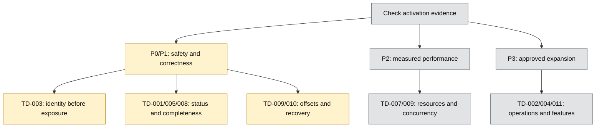

# Technical Debt — Review and Priority

Reviewed against docs/refactor at 56bd7e4125beed1a7bb58b7f6158a17609d4235a on 2026-10-07. Static source inspection only; no build/test/lint/format/load/provider verification was run. Code-review-graph is unavailable in this session. Review is bounded to the source references listed below; unrelated implementation completeness is not asserted.

## Use

Keep active Job Operations, manual EOD Data Health and small Market Review in the roadmap. This index owns debt classification, risk priority and activation triggers; [TD-011](011-deferred-observability-capacity-and-realtime.md) owns deferred feature scope. Promotion into the [increment registry](../plans/roadmap/implementation-increments.md) requires a concrete bounded slice; priority alone is not permission to execute it.

P0 is conditional on exposure. P1 correctness precedes capacity decisions when evidence establishes relevance. P2 needs P13-I1 baseline evidence. P3 needs explicit product/operational demand. These are risk priorities, not a promise to implement every item in order; data-loss/security defects may be promoted immediately without a full P11/P12 rollout.

## Reviewed records

| ID | Type | Review status | Priority / activation |
| --- | --- | --- | --- |
| [TD-001](001-p3-i5-metadata-reconciliation.md) | correctness | OPEN / source mismatch confirmed | P1: Partial metadata status leaves executions non-terminal; approve a coordinated status mapping. |
| [TD-002](002-telegram-notification-deduplication.md) | operational hardening | OPEN / process-local limitation confirmed | P3 conditional: Multiple replicas, lost suppression counts, or measured false suppression. |
| [TD-003](003-system-operator-uuid.md) | security / identity | OPEN / temporary identity confirmed | P0 before non-local or multi-user exposure: Before non-local or multi-user deployment; not proof of a currently exposed service. |
| [TD-004](004-post-mvp-roadmap-work.md) | deferred feature / umbrella | DEFERRED / classification record | P3 conditional: Approved deployment, repeated setup friction, or concrete user demand; promote one bounded slice. |
| [TD-005](005-job-status-empty-output-semantics.md) | correctness / output semantics | OPEN / source behavior confirmed | P1: Clarify valid-empty versus missing/invalid output before presenting execution success as data health. |
| [TD-006](006-job-status-transaction-silent-rollback.md) | historical diagnosis | RESOLVED AS WRITTEN / historical only | None: Reopen only with a new root exception and synchronous transaction path. |
| [TD-007](007-async-dependency-evaluation.md) | performance / resource lifecycle | SOURCE PRESENT / load verification pending | P2 conditional: Measured MinIO pressure/latency or lifecycle leakage; preserve readiness semantics. |
| [TD-008](008-vci-intraday-adapter-vnstock4-migration.md) | correctness / provider compatibility | PARTIALLY RESOLVED / completeness open | P1 when intraday is used: Use of intraday results as complete-session data; collect provider/date/cap evidence. |
| [TD-009](009-python-kafka-worker-throughput-and-offset-safety.md) | correctness + capacity (separate slices) | OPEN / static risks confirmed; throughput unmeasured | P1 offset safety; P2 measured capacity: Correctness evidence can justify an immediate narrow fix; concurrency/writer follow baseline and owner promotion. |
| [TD-010](010-kafka-poison-record-and-dead-letter-policy.md) | correctness / recovery policy | OPEN / deferred durable DLT | P1 if poison records strand work: Observed poison-record stalls/loss; immediate narrow handling is separate from full DLT infrastructure. |
| [TD-011](011-deferred-observability-capacity-and-realtime.md) | Deferred feature / operations | DEFERRED, owner-gated | P3; measured diagnostic/capacity need or approved live-provider product need |

## Priority diagram

Arrows show conditional priority lanes, not mandatory implementation dependencies. TD-009 has independent correctness and capacity slices. Closed TD-006 is excluded. Standalone source: [priority-order.mmd](priority-order.mmd). Compare the [roadmap source](../plans/roadmap/roadmap.mmd). Both use the same top-down layout, quoted English labels and state palette. Color describes evidence state, while P0–P3 labels describe risk priority.

## TODO references

TODOs are added only to existing source with a current gap; no placeholder runtime or TODO is created for a feature that has not been built. Resolve the linked debt and remove the corresponding TODO only when its closure evidence exists. Multiple TODOs for one debt are references to the same record, not separate backlog items.

| Source | Debt |
| --- | --- |
| [apps/analyzer/app/metadata/kafka.py](../../apps/analyzer/app/metadata/kafka.py) | [TD-001](001-p3-i5-metadata-reconciliation.md) |
| [apps/core/src/main/java/com/omni/platform/modules/notifications/services/NotificationDeduplicator.java](../../apps/core/src/main/java/com/omni/platform/modules/notifications/services/NotificationDeduplicator.java) | [TD-002](002-telegram-notification-deduplication.md) |
| [apps/omni-console/src/api.ts](../../apps/omni-console/src/api.ts) | [TD-003](003-system-operator-uuid.md) |
| [apps/ingestor/app/handlers/stock_prices.py](../../apps/ingestor/app/handlers/stock_prices.py) | [TD-005](005-job-status-empty-output-semantics.md) |
| [apps/analyzer/app/indicators/kafka.py](../../apps/analyzer/app/indicators/kafka.py) | [TD-005](005-job-status-empty-output-semantics.md) |
| [apps/analyzer/app/signals/kafka.py](../../apps/analyzer/app/signals/kafka.py) | [TD-005](005-job-status-empty-output-semantics.md) |
| [apps/core/src/main/java/com/omni/platform/modules/scheduler/dependencies/DefaultJobDependencyGuard.java](../../apps/core/src/main/java/com/omni/platform/modules/scheduler/dependencies/DefaultJobDependencyGuard.java) | [TD-007](007-async-dependency-evaluation.md) |
| [apps/ingestor/app/stocks/clients/vci_intraday.py](../../apps/ingestor/app/stocks/clients/vci_intraday.py) | [TD-008](008-vci-intraday-adapter-vnstock4-migration.md) |
| [libs/py-common/py_common/kafka/factory.py](../../libs/py-common/py_common/kafka/factory.py) | [TD-009](009-python-kafka-worker-throughput-and-offset-safety.md) |
| [libs/py-common/py_common/kafka/job_status_service.py](../../libs/py-common/py_common/kafka/job_status_service.py) | [TD-009](009-python-kafka-worker-throughput-and-offset-safety.md) |
| [apps/ingestor/app/messaging/consumer.py](../../apps/ingestor/app/messaging/consumer.py) | [TD-009](009-python-kafka-worker-throughput-and-offset-safety.md) |
| [apps/core/src/main/java/com/omni/platform/modules/scheduler/consumers/JobStatusConsumer.java](../../apps/core/src/main/java/com/omni/platform/modules/scheduler/consumers/JobStatusConsumer.java) | [TD-010](010-kafka-poison-record-and-dead-letter-policy.md) |

## Closure and evidence

- OPEN: observed source gap; operational frequency may still be unverified.
- SOURCE PRESENT / verification pending: behavior exists but required evidence is incomplete.
- PARTIALLY RESOLVED: close only the demonstrated subproblem; retain residual risks.
- RESOLVED AS WRITTEN: keep historical evidence; reopen only with a new concrete defect.
- DEFERRED FEATURE: not an engineering defect; activate from demand and scope.

All numeric historical observations remain historical. TODO additions are comments only. Runtime repair, new status contracts, offset changes, concurrency, persistence and replay are outside this change. Existing access/data-safety controls remain required.
