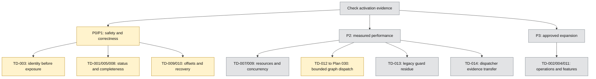

# Technical-Debt Priority Diagram

This diagram summarizes conditional priority lanes from the [technical-debt index](README.md). It is not an implementation schedule and does not override the [canonical increment registry](../plans/roadmap/implementation-increments.md).

P0–P3 labels describe risk priority. Color describes evidence state. Arrows show conditional activation lanes, not mandatory implementation dependencies.

## Reading the Diagram

- TD-012 is a historical promoted-design record; active bounded work is owned by [Plan 030](../plans/030-static-graph-dispatch-planner.md) and P14-I1 through P14-I3.
- Persisted topology, expanded provider policy, adaptive quotas, and advanced fairness remain deferred.
- TD-013 keeps unused blocked-job tracking cleanup and optional missing dependency evaluators outside P14 unless an explicit activation trigger occurs.
- TD-014 preserves unclosed P4-I3 evidence while P14-I3 owns the final dependency-aware dispatcher safety proof.
- TD-009 contains independent offset-safety and measured-capacity slices; a correctness fix does not require the full capacity epic.
- Closed TD-006 is intentionally excluded.
