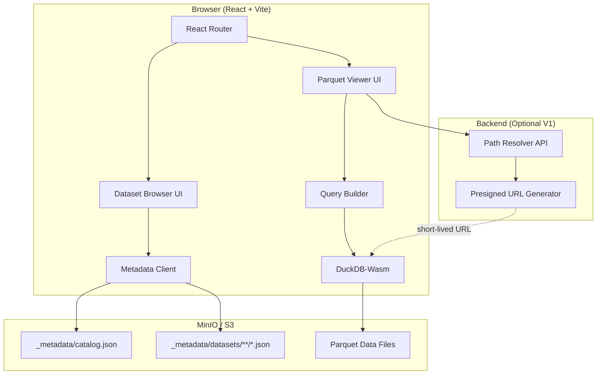
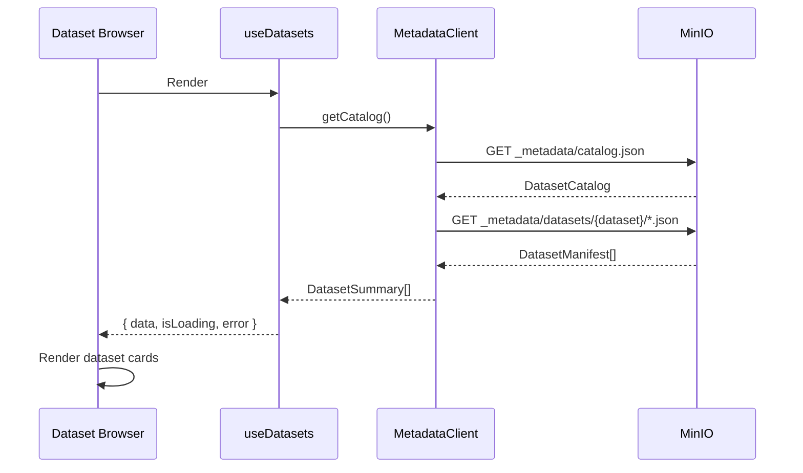
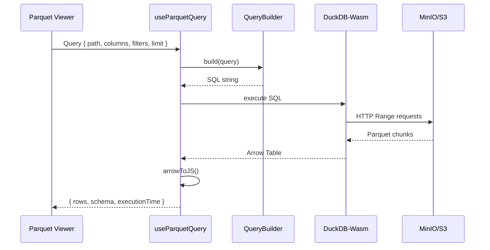

# Internal Tools — Parquet Viewer Detailed Implementation Plan

## Executive Summary

This plan details the implementation of [`apps/internal-tools`](../apps/internal-tools), the first Omni web application. The initial feature is a **Dataset Browser + Parquet Viewer** that reads dataset metadata from MinIO manifests and queries Parquet data directly in the browser using DuckDB-Wasm.

**Key Architecture Decision**: Browser-side Parquet processing eliminates the need for backend row pagination APIs and PostgreSQL/Redis metadata caches in V1.

## Reference Documents

- Base Plan: [`docs/INTERNAL_TOOLS_PARQUET_VIEWER_IMPLEMENTATION_PLAN.md`](../docs/INTERNAL_TOOLS_PARQUET_VIEWER_IMPLEMENTATION_PLAN.md)
- Metadata Contract: [`docs/DATASET_METADATA_MANIFEST_IMPLEMENTATION_PLAN.md`](../docs/DATASET_METADATA_MANIFEST_IMPLEMENTATION_PLAN.md)
- Storage Paths: [`configs/shared/s3-paths.yaml`](../configs/shared/s3-paths.yaml)
- System Overview: [`docs/architecture/system-overview.md`](../docs/architecture/system-overview.md)

## Architecture Overview



## Technology Stack Analysis

### Core Stack (From Plan)

| Technology     | Version       | Purpose              | Status                  |
| -------------- | ------------- | -------------------- | ----------------------- |
| React          | Latest stable | UI framework         | ✅ Standard choice      |
| TypeScript     | ~5.9.2        | Type safety          | ✅ Already in workspace |
| Vite           | Latest        | Build tool           | ⚠️ Need to add          |
| Nx React/Vite  | 22.7.8        | Monorepo integration | ⚠️ Need to add plugin   |
| shadcn/ui      | Latest        | Component library    | ⚠️ Need to configure    |
| Tailwind CSS   | Latest        | Styling              | ⚠️ Need to configure    |
| TanStack Table | v8            | Data grid            | ⚠️ Need to add          |
| TanStack Query | v5            | Data fetching        | ⚠️ Need to add          |
| DuckDB-Wasm    | Latest        | In-browser Parquet   | ⚠️ Need to add          |
| React Router   | v6            | Routing              | ⚠️ Need to add          |
| Vitest         | Latest        | Unit testing         | ⚠️ Need to add          |

### Package Dependencies Required

```json
{
  "dependencies": {
    "react": "^18.3.0",
    "react-dom": "^18.3.0",
    "react-router-dom": "^6.26.0",
    "@tanstack/react-table": "^8.20.0",
    "@tanstack/react-query": "^5.56.0",
    "@duckdb/duckdb-wasm": "^1.29.0",
    "apache-arrow": "^17.0.0",
    "clsx": "^2.1.0",
    "tailwind-merge": "^2.5.0",
    "class-variance-authority": "^0.7.0",
    "lucide-react": "^0.446.0"
  },
  "devDependencies": {
    "@nx/react": "22.7.8",
    "@nx/vite": "22.7.8",
    "@vitejs/plugin-react": "^4.3.0",
    "vite": "^5.4.0",
    "vitest": "^2.1.0",
    "@testing-library/react": "^16.0.0",
    "@testing-library/jest-dom": "^6.5.0",
    "tailwindcss": "^3.4.0",
    "postcss": "^8.4.0",
    "autoprefixer": "^10.4.0"
  }
}
```

## Project Structure

```text
apps/internal-tools/
├── project.json                      # Nx project configuration
├── vite.config.ts                    # Vite bundler config
├── tsconfig.json                     # TypeScript config
├── tsconfig.app.json                 # App-specific TS config
├── tsconfig.spec.json                # Test TS config
├── tailwind.config.js                # Tailwind CSS config
├── postcss.config.js                 # PostCSS config
├── index.html                        # HTML entry point
├── public/                           # Static assets
│   └── duckdb/                       # DuckDB-Wasm bundles
├── src/
│   ├── main.tsx                      # React app entry
│   ├── app/
│   │   ├── App.tsx                   # Root component
│   │   ├── routes.tsx                # Route definitions
│   │   └── providers.tsx             # Context providers
│   ├── features/
│   │   ├── dataset-browser/
│   │   │   ├── domain/
│   │   │   │   ├── types.ts          # Dataset/manifest types
│   │   │   │   └── schemas.ts        # Known Omni schemas
│   │   │   ├── application/
│   │   │   │   ├── useDatasets.ts    # Query hook
│   │   │   │   └── usePartitions.ts  # Query hook
│   │   │   ├── infrastructure/
│   │   │   │   ├── metadata-client.ts # MinIO metadata reader
│   │   │   │   └── catalog-cache.ts   # In-memory cache
│   │   │   └── components/
│   │   │       ├── DatasetBrowser.tsx
│   │   │       ├── DatasetCard.tsx
│   │   │       ├── PartitionList.tsx
│   │   │       └── DatasetStats.tsx
│   │   └── parquet-viewer/
│   │       ├── domain/
│   │       │   ├── types.ts          # Query/result types
│   │       │   └── field-metadata.ts # Known field definitions
│   │       ├── application/
│   │       │   ├── useParquetQuery.ts # DuckDB query hook
│   │       │   └── useSchemaCheck.ts  # Schema validation
│   │       ├── infrastructure/
│   │       │   ├── duckdb/
│   │       │   │   ├── connection.ts  # Connection pool
│   │       │   │   ├── query-builder.ts # SQL generation
│   │       │   │   └── arrow-adapter.ts # Arrow to JS
│   │       │   └── dataset-resolver/
│   │       │       ├── path-resolver.ts # URL resolution
│   │       │       └── presigned-client.ts # API client
│   │       └── components/
│   │           ├── ParquetViewer.tsx
│   │           ├── DataTable.tsx      # TanStack Table
│   │           ├── QueryControls.tsx  # Filter/sort/limit
│   │           ├── SchemaPanel.tsx
│   │           ├── ColumnSelector.tsx
│   │           └── renderers/
│   │               ├── DateRenderer.tsx
│   │               ├── NumberRenderer.tsx
│   │               └── GenericRenderer.tsx
│   └── shared/
│       ├── components/
│       │   └── ui/                    # shadcn components
│       ├── lib/
│       │   ├── utils.ts               # Tailwind cn helper
│       │   └── constants.ts
│       └── hooks/
│           └── useDebounce.ts
└── tests/
    ├── metadata-client.test.ts
    ├── query-builder.test.ts
    └── schema-validation.test.ts
```

## Domain Model

### Dataset Metadata Types

```typescript
// features/dataset-browser/domain/types.ts

export interface DatasetCatalog {
  version: number;
  datasets: DatasetDefinition[];
}

export interface DatasetDefinition {
  name: string;
  metadataPrefix: string;
  dataPrefix: string;
  description?: string;
}

export interface DatasetManifest {
  version: number;
  dataset: string;
  partition?: Record<string, string>;
  status: 'READY' | 'PROCESSING' | 'FAILED';
  path: string;
  dataVersion: string;
  objectCount: number;
  totalBytes: number;
  rowCount: number;
  columnCount: number;
  columns: ColumnMetadata[];
  schemaVersion?: number;
  schemaHash?: string;
  minTimestamp?: string;
  maxTimestamp?: string;
  inputs?: DatasetInput[];
  sourceExecutionId?: string;
  generatedAt: string;
}

export interface ColumnMetadata {
  name: string;
  type: string;
  nullable?: boolean;
}

export interface DatasetInput {
  dataset: string;
  partition?: Record<string, string>;
  dataVersion: string;
}

export interface DatasetSummary {
  definition: DatasetDefinition;
  latestManifest?: DatasetManifest;
  partitionCount: number;
  totalRows: number;
  totalBytes: number;
  lastUpdated?: string;
}
```

### Parquet Query Types

```typescript
// features/parquet-viewer/domain/types.ts

export interface ParquetQuery {
  path: string;
  columns: string[];
  filters: QueryFilter[];
  sort?: QuerySort;
  limit: number;
  offset?: number;
}

export interface QueryFilter {
  column: string;
  operator: '=' | '!=' | '>' | '<' | '>=' | '<=' | 'LIKE' | 'IN';
  value: unknown;
}

export interface QuerySort {
  column: string;
  direction: 'ASC' | 'DESC';
}

export interface ParquetResult {
  rows: unknown[];
  schema: ParquetSchema;
  rowCount: number;
  executionTime: number;
}

export interface ParquetSchema {
  fields: ParquetField[];
}

export interface ParquetField {
  name: string;
  type: string;
  nullable: boolean;
}

export interface DatasetRef {
  dataset: string;
  partition?: Record<string, string>;
  path?: string;
}
```

### Known Field Definitions

```typescript
// features/parquet-viewer/domain/field-metadata.ts

export interface FieldMetadata {
  name: string;
  label: string;
  type: 'date' | 'timestamp' | 'number' | 'string' | 'boolean';
  format?: string;
  description?: string;
}

export const DATASET_SCHEMAS: Record<string, FieldMetadata[]> = {
  eod: [
    { name: 'date', label: 'Date', type: 'date', description: 'Trading date' },
    { name: 'symbol', label: 'Symbol', type: 'string' },
    { name: 'open', label: 'Open', type: 'number', format: '0,0.00' },
    { name: 'high', label: 'High', type: 'number', format: '0,0.00' },
    { name: 'low', label: 'Low', type: 'number', format: '0,0.00' },
    { name: 'close', label: 'Close', type: 'number', format: '0,0.00' },
    { name: 'volume', label: 'Volume', type: 'number', format: '0,0' },
  ],
  indicators: [
    { name: 'date', label: 'Date', type: 'date' },
    { name: 'symbol', label: 'Symbol', type: 'string' },
    { name: 'indicator_name', label: 'Indicator', type: 'string' },
    { name: 'value', label: 'Value', type: 'number', format: '0,0.0000' },
  ],
  signals: [
    { name: 'date', label: 'Date', type: 'date' },
    { name: 'symbol', label: 'Symbol', type: 'string' },
    { name: 'signal', label: 'Signal', type: 'string' },
    {
      name: 'confidence',
      label: 'Confidence',
      type: 'number',
      format: '0.00%',
    },
  ],
  'intraday-bars': [
    { name: 'bar_time', label: 'Time', type: 'timestamp' },
    { name: 'symbol', label: 'Symbol', type: 'string' },
    { name: 'close', label: 'Close', type: 'number', format: '0,0.00' },
    { name: 'volume', label: 'Volume', type: 'number', format: '0,0' },
  ],
};
```

## Implementation Phases

### Phase 1: Project Setup & Infrastructure

**Goal**: Create working Nx React + Vite project with basic routing

#### Tasks

1. **Generate Nx React + Vite app**

   ```bash
   nx g @nx/react:app internal-tools --bundler=vite --routing --style=css
   ```

2. **Install dependencies**

   ```bash
   npm install react-router-dom @tanstack/react-table @tanstack/react-query @duckdb/duckdb-wasm apache-arrow
   npm install -D tailwindcss postcss autoprefixer
   ```

3. **Configure Tailwind CSS**

   ```bash
   npx tailwindcss init -p
   ```

4. **Initialize shadcn/ui**

   ```bash
   npx shadcn@latest init
   ```

5. **Set up project.json targets**
   - `serve`: Dev server with HMR
   - `build`: Production build
   - `test`: Vitest runner
   - `lint`: ESLint
   - `preview`: Preview production build

#### Acceptance Criteria

- ✅ `nx serve internal-tools` starts dev server
- ✅ Basic routing works (`/` and `/data`)
- ✅ Tailwind CSS styling applies
- ✅ shadcn/ui components available

### Phase 2: Metadata Browser

**Goal**: Read and display dataset catalog and manifests from MinIO

#### Tasks

1. **Implement MetadataClient**

   ```typescript
   class MetadataClient {
     async getCatalog(): Promise<DatasetCatalog>;
     async getDatasetManifests(dataset: string): Promise<DatasetManifest[]>;
     async getManifest(
       dataset: string,
       partition: Record<string, string>
     ): Promise<DatasetManifest>;
   }
   ```

2. **Create TanStack Query hooks**

   ```typescript
   export function useDatasets();
   export function usePartitions(dataset: string);
   export function useManifest(
     dataset: string,
     partition: Record<string, string>
   );
   ```

3. **Build Dataset Browser UI**

   - Grid of DatasetCard components
   - Show: name, status, row count, size, last updated
   - Click card → navigate to partition list

4. **Build Partition List UI**
   - Table of partitions for selected dataset
   - Show: partition keys, row count, size, timestamp range
   - Click partition → navigate to Parquet Viewer

#### Data Flow



#### Acceptance Criteria

- ✅ Catalog loads from MinIO
- ✅ Dataset cards show correct statistics
- ✅ Partition drill-down works
- ✅ Loading and error states display correctly
- ✅ No full Parquet prefix scans

### Phase 3: DuckDB-Wasm Integration

**Goal**: Query remote Parquet files in browser

#### Tasks

1. **Configure Vite for DuckDB-Wasm**

   ```typescript
   // vite.config.ts
   export default defineConfig({
     plugins: [react()],
     optimizeDeps: {
       exclude: ['@duckdb/duckdb-wasm'],
     },
     worker: {
       format: 'es',
     },
   });
   ```

2. **Copy DuckDB bundles to public/**

   ```bash
   cp node_modules/@duckdb/duckdb-wasm/dist/*.wasm public/duckdb/
   ```

3. **Implement DuckDB connection pool**

   ```typescript
   class DuckDBConnection {
     private db: AsyncDuckDB;
     private conn: AsyncDuckDBConnection;

     async initialize(): Promise<void>;
     async query(sql: string, params?: unknown[]): Promise<ParquetResult>;
     async close(): Promise<void>;
   }
   ```

4. **Implement QueryBuilder**

   ```typescript
   class QueryBuilder {
     build(query: ParquetQuery): string;
   }

   // Example output:
   // SELECT date, symbol, close
   // FROM read_parquet('https://...')
   // WHERE date >= '2026-08-01'
   // ORDER BY date DESC
   // LIMIT 200
   ```

5. **Implement Arrow to JavaScript adapter**
   ```typescript
   function arrowToJS(table: arrow.Table): unknown[];
   ```

#### DuckDB Query Flow



#### Acceptance Criteria

- ✅ DuckDB-Wasm loads and initializes
- ✅ Can query remote Parquet via HTTP
- ✅ Arrow results convert to JavaScript objects
- ✅ Query execution time tracked
- ✅ Connection cleanup on unmount

### Phase 4: Parquet Viewer UI

**Goal**: Interactive table with filtering, sorting, projection

#### Tasks

1. **Implement DataTable with TanStack Table**

   ```typescript
   function DataTable({ data, schema, query, onQueryChange });
   ```

2. **Implement QueryControls**

   - Column selector (projection)
   - Filter builder (field, operator, value)
   - Sort controls (column, direction)
   - Limit slider (50-5000 rows)

3. **Implement SchemaPanel**

   - Show physical schema from DuckDB
   - Compare with manifest schema
   - Highlight unknown/missing fields

4. **Implement field renderers**

   - DateRenderer: Format dates
   - NumberRenderer: Format with thousands separator
   - GenericRenderer: Fallback for unknown types

5. **Add navigation**
   - Breadcrumb: Dataset → Partition → Viewer
   - Back button
   - Deep linking support

#### Acceptance Criteria

- ✅ Table renders Parquet data
- ✅ Column selection works
- ✅ Filters apply correctly
- ✅ Sorting works
- ✅ Known fields use custom renderers
- ✅ Unknown fields display generically
- ✅ Schema warnings show when mismatch detected

### Phase 5: Path Resolution

**Goal**: Handle private MinIO access securely

#### Tasks

1. **Implement PathResolver**

   ```typescript
   interface PathResolver {
     resolve(ref: DatasetRef): Promise<string>;
   }

   class DirectPathResolver implements PathResolver {
     // For local dev with public MinIO
     resolve(ref: DatasetRef): Promise<string> {
       return `http://localhost:9000/stock-data/${ref.path}`;
     }
   }

   class PresignedPathResolver implements PathResolver {
     // For private MinIO
     async resolve(ref: DatasetRef): Promise<string> {
       const response = await fetch('/api/datasets/resolve', {
         method: 'POST',
         body: JSON.stringify(ref),
       });
       return response.json().presignedUrl;
     }
   }
   ```

2. **Create backend API endpoint (if needed)**

   ```java
   @PostMapping("/api/datasets/resolve")
   public DatasetUrl resolveDataset(@RequestBody DatasetRef ref) {
     // Validate allow-listed paths
     // Generate short-lived presigned URL
     // Return { presignedUrl, expiresAt }
   }
   ```

3. **Add environment-based resolver selection**
   ```typescript
   const pathResolver = import.meta.env.VITE_USE_PRESIGNED_URLS
     ? new PresignedPathResolver()
     : new DirectPathResolver();
   ```

#### Security Model

```text
┌─────────────────┐
│   Browser       │
│  DuckDB-Wasm    │
└────────┬────────┘
         │
         │ 1. Request dataset ref
         │
         ↓
┌─────────────────┐
│  Backend API    │
│  (Optional)     │
└────────┬────────┘
         │
         │ 2. Validate allow-list
         │ 3. Generate presigned URL
         │
         ↓
┌─────────────────┐
│    MinIO/S3     │
│   (Private)     │
└─────────────────┘
         ↑
         │ 4. Direct GET with presigned URL
         │
    ┌────┴────┐
    │ Browser │
    └─────────┘
```

#### Acceptance Criteria

- ✅ Direct URLs work in local dev
- ✅ Presigned URLs work with private MinIO
- ✅ Path validation prevents unauthorized access
- ✅ MinIO credentials never reach browser
- ✅ URLs expire after short TTL

### Phase 6: Testing & Documentation

**Goal**: Ensure reliability and maintainability

#### Tasks

1. **Write unit tests**

   - MetadataClient: mock fetch responses
   - QueryBuilder: SQL generation
   - Schema validation: manifest vs physical
   - Arrow adapter: data transformation

2. **Write integration tests (later with Playwright)**

   - Full user flow: browse → select → view
   - Filter application
   - Schema mismatch warnings

3. **Create documentation**

   - README.md for internal-tools
   - Development setup guide
   - Known dataset schemas
   - Troubleshooting guide

4. **Update repository guidance**
   - Add internal-tools to [`AGENTS.md`](../AGENTS.md)
   - Update [`docs/architecture/system-overview.md`](../docs/architecture/system-overview.md)
   - Document new APIs in [`docs/development/where-to-change.md`](../docs/development/where-to-change.md)

#### Acceptance Criteria

- ✅ Test coverage > 80%
- ✅ All critical paths tested
- ✅ Documentation complete
- ✅ Repository guidance updated

## Technical Decisions & Tradeoffs

### 1. Browser-Side Parquet Processing

**Decision**: Use DuckDB-Wasm to query Parquet directly in browser

**Rationale**:

- Eliminates backend row pagination API
- No PostgreSQL/Redis metadata cache needed
- Leverages HTTP Range requests for efficiency
- Supports ad-hoc filtering/sorting without backend changes
- Scales to large datasets via streaming

**Tradeoffs**:

- Initial DuckDB-Wasm bundle size (~5MB)
- Requires modern browser with WASM support
- Query performance depends on network and client hardware
- Limited to browser memory constraints

**Mitigation**:

- Hard limit of 5,000 rows per query window
- Lazy loading with pagination
- Show warning for very large datasets

### 2. Metadata Manifests as Source of Truth

**Decision**: Read dataset statistics from MinIO JSON manifests

**Rationale**:

- Already planned in dataset metadata implementation
- Fast O(1) reads vs O(N) Parquet scans
- No additional database infrastructure
- Single source of truth for dataset lineage

**Tradeoffs**:

- Manifest must be written atomically after data
- Stale manifest if write fails
- No transactional consistency with Parquet data

**Mitigation**:

- Manifest write is last step in job success
- Failed jobs leave previous manifest intact
- Schema validation can detect drift

### 3. Feature-Based Architecture

**Decision**: Organize by feature (dataset-browser, parquet-viewer) not layer (components, services)

**Rationale**:

- Clear ownership and boundaries
- Easier to navigate for new developers
- Supports future feature isolation
- Aligns with domain-driven design

**Tradeoffs**:

- Some code duplication across features
- Requires discipline to maintain boundaries

**Mitigation**:

- Shared code goes in `shared/`
- Clear feature boundaries in documentation

## Open Questions & Clarifications

### 1. MinIO Access Pattern

**Question**: Should V1 use direct public MinIO URLs or implement presigned URL backend?

**Options**:

- **Option A**: Direct public URLs (local dev only)
  - Pros: Simpler, no backend API needed
  - Cons: Only works with public MinIO
- **Option B**: Presigned URL backend (production-ready)
  - Pros: Secure, works with private MinIO
  - Cons: Requires backend API, more complexity

**Recommendation**: Start with Option A for local dev, add Option B when deploying.

### 2. Dataset Allow-List

**Question**: How should we restrict which datasets are accessible?

**Options**:

- **Option A**: No restriction (trust internal network)
- **Option B**: Backend validates against catalog
- **Option C**: Frontend reads catalog as allow-list

**Recommendation**: Option C for V1, Option B for production.

### 3. Large Dataset Handling

**Question**: What should happen when a partition has > 1M rows?

**Options**:

- **Option A**: Show warning, allow query with limit
- **Option B**: Require filters before allowing query
- **Option C**: Partition-level pagination

**Recommendation**: Option A for V1, show estimated row count from manifest.

### 4. Schema Evolution

**Question**: How should we handle additive schema changes?

**Options**:

- **Option A**: Always use physical schema, show all columns
- **Option B**: Filter to known columns by default, allow "Show All"
- **Option C**: Warn on schema mismatch, block query

**Recommendation**: Option A (show all), highlight unknown columns in different color.

### 5. Caching Strategy

**Question**: Should we cache metadata in browser?

**Options**:

- **Option A**: No caching, always fetch
- **Option B**: TanStack Query default cache (5 min)
- **Option C**: IndexedDB persistent cache

**Recommendation**: Option B for V1, sufficient for development use.

## Success Metrics

After implementation, developers should be able to:

1. ✅ Browse all Omni datasets and partitions
2. ✅ See dataset statistics without scanning Parquet
3. ✅ Open any partition directly in Parquet Viewer
4. ✅ Filter/sort/project data in browser
5. ✅ Inspect additive/unknown columns
6. ✅ Verify schema matches manifest
7. ✅ Debug data freshness issues
8. ✅ Query datasets without writing Python scripts

## Risk Assessment

| Risk                               | Likelihood | Impact | Mitigation                   |
| ---------------------------------- | ---------- | ------ | ---------------------------- |
| DuckDB-Wasm performance issues     | Medium     | High   | Hard query limits, streaming |
| Browser memory constraints         | Medium     | Medium | Row limits, pagination       |
| Schema drift between manifest/data | Low        | Medium | Runtime schema validation    |
| Large bundle size                  | Low        | Low    | Code splitting, lazy loading |
| CORS issues with MinIO             | Low        | High   | Proper CORS configuration    |
| Presigned URL complexity           | Medium     | Medium | Start with direct URLs       |

## Dependencies & Blockers

### Hard Dependencies

1. **Dataset Metadata Manifest Implementation** (from [`DATASET_METADATA_MANIFEST_IMPLEMENTATION_PLAN.md`](../docs/DATASET_METADATA_MANIFEST_IMPLEMENTATION_PLAN.md))

   - Status: ⚠️ Not yet implemented
   - Blocker: Need `_metadata/catalog.json` and partition manifests
   - Workaround: Mock manifests for development

2. **MinIO with Sample Data**
   - Status: ✅ Available in docker-compose
   - Required: Sample Parquet files for testing

### Soft Dependencies

1. **Backend Path Resolution API**

   - Status: ❌ Not required for V1
   - Use case: Private MinIO access

2. **Authentication/Authorization**
   - Status: ❌ Not required for V1 (internal tool)
   - Use case: Production deployment

## Repository Guidance Updates

After implementation, update:

### [`AGENTS.md`](../AGENTS.md)

Add section:

```markdown
## Internal Tools Rule

When modifying or extending Internal Tools:

1. Use code-review-graph to check impact on metadata contracts
2. Keep features isolated in feature folders
3. Run `nx test internal-tools` before committing
4. Update known dataset schemas when adding new datasets
5. Keep DuckDB queries projection-limited (no SELECT \*)
```

### [`docs/architecture/system-overview.md`](../docs/architecture/system-overview.md)

Add Internal Tools to component table and diagram.

### [`docs/development/where-to-change.md`](../docs/development/where-to-change.md)

Add section for UI changes and dataset browser modifications.

## Next Steps

Once this plan is approved:

1. Execute Phase 1 (Project Setup) in Code mode
2. Create mock metadata files for development
3. Implement MetadataClient against mocks
4. Build Dataset Browser UI
5. Integrate DuckDB-Wasm
6. Build Parquet Viewer UI
7. Test with real MinIO data
8. Update documentation

## Appendix: Example Queries

### Query 1: Recent EOD Data

```sql
SELECT date, symbol, close, volume
FROM read_parquet('http://localhost:9000/stock-data/eod/hose/*.parquet')
WHERE date >= '2026-08-01'
ORDER BY date DESC, symbol ASC
LIMIT 200
```

### Query 2: Filtered Indicators

```sql
SELECT date, symbol, indicator_name, value
FROM read_parquet('http://localhost:9000/stock-data/indicators/ad_close/1d/hose/*.parquet')
WHERE indicator_name = 'rsi' AND value > 70
ORDER BY date DESC
LIMIT 100
```

### Query 3: Schema Inspection

```sql
DESCRIBE SELECT * FROM read_parquet('http://localhost:9000/stock-data/signals/**/*.parquet')
```

### Query 4: Aggregate Statistics

```sql
SELECT
  COUNT(*) as row_count,
  COUNT(DISTINCT symbol) as symbol_count,
  MIN(date) as min_date,
  MAX(date) as max_date
FROM read_parquet('http://localhost:9000/stock-data/eod/hose/*.parquet')
```
