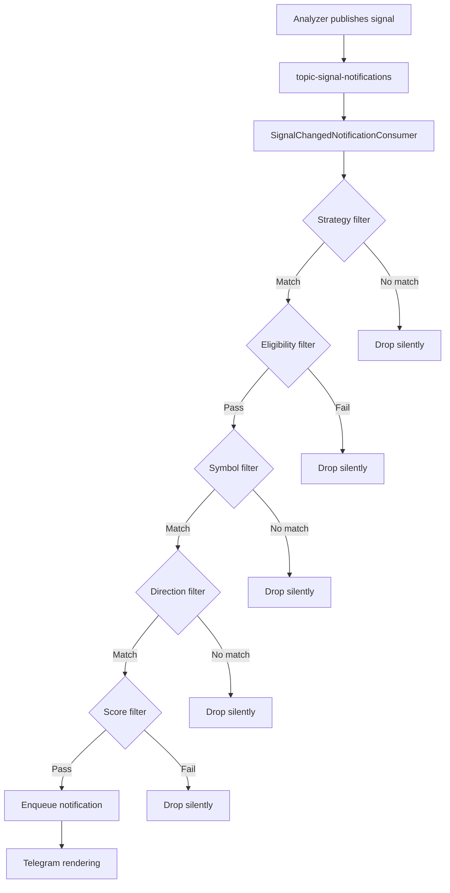

# P8-I1, P8-I2, and Configurable Notification Filter Implementation Plan

**Status**: Planning  
**Created**: 2026-09-15  
**Owner**: Architect Mode  
**Dependencies**: P8-I1 blocks P8-I2; both required before P8-I5

## Executive Summary

This plan addresses the completion of P8-I1 (Operational and generic Telegram notification formats) and P8-I2 (Immediate and digest signal notification formats), plus the addition of configurable notification filters requested by the owner.

**Current Status**:

- **P8-I1**: `verification_pending` — Local tests pass but no PR/CI/live Telegram evidence
- **P8-I2**: `verification_pending` — Local tests pass but no PR/CI/live Telegram evidence
- **Filter capability**: Not yet implemented (new requirement)

**Key Insight**: The rendering infrastructure from [`TelegramRendering.java`](apps/core/src/main/java/com/omni/platform/modules/notifications/telegram/TelegramRendering.java) is already implemented and tested. The primary gaps are:

1. PR creation and CI verification
2. Live Telegram manual verification
3. Configurable filter addition

## 1. Current State Analysis

### 1.1 P8-I1 Implementation Status

**Completed**:

- ✅ [`NotificationKind`](apps/core/src/main/java/com/omni/platform/modules/notifications/dtos/NotificationRequest.java) enum with 8 explicit kinds
- ✅ [`StructuredContent`](apps/core/src/main/java/com/omni/platform/modules/notifications/dtos/NotificationRequest.java:64-86) sealed interface for type-safe signal content
- ✅ [`TelegramRendering.Registry`](apps/core/src/main/java/com/omni/platform/modules/notifications/telegram/TelegramRendering.java) with 4 specialized renderers
- ✅ HTML escaping, block-aware length budgeting, metadata filtering
- ✅ Operational/job lifecycle/generic renderers with golden tests
- ✅ Sound policy (audible operational errors, silent info/signals)
- ✅ Display timezone configuration ([`application.yaml:68`](apps/core/src/main/resources/application.yaml:68))

**Verification Evidence** (2026-09-05):

```
PASS P8-I1 required=3 pass=3 fail=0 unknown=0 missing=0 sources=exit_code
- nx run platform:test
- nx run platform:build
- Prettier formatting (P8-I1 docs/config files)
```

**Gaps**:

- ❌ No PR created
- ❌ No CI evidence
- ❌ No live Telegram verification

### 1.2 P8-I2 Implementation Status

**Completed**:

- ✅ [`SignalChangedRenderer`](apps/core/src/main/java/com/omni/platform/modules/notifications/telegram/TelegramRendering.java:209-243)
- ✅ [`SignalDigestRenderer`](apps/core/src/main/java/com/omni/platform/modules/notifications/telegram/TelegramRendering.java:245-294)
- ✅ Hard cutover validation (requires matching structured content)
- ✅ BUY/SELL/HOLD layouts with price/score/date/reason formatting
- ✅ Budget-based digest item inclusion
- ✅ `newSignalDate` eligibility ([`kafka.py:119-126`](apps/analyzer/app/signals/kafka.py:119-126))
- ✅ Telegram signal strategy configuration ([`application.yaml:57`](apps/core/src/main/resources/application.yaml:57))

**Verification Evidence** (2026-09-05):

```
PASS P8-I2 required=3 pass=3 fail=0 unknown=0 missing=0 sources=exit_code
- nx run platform:test
- nx run platform:build
- Prettier formatting (P8-I2 docs)
```

**Gaps**:

- ❌ No PR created
- ❌ No CI evidence
- ❌ No live Telegram verification
- ❌ 2026-09-09 daily confirmed-result extension tests not run

### 1.3 Configurable Filter Requirements

**Owner Request**: "ability to customize (config) the filter"

**Current Filtering**:

1. **Signal strategy filter** ([`application.yaml:57`](apps/core/src/main/resources/application.yaml:57)):

   ```yaml
   signal-strategy: ${TELEGRAM_SIGNAL_STRATEGY:CONFIRMED_TREND_EQUALS}
   ```

   Used in: [`SignalChangedNotificationConsumer`](apps/core/src/main/java/com/omni/platform/modules/notifications/consumers/SignalChangedNotificationConsumer.java)

2. **Eligibility logic** ([`kafka.py:119-126`](apps/analyzer/app/signals/kafka.py:119-126)):
   - Signal changed: always included
   - New signal date: only for CONFIRMED_TREND_EQUALS + 1d + persisted

**Missing**: No configuration for filtering by:

- Symbol/symbol pattern (e.g., "HOSE-FPT,HOSE-VNM")
- Signal direction (BUY only, SELL only, etc.)
- Score threshold (e.g., score >= 0.7)
- Timeframe selection

## 2. Configurable Filter Design

### 2.1 Architecture

Add flexible notification filters without changing:

- Analyzer calculations or Kafka contracts
- Core notification rendering infrastructure
- Scheduler/outbox boundaries

**Approach**: Filter at consumption boundary in Platform after Kafka delivery, before rendering.



### 2.2 Configuration Schema

Add to [`TelegramNotificationProperties`](apps/core/src/main/java/com/omni/platform/modules/notifications/configs/TelegramNotificationProperties.java):

```java
@ConfigurationProperties(prefix = "app.notifications.telegram")
public record TelegramNotificationProperties(
    // ... existing fields ...
    SignalFilterConfig signalFilter
) {
    public record SignalFilterConfig(
        List<String> allowedStrategies,      // [CONFIRMED_TREND_EQUALS, TREND_MOMENTUM_V1]
        List<String> allowedSymbols,         // [HOSE-FPT, HOSE-VNM] or empty = all
        List<String> symbolPatterns,         // [HOSE-*, HNX-*] or empty = no pattern
        List<String> allowedDirections,      // [BUY, SELL, HOLD] or empty = all
        List<String> allowedTimeframes,      // [1d, 4h] or empty = all
        Double minScore,                     // 0.7 or null = no threshold
        Boolean enableNewSignalDate          // true = include qualified newSignalDate
    ) {
        public SignalFilterConfig {
            // Defaults
            if (allowedStrategies == null || allowedStrategies.isEmpty()) {
                allowedStrategies = List.of("CONFIRMED_TREND_EQUALS");
            }
            if (allowedSymbols == null) allowedSymbols = List.of();
            if (symbolPatterns == null) symbolPatterns = List.of();
            if (allowedDirections == null) allowedDirections = List.of();
            if (allowedTimeframes == null) allowedTimeframes = List.of();
            if (enableNewSignalDate == null) enableNewSignalDate = true;
        }

        public boolean matchesSymbol(String symbolKey) {
            if (allowedSymbols.isEmpty() && symbolPatterns.isEmpty()) {
                return true; // No filter = allow all
            }
            if (allowedSymbols.contains(symbolKey)) {
                return true;
            }
            for (String pattern : symbolPatterns) {
                if (matchesPattern(symbolKey, pattern)) {
                    return true;
                }
            }
            return false;
        }

        private boolean matchesPattern(String value, String pattern) {
            // Simple glob: HOSE-* matches HOSE-FPT, HOSE-VNM, etc.
            String regex = pattern.replace("*", ".*");
            return value.matches(regex);
        }
    }
}
```

**Environment Variables**:

```bash
# Strategy (existing)
TELEGRAM_SIGNAL_STRATEGY=CONFIRMED_TREND_EQUALS

# New filters (comma-separated)
TELEGRAM_SIGNAL_FILTER_ALLOWED_STRATEGIES=CONFIRMED_TREND_EQUALS,TREND_MOMENTUM_V1
TELEGRAM_SIGNAL_FILTER_ALLOWED_SYMBOLS=HOSE-FPT,HOSE-VNM,HNX-ACB
TELEGRAM_SIGNAL_FILTER_SYMBOL_PATTERNS=HOSE-*
TELEGRAM_SIGNAL_FILTER_ALLOWED_DIRECTIONS=BUY,SELL
TELEGRAM_SIGNAL_FILTER_ALLOWED_TIMEFRAMES=1d
TELEGRAM_SIGNAL_FILTER_MIN_SCORE=0.7
TELEGRAM_SIGNAL_FILTER_ENABLE_NEW_SIGNAL_DATE=true
```

**YAML** ([`application.yaml`](apps/core/src/main/resources/application.yaml)):

```yaml
app:
  notifications:
    telegram:
      signal-filter:
        allowed-strategies: ${TELEGRAM_SIGNAL_FILTER_ALLOWED_STRATEGIES:CONFIRMED_TREND_EQUALS}
        allowed-symbols: ${TELEGRAM_SIGNAL_FILTER_ALLOWED_SYMBOLS:}
        symbol-patterns: ${TELEGRAM_SIGNAL_FILTER_SYMBOL_PATTERNS:}
        allowed-directions: ${TELEGRAM_SIGNAL_FILTER_ALLOWED_DIRECTIONS:}
        allowed-timeframes: ${TELEGRAM_SIGNAL_FILTER_ALLOWED_TIMEFRAMES:}
        min-score: ${TELEGRAM_SIGNAL_FILTER_MIN_SCORE:}
        enable-new-signal-date: ${TELEGRAM_SIGNAL_FILTER_ENABLE_NEW_SIGNAL_DATE:true}
```

### 2.3 Filter Implementation

Update [`SignalChangedNotificationConsumer`](apps/core/src/main/java/com/omni/platform/modules/notifications/consumers/SignalChangedNotificationConsumer.java):

```java
@KafkaListener(/* ... */)
public void onSignalChanged(ConsumerRecord<String, String> record) {
    try {
        SignalChangedNotificationMessage message = /* parse */;

        // Apply filters
        if (!passesFilters(message)) {
            log.debug("Signal notification filtered out: strategy={} symbolKey={} signal={} score={}",
                message.strategy(), message.symbolKey(), message.newSignal(), message.score());
            return;
        }

        // Existing notification creation...
    } catch (Exception e) {
        // ...
    }
}

private boolean passesFilters(SignalChangedNotificationMessage message) {
    var filter = properties.signalFilter();

    // Strategy filter (backward compatible with old property)
    if (!filter.allowedStrategies().contains(message.strategy())) {
        return false;
    }

    // Symbol filter
    if (!filter.matchesSymbol(message.symbolKey())) {
        return false;
    }

    // Direction filter
    if (!filter.allowedDirections().isEmpty()
        && !filter.allowedDirections().contains(message.newSignal())) {
        return false;
    }

    // Timeframe filter
    if (!filter.allowedTimeframes().isEmpty()
        && !filter.allowedTimeframes().contains(message.timeframe())) {
        return false;
    }

    // Score threshold
    if (filter.minScore() != null && message.score() != null) {
        double score = parseScore(message.score());
        if (score < filter.minScore()) {
            return false;
        }
    }

    return true;
}

private double parseScore(Object score) {
    if (score instanceof Number n) return n.doubleValue();
    if (score instanceof String s) return Double.parseDouble(s);
    return 0.0;
}
```

### 2.4 Backward Compatibility

**Migration Strategy**:

1. Existing `signal-strategy` property maps to `signal-filter.allowed-strategies`
2. Default empty lists mean "no filter" (allow all)
3. Existing behavior: only `CONFIRMED_TREND_EQUALS` notifications sent
4. After migration: operators can expand to multiple strategies or add additional filters

**Deprecation Path**:

- Phase 1 (this increment): Keep both `signal-strategy` and `signal-filter.allowed-strategies`
- Phase 2 (future): Deprecate `signal-strategy` with startup warning
- Phase 3 (future): Remove `signal-strategy`

## 3. Implementation Roadmap

### 3.1 P8-I1 Completion Path

**Goal**: Move from `verification_pending` to `completed`

**Steps**:

1. ✅ Local verification already passed (2026-09-05)
2. Create branch: `feature/p8-i1-operational-notification-formats`
3. Run verification commands:
   ```bash
   nx run platform:test
   nx run platform:build
   npx prettier --check "docs/plans/011-*.md" "apps/core/src/main/resources/application.yaml"
   ```
4. Commit with message following P1-I4 pattern:

   ```
   P8-I1: Operational and generic Telegram notification formats

   - Add NotificationKind enum and structured content validation
   - Implement TelegramRendering.Registry with 4 specialized renderers
   - Add HTML escaping, block-aware budgeting, metadata filtering
   - Implement operational, job lifecycle, and generic/manual renderers
   - Add sound policy (audible errors, silent info/signals)
   - Add display timezone configuration (Asia/Bangkok default)
   - 45 new tests covering rendering, escaping, boundaries, policy

   Refs: #<issue>
   ```

5. Create draft PR with:
   - Title: `P8-I1: Operational and generic Telegram notification formats`
   - Description linking to [`docs/plans/011-telegram-notification-format-modernization.md`](docs/plans/011-telegram-notification-format-modernization.md)
   - Checklist from plan's acceptance criteria
6. Wait for CI (GitHub Actions)
7. Manual Telegram verification in test channels:
   - Send operational success/warning/error
   - Verify HTML rendering, no entity errors
   - Confirm audible errors, silent info
   - Test with `<`, `&`, multiline, Unicode
8. Update [`plans/roadmap/implementation-increments.md`](plans/roadmap/implementation-increments.md):
   - Set `pr` field to PR URL
   - Set `last_verified_commit` to HEAD commit SHA
   - Change `status` from `verification_pending` to `completed`
9. Merge PR

**Estimated Timeline**: 1-2 days (mostly waiting for manual Telegram verification)

### 3.2 P8-I2 Completion Path

**Goal**: Move from `verification_pending` to `completed`

**Dependency**: P8-I1 must be `completed` first

**Steps**:

1. ✅ Local verification already passed (2026-09-05)
2. Create branch: `feature/p8-i2-signal-notification-formats`
3. Run verification commands including daily confirmed extension:
   ```bash
   nx run platform:test
   nx run platform:build
   nx run analyzer:test
   nx run analyzer:lint
   npx prettier --check "docs/plans/011-*.md"
   ```
4. Verify [`newSignalDate`](apps/analyzer/app/signals/kafka.py:119-126) logic with tests
5. Commit and create draft PR:
   - Title: `P8-I2: Immediate and digest signal notification formats`
   - Description with signal layout examples
6. Wait for CI
7. Manual Telegram verification in signals test channel:
   - Send BUY, SELL, HOLD, unknown signal
   - Send small digest (fits in one message)
   - Send oversized digest (triggers omission)
   - Verify newSignalDate daily confirmed results
   - Confirm silent delivery, correct ICT times
8. Update increment registry and merge

**Estimated Timeline**: 1-2 days

### 3.3 Configurable Filter Implementation

**Goal**: Add flexible signal notification filters

**Dependency**: P8-I2 must be `completed` first (uses P8-I2 infrastructure)

**Steps**:

#### Step 1: Configuration Model (1-2 hours)

1. Update [`TelegramNotificationProperties`](apps/core/src/main/java/com/omni/platform/modules/notifications/configs/TelegramNotificationProperties.java)
2. Add `SignalFilterConfig` record with validation
3. Add default value handling and pattern matching

#### Step 2: Filter Implementation (2-3 hours)

1. Update [`SignalChangedNotificationConsumer.java`](apps/core/src/main/java/com/omni/platform/modules/notifications/consumers/SignalChangedNotificationConsumer.java)
2. Add `passesFilters()` method
3. Add structured logging for filtered notifications
4. Preserve backward compatibility with old `signal-strategy` property

#### Step 3: Configuration Files (30 minutes)

1. Update [`application.yaml`](apps/core/src/main/resources/application.yaml)
2. Update [`.env.example`](.env.example)
3. Update [`.env.deploy.example`](.env.deploy.example)
4. Add filter examples to comments

#### Step 4: Tests (3-4 hours)

1. Configuration binding tests:
   - Default empty lists = no filter
   - Multiple strategies
   - Symbol exact match
   - Symbol pattern (HOSE-_, HNX-_)
   - Direction filter (BUY only)
   - Timeframe filter (1d only)
   - Score threshold (>= 0.7)
   - Combined filters
2. Consumer filter tests:
   - Strategy pass/fail
   - Symbol pass/fail with patterns
   - Direction pass/fail
   - Score threshold pass/fail
   - Backward compatibility with old property
3. Integration tests with mock Kafka records

#### Step 5: Documentation (1 hour)

1. Update [`apps/core/README.md`](apps/core/README.md)
2. Update [`docs/plans/011-telegram-notification-format-modernization.md`](docs/plans/011-telegram-notification-format-modernization.md)
3. Add filter examples to [`docs/README.md`](docs/README.md)

#### Step 6: Verification (1-2 hours)

1. Run tests: `nx run platform:test`
2. Run build: `nx run platform:build`
3. Manual verification:
   - Configure symbol filter: `HOSE-FPT,HOSE-VNM`
   - Verify only those symbols trigger notifications
   - Configure BUY-only filter
   - Verify SELL/HOLD signals are dropped
   - Configure score threshold: 0.7
   - Verify low-score signals are dropped

**Estimated Timeline**: 1-2 days

**Branch**: `feature/configurable-notification-filters`

**PR Title**: `Add configurable Telegram signal notification filters`

## 4. Verification Commands

### 4.1 Required Nx Commands

Based on [`apps/core/project.json`](apps/core/project.json):

```bash
# Unit tests
nx run platform:test

# Full build (includes test)
nx run platform:build

# Fast build (no tests)
nx run platform:build-fast

# Affected projects
nx affected:test
nx affected:build
```

### 4.2 Code Quality

```bash
# Prettier (docs/config)
npx prettier --check \
  "docs/plans/011-telegram-notification-format-modernization.md" \
  "docs/plans/022-notification-outbox.md" \
  "plans/roadmap/phase-8-notification-routing.md" \
  "apps/core/src/main/resources/application.yaml" \
  ".env.example"

# Prettier write
npx prettier --write <files>
```

**Note**: Platform has no `lint` or Java `format` Nx target per P8-I1 evidence.

### 4.3 Manual Telegram Verification Checklist

**Prerequisites**:

- Non-production Telegram bot token
- Test chat IDs for operations and signals channels
- Configure: `TELEGRAM_NOTIFICATIONS_ENABLED=true`

**Test Scenarios**:

#### P8-I1 Scenarios:

- [ ] Operational success message
- [ ] Operational warning message
- [ ] Operational error with `<tag>`, `&`, multiline
- [ ] Job succeeded notification
- [ ] Job failed notification
- [ ] Generic/manual notification with metadata
- [ ] Verify audible errors, silent info/warnings
- [ ] Verify dates in ICT (Asia/Bangkok)
- [ ] Verify no Telegram entity parse errors
- [ ] Verify operations channel routing

#### P8-I2 Scenarios:

- [ ] Immediate BUY signal
- [ ] Immediate SELL signal
- [ ] Immediate HOLD signal
- [ ] Unknown/fallback signal
- [ ] Small signal digest (3-5 items)
- [ ] Large signal digest (20+ items with omissions)
- [ ] Daily confirmed `newSignalDate` result (unchanged signal)
- [ ] Verify silent delivery (no sound)
- [ ] Verify signals channel routing
- [ ] Verify correct strategy/timeframe display
- [ ] Verify price/score formatting

#### Filter Scenarios:

- [ ] Configure symbol filter, verify only matching symbols notify
- [ ] Configure BUY-only filter, verify SELL/HOLD dropped
- [ ] Configure score threshold, verify low scores dropped
- [ ] Configure pattern `HOSE-*`, verify HNX symbols dropped
- [ ] Verify filter logs show dropped notifications

## 5. Risks and Mitigations

### 5.1 P8-I1/P8-I2 Completion Risks

| Risk                      | Impact            | Mitigation                                             |
| ------------------------- | ----------------- | ------------------------------------------------------ |
| CI failures in PR         | Blocks completion | Run `nx affected` locally first; fix before PR         |
| Live Telegram errors      | Blocks completion | Test in non-prod channel; verify HTML/entities         |
| Manual verification delay | Extends timeline  | Schedule 2-hour verification window; prepare test data |
| Merge conflicts           | Rework required   | Rebase frequently; coordinate with active branches     |

### 5.2 Filter Implementation Risks

| Risk                          | Impact                 | Mitigation                                               |
| ----------------------------- | ---------------------- | -------------------------------------------------------- |
| Backward incompatibility      | Breaks existing config | Keep old `signal-strategy` working; add migration guide  |
| Filter bypass bugs            | Wrong notifications    | Comprehensive test coverage; structured filter logs      |
| Pattern matching errors       | Unexpected behavior    | Use simple glob only; document limitations               |
| Performance with many filters | Latency                | Keep filters simple; benchmark with realistic config     |
| Score parsing failures        | Filter malfunction     | Handle null/missing; log parse errors; graceful fallback |

## 6. Success Criteria

### 6.1 P8-I1 Complete When:

- [x] Local tests passing
- [ ] PR created with CI passing
- [ ] Manual Telegram verification complete (8 scenarios)
- [ ] Increment registry updated: `status=completed`, `pr=<url>`, `last_verified_commit=<sha>`
- [ ] PR merged to main

### 6.2 P8-I2 Complete When:

- [x] Local tests passing
- [ ] P8-I1 is completed
- [ ] PR created with CI passing
- [ ] Manual Telegram verification complete (11 scenarios)
- [ ] Daily confirmed newSignalDate logic verified
- [ ] Increment registry updated
- [ ] PR merged to main

### 6.3 Filter Feature Complete When:

- [ ] P8-I2 is completed
- [ ] Configuration model implemented with defaults
- [ ] Consumer filter logic implemented
- [ ] Backward compatibility verified
- [ ] 20+ tests passing (config, consumer, integration)
- [ ] Documentation updated
- [ ] Manual filter verification complete (5 scenarios)
- [ ] PR created and merged

## 7. Next Steps

### Immediate (Today):

1. Confirm plan with owner
2. Create P8-I1 branch
3. Run local verification commands
4. Create draft PR for P8-I1

### Short Term (This Week):

1. Complete P8-I1 manual Telegram verification
2. Merge P8-I1, update increment registry
3. Repeat for P8-I2

### Medium Term (Next Week):

1. Implement configurable filters
2. Complete filter tests and verification
3. Merge filters PR

### Future:

1. P9-I5 (VCI health metrics) — blocks P8-I5
2. P8-I5 (Notification Outbox) — requires P8-I1, P8-I2, P9-I5 completed

## 8. Questions for Owner

1. **Filter Scope**: Is the proposed filter configuration sufficient, or are additional filters needed (e.g., filter by reason codes, date range)?

2. **Filter Priority**: Should filters be implemented immediately or after P8-I1/P8-I2 completion?

3. **Telegram Verification**: Do you have access to non-production Telegram test channels, or should we set up new test bots/channels?

4. **CI Access**: Is GitHub Actions configured for this repository, or are there CI setup steps needed?

5. **Merge Strategy**: Should PRs use squash merge, merge commits, or rebase?

6. **Documentation**: Should filter configuration be documented in a separate operator guide or in existing docs?

---

**Plan Status**: Ready for review and owner approval  
**Estimated Total Timeline**: 5-7 days (P8-I1: 1-2 days, P8-I2: 1-2 days, Filters: 1-2 days, Buffer: 1 day)
